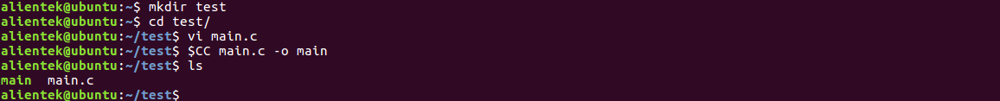

# 4.6 编译一个简单的c文件

&emsp;&emsp;在编译出厂Qt GUI之前，前提需要先安装[4.2小节](./install_poky.md)的Poky交叉编译工具链。

&emsp;&emsp;本文新建一个test文件夹，在test文件夹下编辑一个main.c文件，使用vi/vim指令，复制下面的内容。

&emsp;&emsp;程序功能是打印一句“hello world!”，拷贝以下内容到vi/vim编辑器窗口里。按i进入插入模式，右键进行粘贴内容，粘贴成功后按ESC键退出编辑模式，然后输入`:wq`保存并退出。
```c#
mkdir test
cd test
vi main.c
```
&emsp;&emsp;在main.c复制粘贴下面的内容。
```c#
#include <stdio.h>
int main(void)
{
        printf("hello world!\n");
        return 0;
}
```

&emsp;&emsp;如果您在上文已经使能过环境变量就不用再执行下面这一步了。
```c#
source /opt/fsl-imx-x11/4.1.15-2.1.0/
environment-setup-cortexa7hf-neon-poky-linux-gnueabi
```

编译main.c文件，指令解释:

（1）	$CC ：$是取值符号，取终端的环境变量CC的值.<br />
（2）	main.c ：c文件<br />
（3）	-o ：参数-o，后面加编译的目标文件
```c#
$CC main.c -o main
```

&emsp;&emsp;或者写成下面这样来编译main.c文件也是可以的，实际是把$CC的值换成了如下，下面为一条指令，由于PDF格式问题，建议分段复制。
```c#
arm-poky-linux-gnueabi-gcc  -march=armv7ve -mfpu=neon  -mfloat-abi=hard -mcpu=cortex-a7 --sysroot=$SDKTARGETSYSROOT main.c -o main
```

<center>
<br />
图4.6 1 编译main.c
</center>

&emsp;&emsp;编译好的main文件，直接拷贝到出厂系统里，在串口终端执行`./main`，结果是串口打印一句“hello world!”。