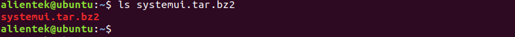
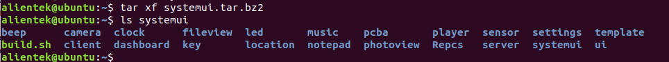
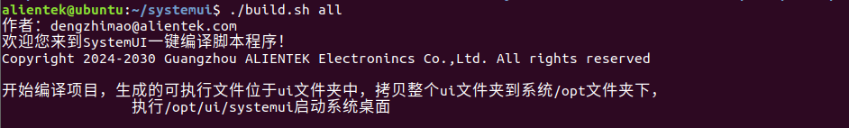
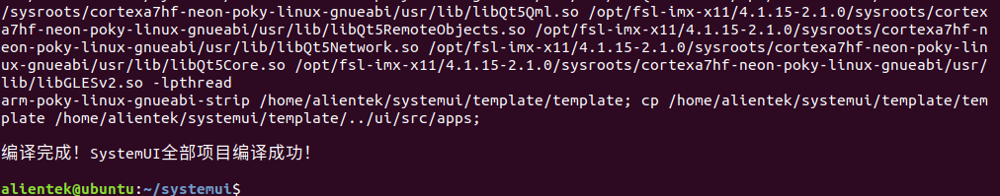
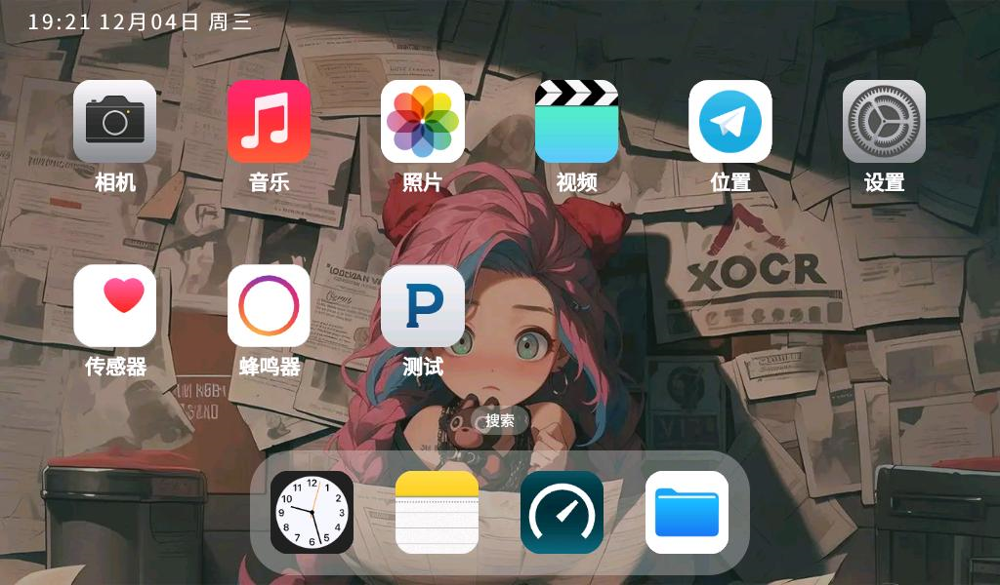
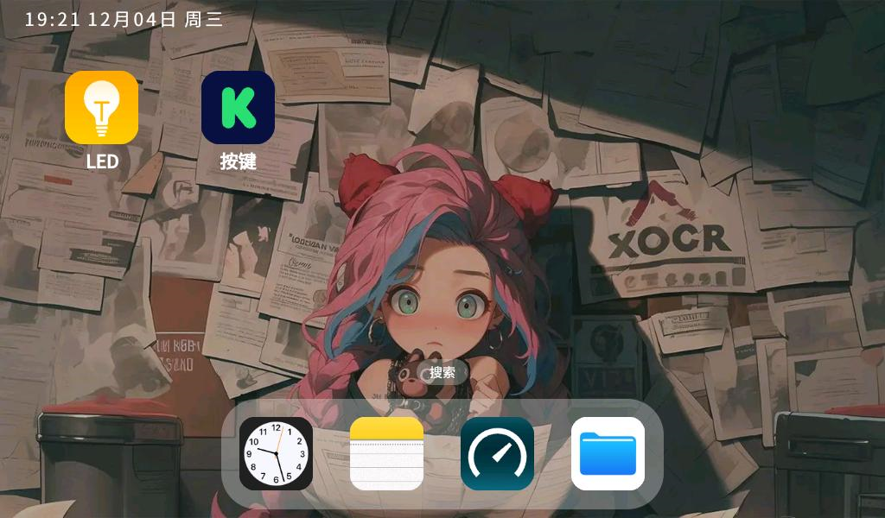

# 4.5 编译出厂Qt GUI综合Demo

&emsp;&emsp;**在编译出厂Qt GUI之前，前提需要先安装4.2小节的Poky交叉编译工具链！！！**

&emsp;&emsp;拷贝**开发板光盘A-基础资料->1、例程源码->9、Qt综合例程源码**下的systemui.tar.bz2压缩文件到Ubuntu虚拟机。如下图，编者已经拷贝到虚拟机家目录（用户目录）下。

<center>
<br />
图4.5 1 拷贝systemui项目到Ubuntu虚拟机
</center>

&emsp;&emsp;使用指令tar xf systemui.tar.bz2解压得到如下文件。
```c#
tar xf systemui.tar.bz2
```

<center>
<br />
图4.5 2 解压后的文件
</center>

```c#
cd systemui/
./build.sh all         #直接执行此命令编译全部
./build.sh cleanall    #直接执行此命令清除全部
```
&emsp;&emsp;编译全部如下。

<center>
<br />
图4.5 3 开始编译
</center>

<center>
<br />
图4.5 4 编译成功
</center>

&emsp;&emsp;最后将编译完成的ui文件夹直接替换到开发板根文件系统路径/opt下即可。

&emsp;&emsp;**单个项目编译，请参考【正点原子】I.MX6U出厂系统Qt交叉编译环境搭建。**

<center>
<br />
图4.5 5 出厂GUI第一屏演示
</center>

<center>
<br />
图4.5 6 出厂GUI第二屏演示
</center>
