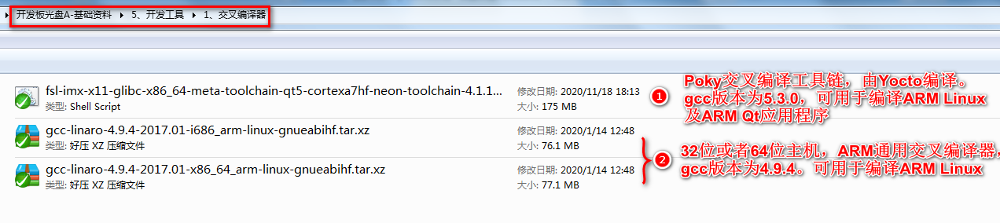

章节前言：

&emsp;&emsp;搭建交叉编译环境是学习Linux很重要的一步，正点原子提供两种交叉编译工具链。

&emsp;&emsp;这两种交叉编译工具链解释如下图。这两种编译器都有各自的作用，我们只要在相应的实验里使用指定的交叉编译工具链即可，切勿混着用。

&emsp;&emsp;同时它们的使用方法是不一样的，不能生搬硬套！第一种交叉编译器使用的方法，请参考本文档的4.2~4.7小节。第二种交叉编译器请参考【正点原子】I.MX6U嵌入式Linux驱动开发指南。

 
资料提供的两种交叉编译工具链

&emsp;&emsp;很多用户容易将上面两种交叉编译工具搞混。我们只需要知道上面的第二种通用的交叉编译器去学习【正点原子】I.MX6U嵌入式Linux驱动开发指南这本教程。

&emsp;&emsp;第一种Poky编译器是Yocto项目编译出的，常用于**编译开发板光盘A-基础资料->1、例程源码->3、正点原子Uboot和Linux出厂源码**及快速编译Qt应用程序到开发板上运行。

