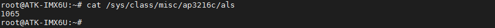
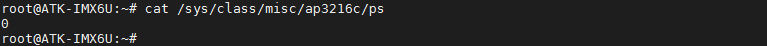
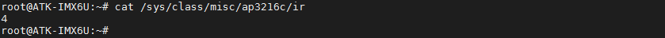

# 3.20 AP3216C测试

<div class="imx6u_center-table-div">
<table class="imx6u_center-table">
  <tr>
    <th>ALPHA</th>
    <th>MINI</th>
  </tr>
  <tr>
    <td>本实验支持</td>
    <td>本实验不支持</td>
  </tr>
</table>
</div>

AP3216C简介：

&emsp;&emsp;ALPHA开发板上通过 I2C1 连接了一个三合一环境传感器：AP3216C，AP3216C 是由敦南可以推出的一款传感器，其支持环境光强度(ALS)、接近距离(PS)和红外线强度(IR)这三个环境参数检测。

AP3216C 的特点如下：

①、I2C 接口，快速模式下波特率可以到 400Kbit/S<br />
②、多种工作模式选择：ALS、PS+IR、ALS+PS+IR、PD 等等。<br />
③、内建温度补偿电路。<br />
④、宽工作温度范围(-30°C ~ +80°C)。<br />
⑤、超小封装，4.1mm x 2.4mm x 1.35mm<br />
⑥、环境光传感器具有 16 为分辨率。<br />
⑦、接近传感器和红外传感器具有 10 为分辨率。

&emsp;&emsp;AP3216C 常被用于手机、平板、导航设备等，其内置的接近传感器可以用于检测是否有物体接近，比如手机上用来检测耳朵是否接触听筒，如果检测到的话就表示正在打电话，手机就会关闭手机屏幕以省电。也可以使用环境光传感器检测光照强度，可以实现自动背光亮度调节。

&emsp;&emsp;进入开发板文件系统执行下面指令读取环境传感器的环境参数值，根据开发板所处环境不同，环境参数值不同，先用下面指令读取一次环境参数值，再用手接近AP3216C传感器（ALPHA底板U8处），再用指令读取相应的参数值，参数值会有比较大的变化。

&emsp;&emsp;读取环境光强度值（ALS）

```c#
cat /sys/class/misc/ap3216c/als
```

<center>
<br />
图3.20 1读取环境光强度值
</center>

&emsp;&emsp;读取接近距离(PS)
```c#
cat /sys/class/misc/ap3216c/ps
```

<center>
<br />
图3.20 2 读取接近距离值
</center>

```c#
cat /sys/class/misc/ap3216c/ir
```
&emsp;&emsp;读取红外线强度(IR)

<center>
<br />
图3.20 3 读取红外线强度值
</center>


