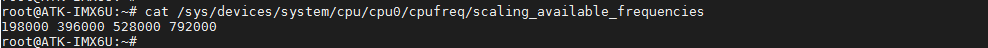
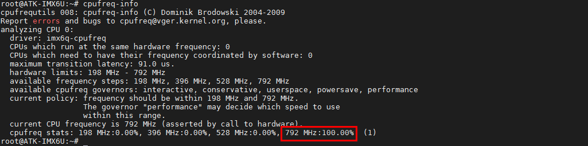

# 3.28 查看CPU主频

&emsp;&emsp;目前正点原子在售的I.MX6U都是CPU主频800MHz（实792MHz）的。我们可以使用如下指令查看出厂系统CPU主频。

&emsp;&emsp;查看可用主频，使用如下指令，可以看到有198MHz、396MHz、528MHz和792MHz的主频可用。
```c#
cat /sys/devices/system/cpu/cpu0/cpufreq/scaling_available_frequencies
```

<center>
<br />
图3.28 1 查看可用主频
</center>

&emsp;&emsp;输入cpufreq-info查看cpu运行的频率，由于出厂内核配置了CPU主频为“Performance”（此模式不考虑耗电，最高性能），直接运行在最高主频上。所以看到792MHz处是100%。
```c#
cpufreq-info
```

<center>
<br />
图3.28 2 查看CPU主频相关信息
</center>

&emsp;&emsp;那么是否可以无需重新编译Linux源码来修改CPU的主频呢，答案是可以的！

&emsp;&emsp;输入下面的指令，申请用户空间控制CPU主频。
```c#
echo userspace > /sys/devices/system/cpu/cpu0/cpufreq/scaling_governor
```

&emsp;&emsp;输入下面指令将CPU主频修改为198MHz，注意不是任意主频都支持，必须是上面支持的那几种频率！

```c#
echo 198000 > /sys/devices/system/cpu/cpu0/cpufreq/scaling_setspeed
```

&emsp;&emsp;再查看当前的CPU主频，修改成了低主频，明显的是Qt桌面滑动变卡了，说明此主频生效！

```c#
cat /sys/devices/system/cpu/cpu0/cpufreq/cpuinfo_cur_freq
```

<center>
<br />
图3.28 3 查看当前CPU主频
</center>
