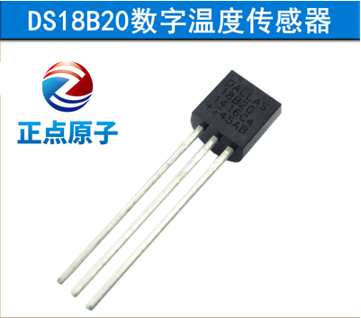
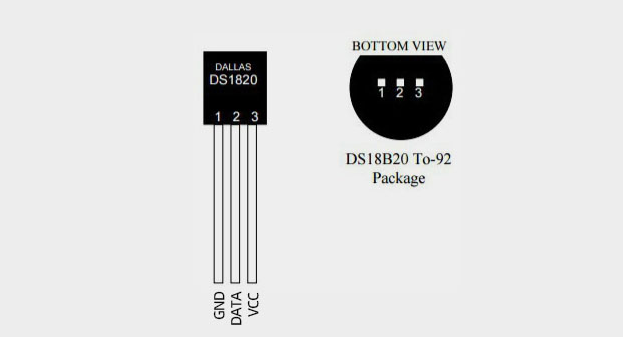
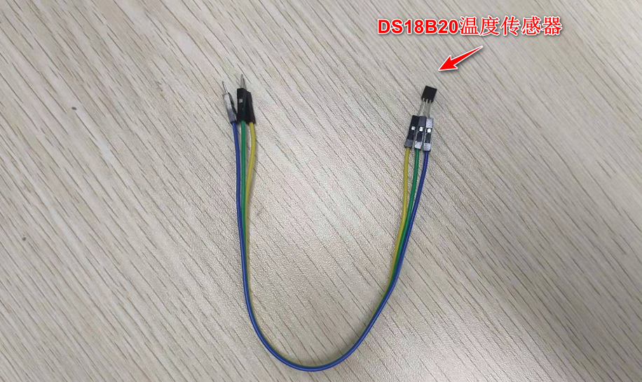
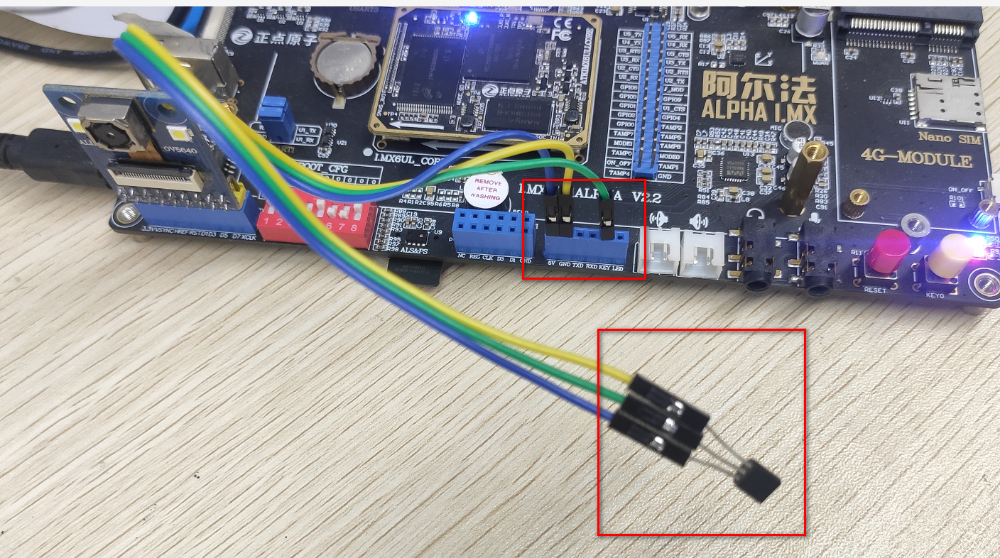
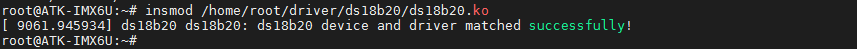
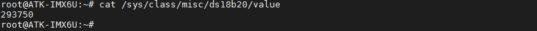

# 3.30 DS18B20测试

&emsp;&emsp;开发板用于测试DS18B20对应的管脚关系如下：

<div class="center-table-div">
<table class="center-table">
  <tr>
    <th>开发板</th>
    <th>GPIO1</th>
  </tr>
  <tr>
    <td>ALPHA/Mini</td>
    <td>DATA</td>
  </tr>
</table>
</div>


DS18B20简介：

&emsp;&emsp;DS18B20 是由 DALLAS 半导体公司推出的一种的“一线总线”接口的温度传感器。与传
统的热敏电阻等测温元件相比，它是一种新型的体积小、适用电压宽、与微处理器接口简单的数字化温度传感器。

&emsp;&emsp;一线总线结构具有简洁且经济的特点，可使用户轻松地组建传感器网络，从而为测量系统的构建引入全新概念，测量温度范围为-55~+125℃ ，精度为±0.5℃。3-5.5 V 的电压范围，采用多种封装形式，从而使系统设计灵活、方便等。

&emsp;&emsp;此实验需要准备DS18B20模块，可在正点原子淘宝店购买。

<center>
<br />
图3.30 1 DS18B20模块
</center>

&emsp;&emsp;DS18B20模块的管脚排列如下图， 以**正视图为准**。

<center>
<br />
图3.30 2 DS18B20正视图与俯视图
</center>

&emsp;&emsp;由于开发板管脚资源有限，使用紧张。没有单独留出一个座子给DS18B20和DHT11使用。

&emsp;&emsp;查看原理图可知，GPIO1管理上ATK MODULE座子上。所以我们可以通过杜绑线来连接DS18B20到ATK MODULE座子上的GPIO1管脚上。

<center>
<br />
图3.30 3 底板ATK模块原理图
</center>

&emsp;&emsp;那么我们就可以使用三根杜邦线（一头公，另一头母的），连接DS18B20模块。如下图。

<center>
<br />
图3.30 4 DS18B20与杜邦线连接
</center>

&emsp;&emsp;然后根据上文的DS18B20的正视图，有字的一面为正视图。将DATA脚接到ATK MODULE座子上丝印为KEY的座孔上。然后再将VCC，与GND都接在ATK MODULE的孔位上。（注意不要将DS18B20传感器的VCC与GND接反，否则会将DS18B20烧坏，若接反，模块会迅速发热，请快速断开！检查接法）。

&emsp;&emsp;如下图，正确的接法如下。下图为APLHA底板与DS18B20接法，Mini底板同理。

<center>
<br />
图3.30 5 DS18B20与底板连接
</center>

&emsp;&emsp;接好模块后，我们需要加载驱动。正点原子为DS18B20编写了驱动模块（`源码在01、例程源码->05、模块驱动源码->04、dht11&ds18b20驱动源码`）。驱动在文件系统路径/home/root/driver/ds18b20/ds18b20.ko。

&emsp;&emsp;所以我们直接加载这个驱动即可。（注：此驱动需要更新到v2.2版本的文件系统才有）。
```c#
insmod /home/root/driver/ds18b20/ds18b20.ko
```

<center>
<br />
图3.30 6 加载DS18B20驱动
</center>

&emsp;&emsp;读取DS18B20的温度传感器的值。
```c#
cat /sys/class/misc/ds18b20/value
```

<center>
<br />
图3.30 7 读取DS18B20的数据
</center>

&emsp;&emsp;得出来的数值除以10000，就是实际的温度数据，如上，得到的环境温度为29.375度（注：精度为±0.5℃）。如果不能获取数据，请检查是传感器是否连接稳定，及接法是否正确。