# 3.18 EC20 4G模块上网测试

<div class="imx6u_center-table-div">
<table class="imx6u_center-table">
  <tr>
    <th>ALPHA</th>
    <th>MINI</th>
  </tr>
  <tr>
    <td>本实验支持</td>
    <td>本实验不支持/但是可使用PCIE转USB座子接4G模块</td>
  </tr>
</table>
</div>


&emsp;&emsp;移远模块自带了一套驱动和拨号软件，驱动叫GobiNet，我们发布的内核源码已经含GobiNet驱动。移远EC20 4G模块驱动已经编译成模块，可以直接插上EC20 4G模块使用。也可以不使用移远的驱动GobiNet，直接使用ppp拨号上网亦可。

&emsp;&emsp;WWAN LED指示灯说明，当为低的时候LED灯点亮，参考电路如下：

<center>
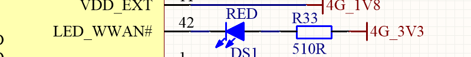<br />
图3.18 1 WWWAN LED指示灯
</center>

&emsp;&emsp;默认状态下LED_WWAN对应的LED灯闪烁情况：

<div class="imx6u_center-table-div">
<table class="imx6u_center-table">
  <tr>
    <th>引脚工作状态</th>
    <th>所指示的网络状态</th>
  </tr>
  <tr>
    <td>慢闪(200ms高/1800ms低)</td>
    <td>找网状态</td>
  </tr>
  <tr>
    <td>慢闪(1800ms高/200ms低)</td>
    <td>待机状态</td>
  </tr>
  <tr>
    <td>快闪(125ms高/125ms低)</td>
    <td>数据传输模式态</td>
  </tr>
  <tr>
    <td>高电平</td>
    <td>通话中</td>
  </tr>
</table>
</div>


实验前准备：
+ EC20 4G模块
+ 4 G上网卡
+ 天线（用于放大信号）

&emsp;&emsp;正点原子ALPHA底板上预留4G模块接口，ME3630-W，EC20等4G模块的安装。准备EC20模块，请自行在网上购买，**注意购买时需要买天线，单单模块是不能正常工作的！**

&emsp;&emsp;（备注：EC20有许多类型模块，目前测试过的是EC20-CE模块，其中EC20-CE系列又有多种模块，不同的模块功能不一样，比如支持的运营商不一样，详细请咨询卖家），其他EC20系列请自行测试，理论上驱动一样，有需求找移远技术支持。）。

&emsp;&emsp;将EC20 4G模块插到4G模块接口处，拧上螺丝。保证4G模块与座子接口吻合连接。请使用原装天线，把天线连接到4G模块的MAIN接口处。

&emsp;&emsp;正确插入4G卡（支持的运营商，请咨询对应模块的卖家，**注意有些可能模块不支持物联网卡，请使用普通4G卡测试**）及插好模块，开发板启动后底板上的WWAN LED 会亮绿灯。

&emsp;&emsp;如果WWAN LED绿灯未亮起，请检查模块是否正确连接插入，4G卡是否插入，天线是否接好，**开发板是必须插上配带的12V电源**，不能只用串口USB_TTL供电。

&emsp;&emsp;进行 4G 模块测试前，将 4G 卡插到底板的SIM卡槽里，再插上EC20 4G模块，同时插上天线，天线接到模块的 MAIN 处。

&emsp;&emsp;正确插入 4G 卡与天线后，开发板启动后底板上的WWAN LED 会亮绿灯，若此灯不亮，请检查 4G 卡是否插对位置，天线是否连接正确，再重插模块试试。

&emsp;&emsp;必须插上开发板使用的电源！**否则供电不足，模块无法正常工作**。模块安装如下图所示：

<center>
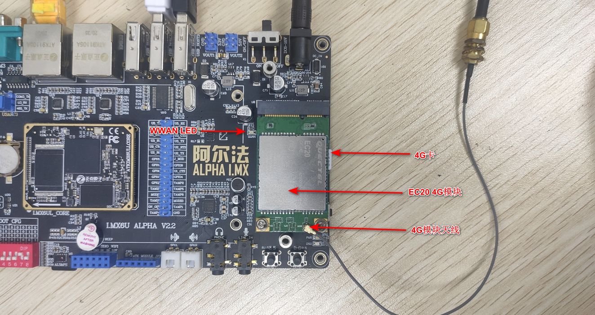<br />
图3.18 2 EC20连接示意图
</center>

&emsp;&emsp;开发板开机启动打印EC20 4G模块信息如下：

<center>
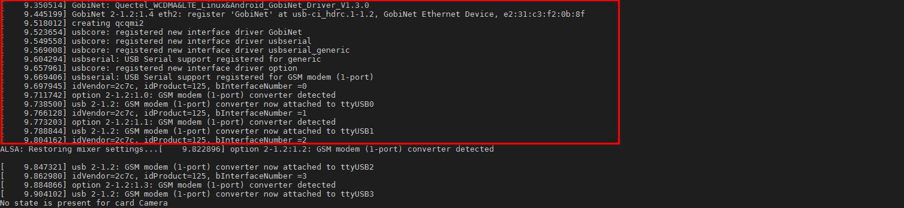<br />
图3.18 3 EC20 打印的USB信息
</center>

&emsp;&emsp;查看是否存在/dev/qcqmil2节点，如果存在的话就说明GobiNet驱动成功，如下图所示：
```c#
ls /dev/q*
```

<center>
<br />
图3.18 4 查看EC20生成的节点
</center>

&emsp;&emsp;再查看是否生成/dev/ttyUSB0~3节点
```c#
ls /dev/ttyUSB*
```

<center>
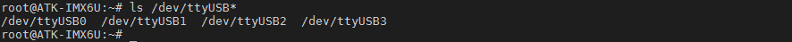<br />
图3.18 5 生成的USB节点
</center>

&emsp;&emsp;这四路ttyUSB的功能如下图所示，不全部测试这些功能了，这里我们只测试上网功能。详细请自行参考EC20 4G模块手册。

<center>
<br />
图3.18 6 四路ttyUSB的功能示意图
</center>

## 3.18.1 ppp拨号上网

&emsp;&emsp;进入/home/root/shell/4G目录下，这个目录存放着测试4G模块的脚本，如果您没看见4G这个目录，请回到[固化系统小节](../preparation/curing_system.md)下载最新的固件更新。
```c#
cd /home/root/shell/4G
ls
```

&emsp;&emsp;4G测试脚本如下。

<center>
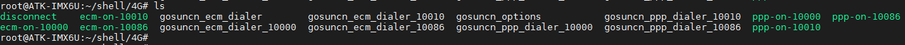<br />
图3.18.1 1 查看4G测试脚本
</center>

脚本解释：

&emsp;&emsp;ppp拨号主要是ppp-on-1000、ppp-on-10010和ppp-on-10086。这三个脚本分别是不同的运营商配置的APN值不一样。

&emsp;&emsp;ppp-on-1000、ppp-on-10010和ppp-on-10086分别是电信卡需要执行的脚本、联通卡需要执行的脚本和移动卡需要执行的脚本。

&emsp;&emsp;比如本次测试使用的是电信卡，那么执行的脚本是ppp-on-10000。
```c#
./ppp-on-10000 &					// &的作用是放到后台运行
```

<center>
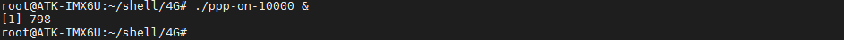<br />
图3.18.1 2 执行电信卡运行的ppp上网测试脚本
</center>

<center>
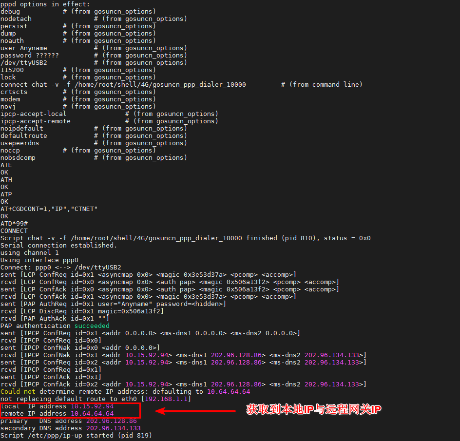<br />
图3.18.1 3 获取IP成功
</center>

&emsp;&emsp;如果开发板同时插上了网线，因为此系统默认会只让一个网卡连外网，设置网关为4G模块的路由规则。使用route指令查看路由表。
```c#
route
```

&emsp;&emsp;因为本人已经插上网线，上网会优先选择eth0/eth1。如果用户没有插网线，就不需要添加路由表啦，因为你的网卡只有4G网卡上网，系统就会选择4G网卡上网。

<center>
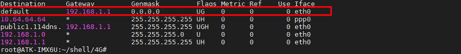<br />
图3.18.1 4 默认是eth0上网
</center>

&emsp;&emsp;我们需要先添加4G模块的网关地址，然后删除默认的eth0的网关，再使用route指令查看添加是否成功
```c#
route add default gw 10.64.64.64	
route del default gw 192.168.1.1
route
```
&emsp;&emsp;可以看到下面default项，已经修改为ppp0上网。

<center>
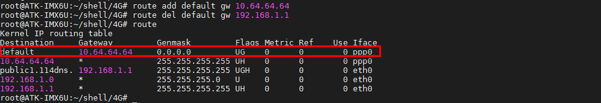<br />
图3.18.1 5 修改为ppp0上网
</center>

&emsp;&emsp;使用ifconfig指令查看获取的ip地址，表明4G网络可以与eth0/eth1共存，上网通过切换默认的路由表来控制连外网即可！
```c#
ifconfig
```

<center>
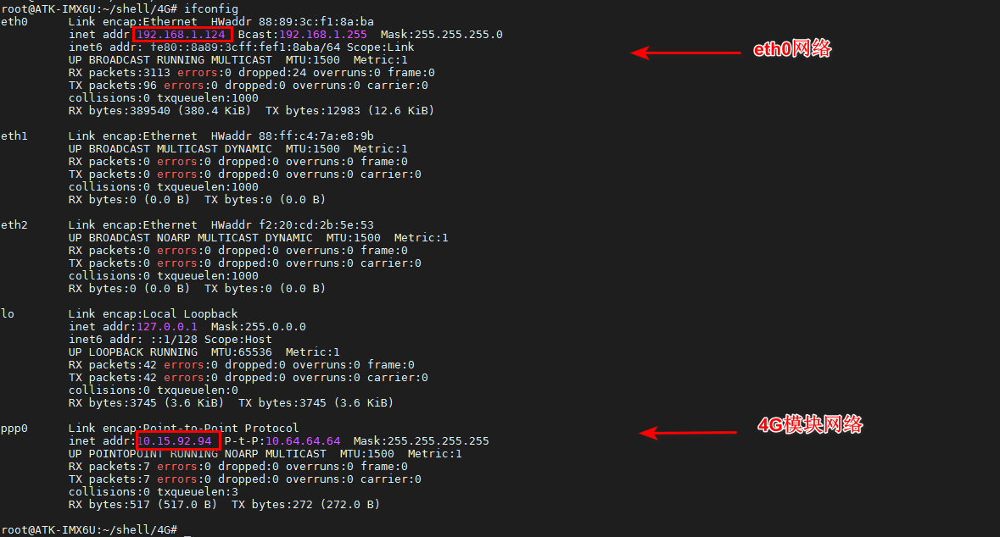<br />
图3.18.1 6 eth网络与4G网络共存
</center>

&emsp;&emsp;通过ping www.baidu.com来测试是否能上网。-I参数是指定ppp0(4G网络)，按“Ctrl +c”结束ping。看到下图结果表明能上网。
```c#
ping www.baidu.com -I ppp0
```

<center>
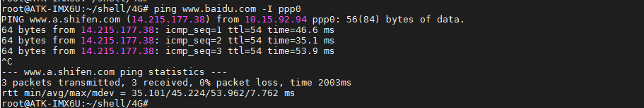<br />
图3.18.1 7 ping百度测试
</center>

## 3.18.2 使用quectel-CM

&emsp;&emsp;使用quectel-CM拨号程序工具（这个工具是我们预先交叉编译好放进文件系统/usr/sbin目录下面的），方便用户使用。此工具在我们I.MX6U 嵌入式Linux开发指南有讲到。

&emsp;&emsp;如果已经做了上面的ppp拨号，那么我们需要断开，执行下面的指令。
```c#
./disconnect
```

<center>
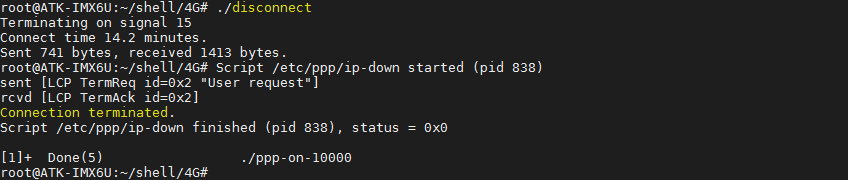<br />
图3.18.2 1 断开上一步的pppd拨号连接
</center>

&emsp;&emsp;查看该工具的用法，执行下面的指令。
```c#
quectel-CM -h
```

<center>
<br />
图3.18.2 2 查看quectel-CM用法
</center>

&emsp;&emsp;可以看到-s参数是指定apn类型，移动卡apn一般是cmnet，联通卡apn一般是3gnet，电信卡一般是ctnet。

&emsp;&emsp;备注：APN指一种网络接入技术，通常是通过手机上网时必须配置的一个参数，它决定了手机通过哪种接入方式来访问网络。
```c#
quectel-CM &         // 如果不清楚apn类型，可以直接输入quectel-CM
```

<center>
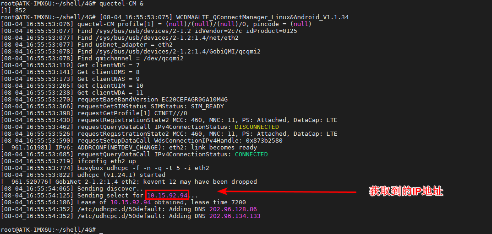<br />
图3.18.2 3 上网连接，获取IP
</center>

&emsp;&emsp;查看网卡信息，使用ifconfig指令，ALPHA开发板底板默认有两个网卡，已经使用eth0和eth1设备名，那么eth2就是4G网卡。可以看到quectel-CM获取了ip 10.15.92.94。
```c#
ifconfig
```

<center>
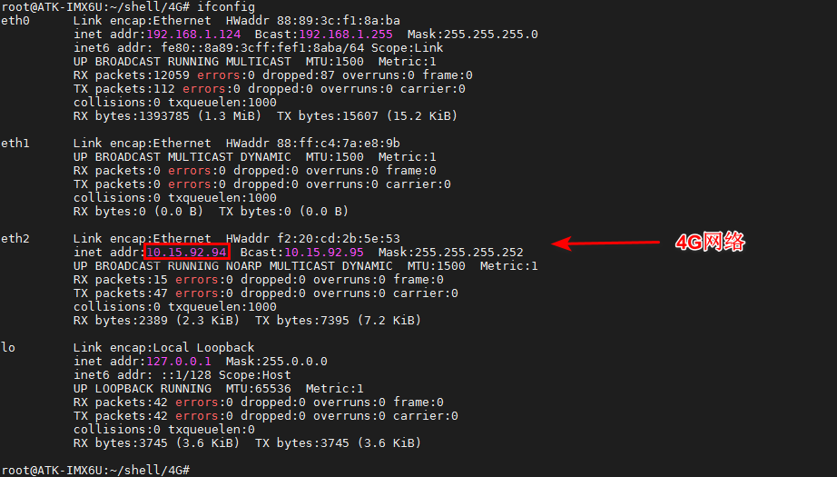<br />
图3.18.2 4 查看eth2获取的IP
</center>

&emsp;&emsp;因为笔者者已经插上网线，在上一步已经把eth0默认的路由表删除，所以无需再删除eth0路由表，现在默认就是选择eth2上网了。

&emsp;&emsp;执行下面的指令测试上网，参数“-I”指定网卡。这里要指定eth2网卡。可按“`Ctrl + C`”终止ping指令。出现如下结果，说明ping百度成功。
```c#
ping www.baidu.com -I eth2
```

<center>
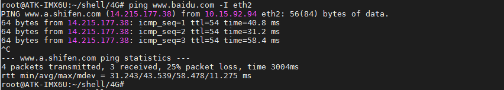<br />
图3.18.2 5 ping百度测试
</center>

