# 3.11 网口测试

<div class="imx6u_center-table-div">
<table class="imx6u_center-table">
  <tr>
    <th>ALPHA</th>
    <th>MINI</th>
  </tr>
  <tr>
    <td>本实验支持</td>
    <td>只支持一个网口eth0</td>
  </tr>
</table>
</div>

&emsp;&emsp;小提示：
ALPHA开发板有 eth0和eth1 两路百兆网卡。eth0对应底板上ENET2，eth1对应底板上的ENET1。可使用ifconfig指令来显示或者配置网络

&emsp;&emsp;查看网络信息。

```c#
ifconfig
```

<center>
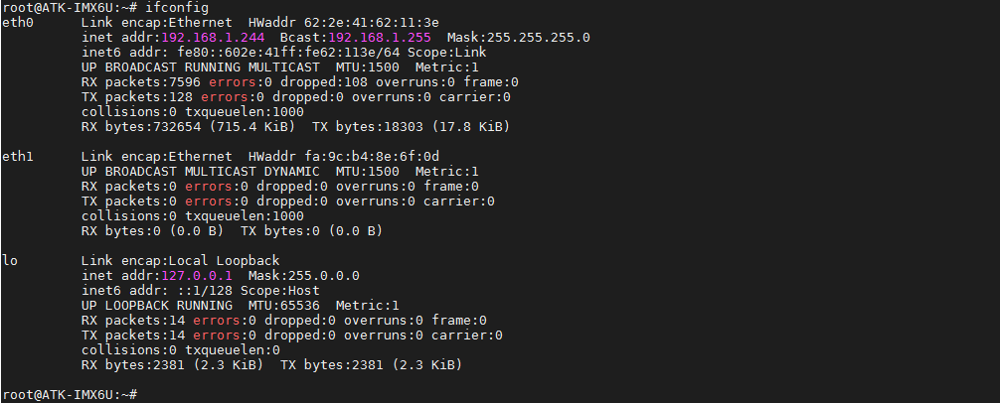<br />
图3.11 1使用ifconfig指令查看网卡信息
</center>

&emsp;&emsp;插上网线到ENET2处可以看到如下信息，系统自动获取了ip，eth1同理。

<center>
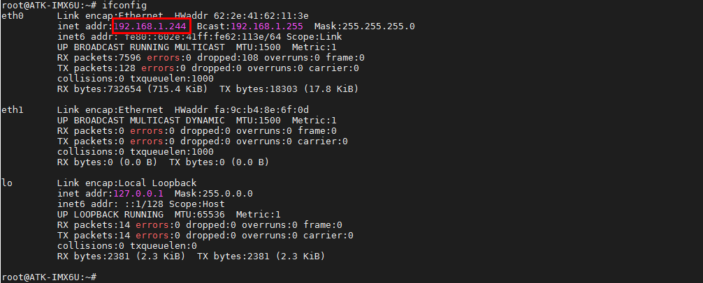<br />
图3.11 2 查看自动获取的ip
</center>

&emsp;&emsp;如果对应网卡没有自动获取到 IP，请使用下面的指令获取。“-i”是指定网卡名称，如不指定，会使用默认会使用eth0。

```c#
udhcpc -i eth0
```

<center>
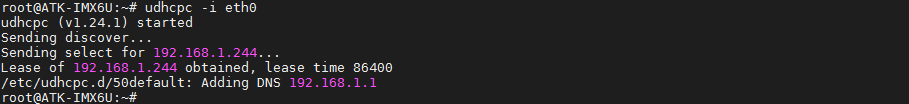<br />
图3.11 3 使用udhcpc手动获取ip
</center>

&emsp;&emsp;关闭与打开网口。

```c#
ifconfig eth1 down     // 关闭网口，网卡名字请根据实际情况修改，down表示关闭
ifconfig eth1 up       // 打开网口，网卡名字请根据实际情况修改，up表示打开
```

<center>
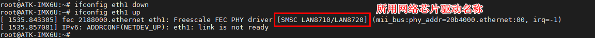<br />
图3.11 4 关闭与打开网口
</center>

&emsp;&emsp;测试网口是否能上网，以访问 www.baidu.com 为例，执行如下命令，**-I**代表指定网口，不加"-I"则使用默认网卡（默认网卡指的是有网络接入的一端，如果两个网口都有网络接入，则使用eth0作为默认网卡）。按**Ctrl+C**终止ping指令。百度的实际地址根据网络运营商不同，访问的地址会不同。

```c#
ping www.baidu.com -I eth0
```

<center>
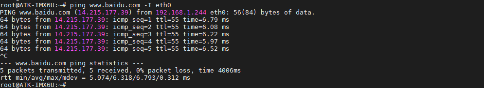<br />
图3.11 5 测试eth0联网
</center>

```c#
ping www.baidu.com -I eth1
```

<center>
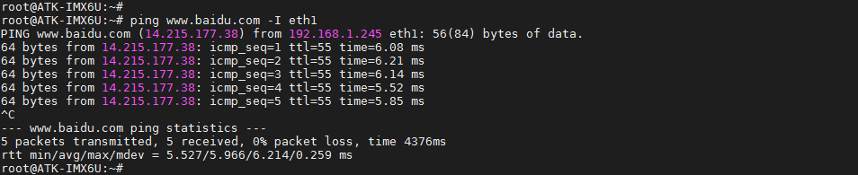<br />
图3.11 6 测试eth1 联网
</center>

&emsp;&emsp;查看网关后，并ping网关。

```c#
route 
```

<center>
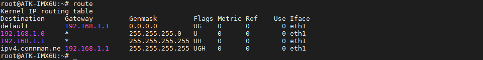<br />
图3.11 7 查看网关
</center>

&emsp;&emsp;由上可知网关为192.168.1.1，根据路由器不同，网关可能不同。ping网关可测试内网与开发板连接是否正常。下面指令不加“-I”参数，使用默认网卡。
ping 192.168.1.1

<center>
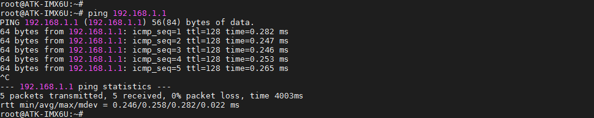<br />
图3.11 8 ping 网关
</center>

&emsp;&emsp;网络通信速度测试

&emsp;&emsp;小提示：
iperf3是一个网络性能测试工具。iperf可以测试最大TCP和UDP带宽性能，具有多种参数和UDP特性，可以根据需要调整，可以报告带宽、延迟抖动和数据包丢失。

&emsp;&emsp;测试Ubuntu与开发板通信速度。如果你的Ubuntu未安装iperf3，请在Ubuntu终端中执行"sudo apt-get install iperf3"安装。
查看Ubuntu的ip地址，备用。（这里要确保开发板的ip地址要与Ubuntu的ip地址是同一局域网内）。

&emsp;&emsp;本次测试Ubuntu作服务端，开发板作客户端，执行下面指令。

```c#
ifconfig
```

<center>
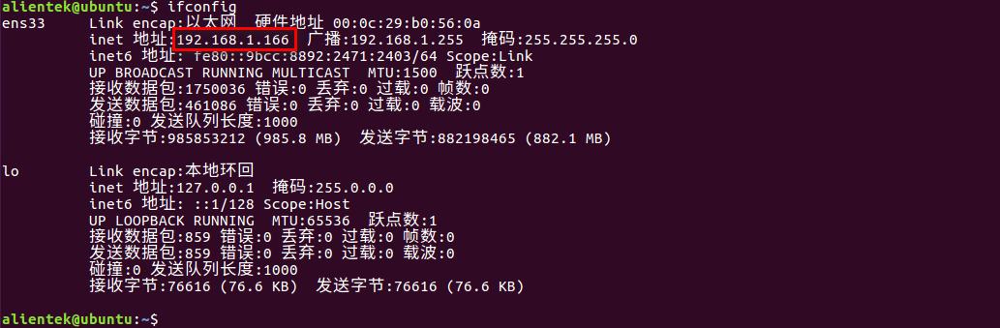<br />
图3.11 9 查看Ubuntu的ip地址
</center>

```c#
iperf3 -s      // Ubuntu作为服务端
```

<center>
<br />
图3.11 10 设置Ubuntu作为服务端
</center>

&emsp;&emsp;开发板作为客户端连接Ubuntu服务端。
```c#
iperf3 -c 192.168.1.84 -i 1   // -i 1 指通信周期，单位秒。
```

<center>
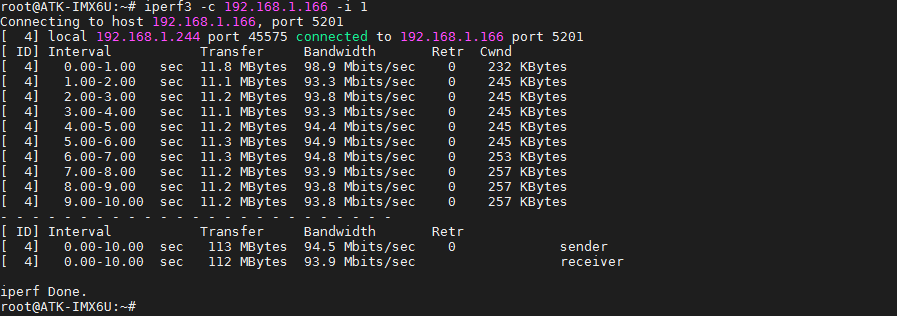<br />
图3.11 11开发板作为客户端并连接Ubuntu服务端
</center>

&emsp;&emsp;Ubuntu服务端打印如下信息。

<center>
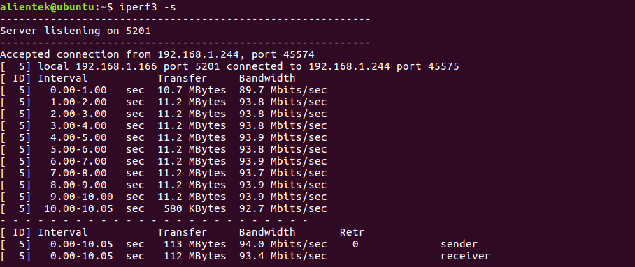<br />
图3.11 12 Ubuntu服务端打印的信息
</center>

&emsp;&emsp;反过来Ubuntu作客户端，开发板作服务端是一样的结果，这里就不浪费笔墨了。

