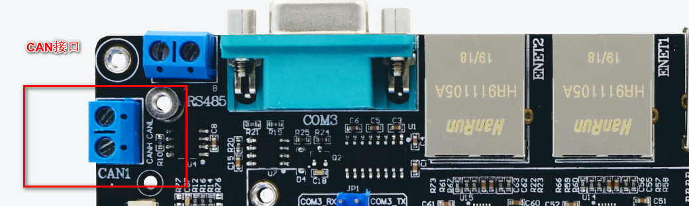
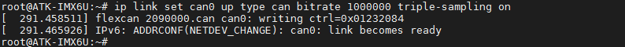
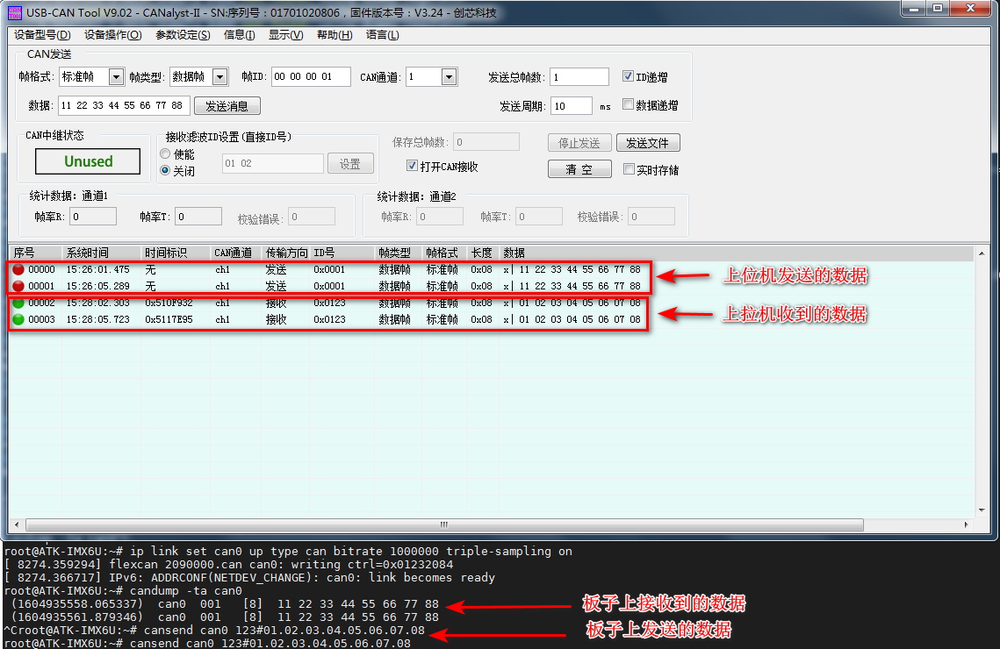

# 3.12 FlexCAN测试

&emsp;&emsp;开发板底板有一路CAN（注：核心板支持两路，底板只能用一路，另一路被复用了）。要想测试CAN，用户手上需要有测试CAN的仪器，（否则需要用两块不同的开发板的CAN或者其他CAN设备测试）比如周立功的CAN分析仪、创芯科技的CAN分析仪和广成科技的CAN分析仪等。或者可用两个CAN设备对接相互收发。

&emsp;&emsp;关于CAN仪器及CAN上位机的使用，请参照各厂商的使用说明书，如不会使用请咨询CAN分析仪厂家的技术支持。

&emsp;&emsp;CAN接口如下图，下图为ALPHA底板的位置，Mini底板CAN接口位置的不一样。

<center>
<br />
3.12 1 ALPHA底板的CAN接口
</center>

&emsp;&emsp;测试前请使用CAN分析仪或者测试CAN的设备连接好I.MX6U底板的CAN，CANH接仪器的CANH，CANL接CAN仪器的CANL。

&emsp;&emsp;设置 can0 的 can 设备通信波特率为 1000000，也就是最大通信波特率1MBit/s。

```c#
ip link set can0 up type can bitrate 1000000 triple-sampling on
```

<center>
<br />
3.12 2打开can设备并设通信波特率
</center>

&emsp;&emsp;使用candump指令接收来自can0的数据<br />
- ta: t代表打印时间，a代表开启ASCII输出

```c#
candump -ta can0
```

&emsp;&emsp;使用cansend指令发送数据。

```c#
cansend can0 123#01.02.03.04.05.06.07.08
```

解释：<br />
(1)	can0设备<br />
(2)	123：帧ID<br />
(3)	01.02.03.04.05.06.07.08：帧数据

&emsp;&emsp;如下图，使用创芯科技的CAN分析仪上面机界面与开发板收发数据如下。

<center>
<br />
3.12 3 上位机与底板收发数据演示
</center>


