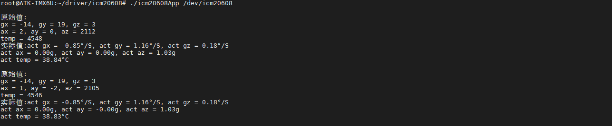

# 3.21 icm20608测试

<div class="center-table-div">
<table class="center-table">
  <tr>
    <th>ALPHA</th>
    <th>MINI</th>
  </tr>
  <tr>
    <td>本实验支持</td>
    <td>本实验不支持</td>
  </tr>
</table>
</div>


&emsp;&emsp;ICM-20608简介：

&emsp;&emsp;ICM-20608 是 InvenSense 出品的一款 6 轴 MEMS 传感器，包括 3 轴加速度和 3 轴陀螺仪。ICM-20608 尺寸非常小，只有 3x3x0.75mm，采用 16P 的 LGA 封装。

&emsp;&emsp;ICM-20608 内部有一个 512字节的 FIFO。陀螺仪的量程范围可以编程设置，可选择±250，±500，±1000 和±2000°/s，加速度的量程范围也可以编程设置，可选择±2g，±4g，±4g，±8g 和±16g。

&emsp;&emsp;陀螺仪和加速度计都是 16 位的 ADC，并且支持 I2C 和 SPI 两种协议，使用 I2C 接口的话通信速度最高可以达到 400KHz，使用 SPI 接口的话通信速度最高可达到 8MHz。

&emsp;&emsp;I.MX6U-ALPHA 开发板上的 ICM-20608 通过 SPI 接口和 I.MX6U 连接在一起。

ICM-20608 特性如下：

①、陀螺仪支持 X，Y 和 Z 三轴输出，内部集成 16 位 ADC，测量范围可设置：±250，±
500，±1000 和±2000°/s。<br />
②、加速度计支持 X，Y 和 Z 轴输出，内部集成 16 位 ADC，测量范围可设置：±2g，±4g，±4g，±8g 和±16g。<br />
③、用户可编程中断。<br />
④、内部包含 512 字节的 FIFO。<br />
⑤、内部包含一个数字温度传感器。<br />
⑥、耐 10000g 的冲击。<br />
⑦、支持快速 I2C，速度可达 400KHz。<br />
⑧、支持 SPI，速度可达 8MHz。<br />

&emsp;&emsp;I.MX6U-ALPHA 使用 SPI3 接口连接了一个六轴传感器 ICM-20608，由正点原子提供linux驱动程序与用户测试程序。
```c#
cd /home/root/driver/icm20608/
ls
```

<center>
<br />
图3.21 1 拷贝驱动文件与程序程序到文件系统
</center>

&emsp;&emsp;使用insmod指令安装驱动文件icm20608.ko，安装成功如下图。驱动在安装时会读取ICM-20608的ID信息，读取返回0XAE表明驱动正常。
```c#
insmod icm20608.ko   // 开机Qt GUI会默认加这个驱动，可不用执行这项
```

<center>
<br />
图3.21 2 安装驱动文件
</center>

&emsp;&emsp;同时在/dev/生成icm20608节点。
```c#
ls /dev/icm20608
```

<center>
<br />
图3.21 3 查看/dev下生成的icm20608节点
</center>

&emsp;&emsp;执行下面的指令可获取6轴传感器的值，应用程序会从`/dev/icm20608`节点不断获取并打印数据信息。
```c#
./icm20608App /dev/icm20608 
```

<center>
<br />
图3.21 4执行指令获取内部数据
</center>


