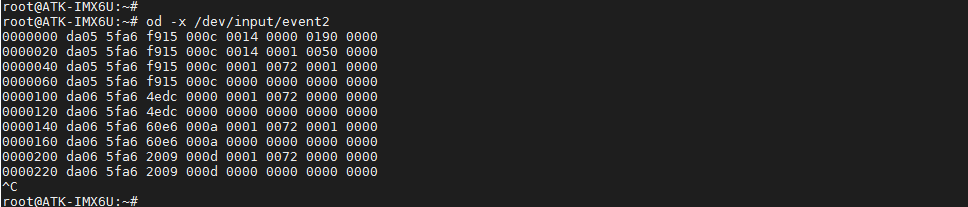

# 3.2 按键测试

底板上按键对应的管脚关系如下：

| 开发板     | GPIO18 |
| ---------- | ------ |
| ALPHA/Mini | KEY0   |

进入开发板系统，在串口终端执行如下指令查看按键所对应的输入事件。

```c#
lsinput
```


可以从上图看出按键事件号为 event2，触摸屏占用了event1，所以当触摸屏没有插上时按键事件号为不一定为 event2！执行下面的指令，进行按键测试，按下底板上的KEY0，打印出按键输入事件的信息如下，按“Ctrl + c”终止指令。

指令提示：hexdump 或者od -x指令都是以十六进制的形式打印出输入事件信息。由于文件系统没提供hexpdump指令，所以只测试od指令。


```c#
od -x /dev/input/event2
```




