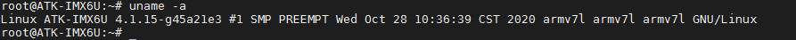
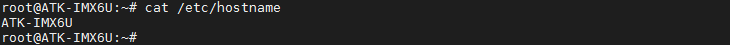
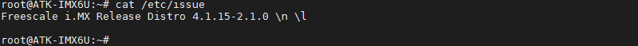
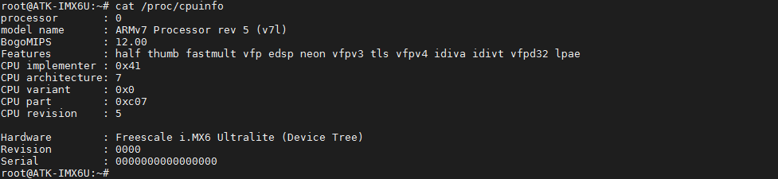
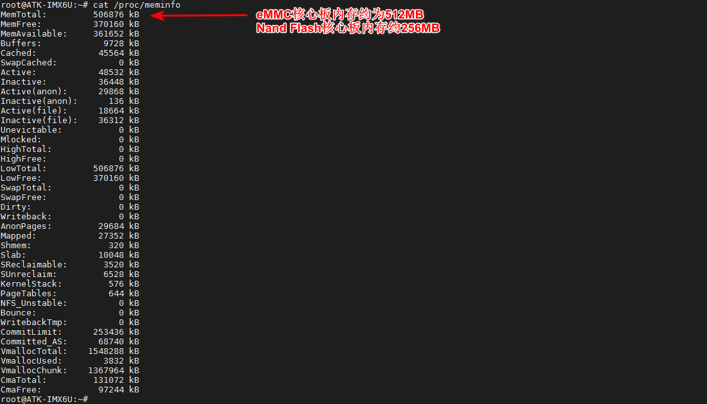

# 3.9 查看系统信息

&emsp;&emsp;显示操作系统的内核版本号。

```c#
uname -a
```

<center>
<br />
图3.9 1显示内核版本号
</center>

&emsp;&emsp;查看系统主机名。

```c#
cat /etc/hostname
```

<center>
<br />
图3.9 2 查看系统主机名
</center>

&emsp;&emsp;查看系统登录开机信息，（备注：非自动登录时会打印开机信息）。

```c#
cat /etc/issue
```

<center>
<br />
图3.9 3 查看系统登录欢迎信息
</center>

&emsp;&emsp;查看CPU相关信息。

```c#
cat /proc/cpuinfo
```

<center>
<br />
图3.9 4 查看CPU相关信息
</center>

&emsp;&emsp;查看内存相关信息。

```c#
cat /proc/meminfo
```

<center>
<br />
图3.9 5 查看内存相关信息
</center>


