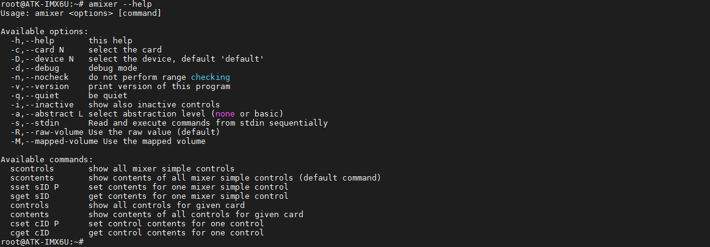
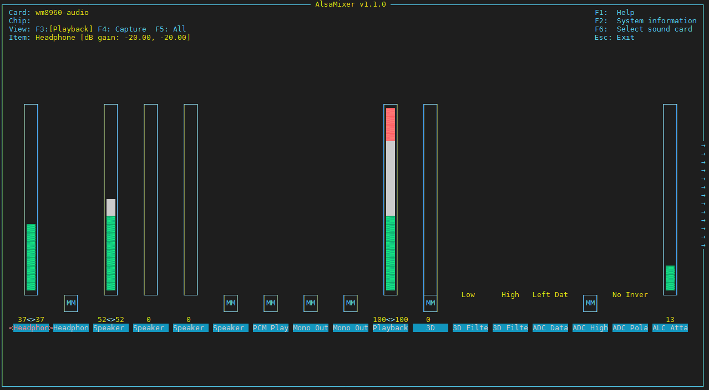
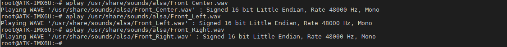
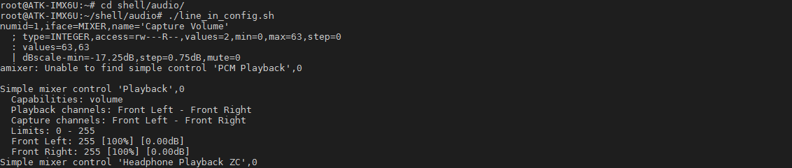
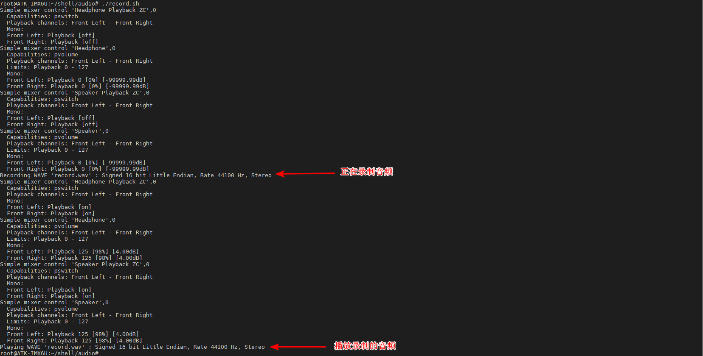
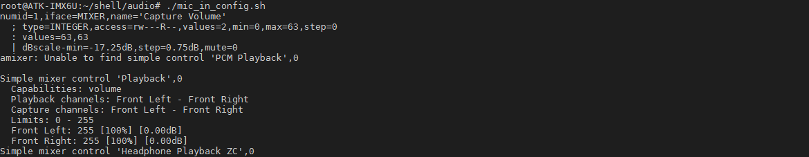

# 3.15 音频测试

| ALPHA  | MINI      |
| ------ | --------- |
| 支持本实验 | 本实验不支持，底板无音频，但是可接usb声卡 |

## 3.15.1 ALSA简单使用

ALSA（高级Linux声音架构）在Linux操作系统上提供了音频和MIDI（Musical Instrument Digital Interface，音乐设备数字化接口）的支持。

amixer 的使用：
```c#
amixer --help          // 查看amixer的用法说明
```



alsamixer的使用：
这里不得不说ALSA真的是强大啊，amixer是用指令控制音频设备，alsamixer则提供一套图形界面来控制音频设备，可以用键盘方向键来控制增减音量，打开或者关闭等。

输入下面的指令，打开alsamixer图形界面，可用键盘的左右上下方向键等键操作，退出直接按Esc按键。下图柱形图就是wm8960-audio的音频控制界面。
```c#
alsamixer
```



## 3.15.2 Headphone测试

开发板系统音频输出功能默认是打开的，下面两条指令可不执行。
```c#
amixer sset 'Left Output Mixer PCM' on
amixer sset 'Right Output Mixer PCM' on
```
播放音频文件时插耳机到PHONE接口处，可以通过下面的指令来设置耳机的音量，或者通过alsamixer图形界面的方法来设置音量。

设置播放音量，执行如下命令，音量的单位是dB，音量最小为 0，最大为127。
```c#
amixer sset Headphone 110,110            // 耳机音量设置为52
```

播放音频
播放开发板文件系统自带的音频，执行下面指令
```c#
aplay /usr/share/sounds/alsa/Front_Center.wav
aplay /usr/share/sounds/alsa/Front_Left.wav
aplay /usr/share/sounds/alsa/Front_Right.wav
```



## 3.15.3 Speaker测试

ALPHA开发板底板留出2路扬声器接口，一路是接左声道（SPKL），一路是接右声道（SPKR），其中底板的扬声器（小喇叭8欧2W）已经接在右声道（SPKR）上。
ALPHA开发板底板使用的音频芯片是WM8960 ，是一款低功耗立体声编解码器，采用 D 类扬声器驱动器，可在 8 欧负载下为每通道提供大于1 W功率。

注：测试外接扬声器（喇叭时），不要接插入耳机。

可不执行下面的指令设置扬声器的音量，默认音量为86。
```c#
amixer sset Speaker 110,110         // 扬声器（喇叭）的音量设置为52
```
同上面Headphone测试一样，执行播放音频的指令测试有声音出来即可。

## 3.15.4 LINE IN 音频输入测试

为了方便，正点原子提供设置音频输入的脚本和录音脚本，脚本里有注释，脚本内容仅供用户参考。

LINE IN录音内部无信号放大电路，使用一条3.5mm两头均为公头的音频线，一端连接开发板的LINE IN接口，另一端连接正在播放音乐的PC机或手机。
```c#
cd shell/audio/
./line_in_config.sh
```



执行record.sh开始录音（注record.sh会录一段10秒钟的录音保存为当前目录下名为record.wav的音频文件，录制音频完成后会自动播放record.wav，如果音频播放很小声，请将输入端的音量调高）。
```c#
./record.sh
```



## 3.15.5 MIC IN 录音测试

为了方便，正点原子提供测试麦克风输入的脚本和录音脚本，脚本里有注释，脚本内容仅供用户参考。
```c#
./mic_in_config.sh
```



执行record.sh开始录音（注record.sh会录一段10秒钟的录音保存为当前目录下名为record.wav的音频文件，录制音频完成后会自动播放record.wav，请对准备开发板底板上的麦头进行大声说话进行录音）。

```c#
./record.sh
```


