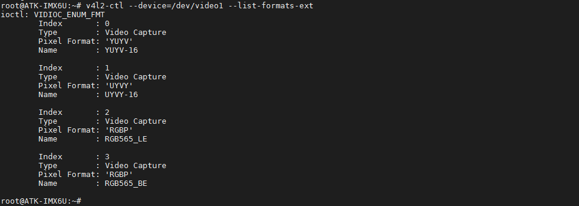

# 3.16 ov5640/ov2640/ov7725摄像头测试

&emsp;&emsp;正点原子I.MX6ULL开发板支持正点原子店铺的三款摄像头模块。ov5640（500万像素），ov2640(200万像素)，ov7725（不带FIFO款）(30万像素)。可以在正点原子店铺选购。支持YUYV及RGB565等格式采集。

## 3.16.1 ov5640摄像头

&emsp;&emsp;实验前请准备ov5640摄像头模块（500万像素），本公司的任何分辨率的RCB LCD电容屏。摄像头美照如下。

<center>
<br />
图3.16.1 1 正点原子ov5640模块
</center>

摄像头插法：

&emsp;&emsp;摄像头镜头往开发板外则直接插到CAMERA接口处。由于没有防反插设计，插摄像头时需要注意看底板丝印，按引脚编号对应插上。插上效果如下(下图为ALPHA开发板接法，Mini Linux开发板也一样，镜头朝外侧即可)。**注意不要与摄像头延长线连接，否则因延长线太长，导致信号干扰**。

<center>
<br />
图3.16.1 2 ov5640与AlPHA开发板接法
</center>

&emsp;&emsp;本实验使用本公司的ov5640模块通过CSI总线对视频进行实时采集。
插拨ov5640摄像头需要注意：
+ 该摄像头不支持热插拨，所以在插拨时都需要断电，再进行操作。
+ 插摄像头时请注意底板上的丝印要与摄像头上面的丝印对上，再插上摄像头。

&emsp;&emsp;ov5640在内核里是编译成模块形式的，插上ov5640摄像头，板子启动时可以看到如下信息。

<center>
<br />
图3.16.1 3 ov5640驱动模块加载信息
</center>

&emsp;&emsp;查看是否生成video1节点。（这里可能是video2，用户根据实际情况查看/dev下的video设备）。

&emsp;&emsp;注：一般是video1节点就是ov5640摄像头的节点，但是也会有特殊情况（需要看video设备驱动的加载顺序）。
```c#
ls /dev/video1
```

<center>
<br />
图3.16.1 4 查看ov5640的节点
</center>

&emsp;&emsp;查看出厂内核版本，在正点原子出厂内核v1.6版本之前（请在1.2.2小节查看出厂内核历史版本，检查用户所处的固件版本）是不支持RGB565和JPEG采集的。

&emsp;&emsp;同时在v1.6版本的内核添加以正点原子屏为大小的摄像头采集分辨率，如下图图3.16.1 4。其中`480x272，800x480，1024x600和1280x800`都是正点原子RGB屏的分辨率，设置这样的一个非标准采集分辨率是为了方便写应用程序，同时在有限的屏幕大小内，以相同的分辨率采集可节省显示性能。

&emsp;&emsp;查看摄像头支持格式、分辨率及帧率。

```c#
v4l2-ctl --device=/dev/video1 --list-formats-ext
```

<center>
<br />
图3.16.1 4 查看摄像头所支持的格式
</center>

### 3.16.1.1 使用gstreamer采集

+ 采集图像并显示

&emsp;&emsp;本次设置采集的图像分辨率为1024*768 30fps，如果需要设置其他分辨率采集需要严格按照上面的参数。执行下面指令开始采集，并显示到LCD上面，按“Ctrl + c”快捷键终止指令，停止采集。

&emsp;&emsp;由于使用gstreamer使用元件imxv4l2src不能设置JPEG格式采集，它只能设置YUYV格式和RGB565模式采集。YUYV格式传入字符参数是format=(string)YUY2，RGB565格式，传入的参数为RGB16。（注：测试前请退出Qt桌面。）：

```c#
gst-launch-1.0 -v imxv4l2src device=/dev/video1 ! "video/x-raw, format=(string)YUY2, \
width=(int)1024, height=(int)768, framerate=(fraction)30/1" ! imxv4l2sink
```

&emsp;&emsp;RGB565格式采集（测试前请退出Qt桌面。）：

```c#
gst-launch-1.0 -v imxv4l2src device=/dev/video1 ! "video/x-raw, format=(string)RGB16, \
 width=(int)1024, height=(int)768, framerate=(fraction)30/1" ! imxv4l2sink
```

<center>
<br />
图3.16.1.1 1 执行指令采集图像
</center>

&emsp;&emsp;屏幕使用本公司7寸800*480 RGB屏，采集图像十分流畅。图像如下：

<center>
<br />
图3.16.1.1 2 7寸屏上的图像
</center>

+ 保存视频

&emsp;&emsp;使用ov5640保存视频，本次就不作演示了。指令参考如下，注意对应ov5640的节点。录像完成后会在当前目录下保存一个video.yuv的视频文件。

&emsp;&emsp;把它上传到电脑使用yuv相关的播放器播放即可。由于pdf格式问题，复制时建议段复制）。

&emsp;&emsp;保存为yuv格式的视频

```c#
gst-launch-1.0 -vvv -e imxv4l2src num-buffers=1000 device=/dev/video1 ! "video/x-raw, \
format=(string)YUY2, width=(int)1024, height=(int)768, framerate=(fraction)30/1" ! \
filesink location=video.yuv
```

&emsp;&emsp;保存为avi格式的视频，由于用到jpegenc转换编码，性能不足，保存的慢，但是播放的快。所以保存的视频会有加快的现象。

```c#
gst-launch-1.0 -vvv -e imxv4l2src num-buffers=1000 device=/dev/video1 ! "video/x-raw, \ 
format=(string)YUY2, width=(int)320, height=(int)240, framerate=(fraction)30/1"  ! jpegenc \
! filesink location=video.avi
```
+ 拍照功能

&emsp;&emsp;使用下面的指令拍照，保存图像为yuv格式。

```c#
gst-launch-1.0 imxv4l2src num-buffers=1 device=/dev/video1 ! 'video/x-raw, \ 
format=(string)YUY2,width=1024,height=768' ! filesink location=picture.yuv
```

&emsp;&emsp;使用下面的指令拍照，保存图像为jpg格式。

```c#
gst-launch-1.0 imxv4l2src num-buffers=1 device=/dev/video1 ! jpegenc ! filesink location=picture.jpg
```

### 3.16.1.2 使用ffmpeg采集

&emsp;&emsp;由于ffmpeg不能直接设置ov5640摄像头的采集分辨率。所以正点原子编写了一个camera_settings应用指令，放在/usr/bin/目录下。

&emsp;&emsp;关于这个应用指令的使用方法如下。使用camera_settings应用指令可以设置ov5640的采集分辨率和采集格式，也可以设备USB摄像头的采集分辨率和采集格式。

```c#
camera_settings -help
```

<center>
<br />
图3.16.1.2 1 camera_settings的使用帮助
</center>

例：
```c#
camera_settings /dev/video1 RGB565 320 240 30
```
指令解释：

（1）	camera_settings:	正点原子编写的应用指令。<br />
（2）	/dev/video1:	ov5640设备节点<br />
（3）	RGB565:		设置摄像头的采集格式，ov5640支持 RGB565，YUYV，JPEG三种格式<br />
（4）	320:		设置采集的宽度<br />
（5）	240:		设置采集的高度<br />
（6）	30:		帧率，支持15帧和30帧

&emsp;&emsp;按上面的指令设置完成后ov5640摄像头的采集分辨率后，采集的图像分辨率越大，可能采集时性能不足，所以我们设置一个比较低的分辨率采集。我们就可以使用ffmpeg指令来保存视频等操作了。

&emsp;&emsp;注意，如果用户使用的是NandFlash类型的核心板（512MB存储大小，文件系统功能越来越丰富，NandFlash存储容量可能会不够），录制视频会占用大量存储量空间，请插入TF卡或者U盘都到开发板上。

&emsp;&emsp;使用cd命令进入到TF卡或者U盘的挂载目录下，一般是/run/media/sda1。这样视频就会保存到TF卡或者U盘的目录。

+ 保存视频，保存在当前目录。
```c#
ffmpeg -t 10 -pix_fmt rgb565le -i /dev/video1 video.avi
```

<center>
<br />
图3.16.1.2 2 使用ffmpeg保存ov5640摄像头录像视频
</center>

指令解释：<br />
（1）	ffmpeg:	ffmpeg指令<br />
（2）	-t 10:	设置采集时间为10s<br />
（3）	-pix_fmt rgb565le: 设置采集的格式，（RGB565）rgb565le采集，此外支持(YUYV)yuyv422    和（JPEG）yuyv422采集（这里为什么YUYV和JPEG一样是yuyv422，编者研究源码得出，暂时未确保准确性）。<br />
（4）	-i /dev/video1: 指定ov5640设备节点。<br />
（5）	video.avi:		输出文件名，不同的格式会自动选择不同的编码，目前测试avi格式流畅。

&emsp;&emsp;播放采集的录像
```c#
gst-play-1.0 video.avi
```

### 3.16.1.3 使用ov5640_camera采集

&emsp;&emsp;使用ov5640_camera指令（请在[1.2.2小节](../introduction%20to%20software%20and%20hardware%20resources/Introduction%20to%20Software%20Resources.md)查看出厂内核历史版本，检查用户所处的固件版本，ov5640_camera在v1.9出厂文件系统版本才有）直接采集显示在正点原子RGB LCD屏上。

&emsp;&emsp;ov5640_camera是正点原子编写的摄像头应用程序，放在/usr/bin/目录下。这个ov5640_camera根据正点原子屏幕的分辨率大小，设置相应分辨率采集，并全屏显示在正点原子RGB LCD屏幕上，仅供测试使用。

&emsp;&emsp;在开发板直接执行ov5640_camera，测试前请退出Qt桌面。采集的分辨率为屏幕的显示分辨率大小，帧数为30帧采集，采集显示在LCD屏上的图像非常流畅。
```c#
ov5640_camera
```

<center>
<br />
图3.16.1.3 1 执行ov5640_camera应用程序
</center>

## 3.16.2 ov2640摄像头

&emsp;&emsp;实验前请准备ov2640摄像头（200万像素），可在正点原子店铺购买。ov2640摄像头美照如下。

<center>
<br />
图3.16.2 1 正点原子ov2640摄像头模块
</center>

&emsp;&emsp;由于出厂系统默认是配置了ov5640摄像头，所以我们要在出厂系统源码里修改设备树，关闭ov5640摄像头，开启ov2640摄像头才能进行此实验。

&emsp;&emsp;修改内核源码的设备树，路径为内核源码顶层目录下的arch/arm/boot/dts/imx6ull-14x14-evk.dts ，编辑第324行及347行，将“ON”改为OFF即将其关闭，将“OFF”改为“ON”即将其打开。修改完成如下。
```c#
#if ATK_CAMERA_OFF
325         ov5640: ov5640@3c {
326                 compatible = "ovti,ov5640";
327                 reg = <0x3c>;
328                 pinctrl-names = "default";
329                 pinctrl-0 = <&pinctrl_csi1
330                              &csi_pwn_rst>;
331                 clocks = <&clks IMX6UL_CLK_CSI>;
332                 clock-names = "csi_mclk";
333                 pwn-gpios = <&gpio1 4 1>;
334                 rst-gpios = <&gpio1 2 0>;
335                 csi_id = <0>;
336                 mclk = <24000000>;
337                 mclk_source = <0>;
338                 status = "okay";
339                 port {
340                         camera_ep: endpoint {
341                                 remote-endpoint = <&csi_ep>;
342                         };
343                 };
344         };
345 #endif
346 
347 #if ATK_CAMERA_ON
348         ov2640: camera@0x30 {
349                 compatible = "ovti,ov2640";
350                 reg = <0x30>;
351                 status = "okay";
352 
353                 pinctrl-names = "default";
354                 pinctrl-0 = <&pinctrl_csi1
355                              &csi_pwn_rst>;
356                 resetb = <&gpio1 2 GPIO_ACTIVE_LOW>;
357                 pwdn = <&gpio1 4 GPIO_ACTIVE_HIGH>;
358                 clocks = <&clks IMX6UL_CLK_CSI>;
359                 clock-names = "xvclk";
360 
361                 port {
362                         camera_ep: endpoint {
363                                 remote-endpoint = <&csi_ep>;
364                                 bus-width = <8>;
365                         };
366                 };
367         };
368 #endif
```

&emsp;&emsp;修改完成后编译内核源码的详细请参考[4.4小节](../cross%20compiling/comple_core.md)。因为我们只修改了设备树，所以我们执行build.sh脚本编译后在tmp目录下找到所有的dtb文件，将其拷贝到`开发板光盘A-基础资料->5、开发工具->4、正点原子MFG_TOOL出厂固件烧录工具->mfgtool->Profiles->Linux->OS Firmware->files->boot`下的所有dtb文件。

&emsp;&emsp;然后再按[2.2小节](../preparation/curing_system.md)重新固化系统即可！如果不想重新烧写系统，亦可按照【正点原子】I.MX6U 开发板文件拷贝及固件更新参考手册V1.x.pdf单独烧录相应的设备树即可。

&emsp;&emsp;重新烧写系统后，再插上ov2640摄像头，接法与[3.16.1小节](#ov5640摄像头)的接法一样。在打印信息处，驱动加载后如下。

<center>
<br />
图3.16.2 2 摄像头驱动加载打印的信息
</center>

&emsp;&emsp;查看摄像头支持格式。

```c#
v4l2-ctl --device=/dev/video1 --list-formats-ext
```


### 3.16.2.1 使用gstreamer采集

+ 采集图像并显示

&emsp;&emsp;可以设置小于最大采集分辨率的采集分辨率(1600x1200)。由于pdf格式问题，复制时分段复制，这里format=(string)RGB16即RGB565采集，可支持format=(string)YUY2即YUYV格式采集。
```c#
gst-launch-1.0 -v v4l2src device=/dev/video1 ! "video/x-raw, format=(string)RGB16, \
width=(int)352, height=(int)288" ! imxv4l2sink
```

<center>
<br />
图3.16.2 3 查看驱动中正点原子ov2640摄像头支持的格式
</center>

&emsp;&emsp;效果图略，十分流畅。

&emsp;&emsp;拍照功能等请参考上一节ov5640的相关指令。

### 3.16.2.2 使用ov2640_camera采集

&emsp;&emsp;ov2640_camera应用程序是正点原子编写的一个用于测试的程序。在串口终端直接执行ov2640_camera即可。
```c#
ov2640_camera	如果是4.3寸屏480x272的屏幕可执行ov772x_camera指令。
```

<center>
<br />
图3.16.2.1 1 使用gstreamer采集
</center>

&emsp;&emsp;效果图略，十分流畅。

## 3.16.3 ov7725摄像头

&emsp;&emsp;实验前准备ov7725摄像头（30万像素）模块，30万像素这个完全足够I.MX6U使用。最大采集分辨率为640x480。在I.MX6U上缺点就是可支持的分辨率少。

&emsp;&emsp;不如ov5640与ov2640摄像头模块在驱动中所支持的分辨率多，仅支持正点原子的ov7725模块不带FIFO款。摄像头模块美照如下。

<center>
<br />
图3.16.3 1 正点原子ov7725摄像头模块
</center>

&emsp;&emsp;由于出厂系统默认是配置了ov5640摄像头，所以我们要在出厂系统源码里修改设备树，关闭ov5640摄像头，开启ov7725摄像头才能进行此实验。

&emsp;&emsp;修改内核源码的设备树，路径为内核源码顶层目录下的**arch/arm/boot/dts/imx6ull-14x14-evk.dts** ，编辑第324行及370行，将“ON”改为OFF即将其关闭，将“OFF”改为“ON”即将其打开。修改完成如下。
```c#
 #if ATK_CAMERA_OFF
325         ov5640: ov5640@3c {
326                 compatible = "ovti,ov5640";
327                 reg = <0x3c>;
328                 pinctrl-names = "default";
329                 pinctrl-0 = <&pinctrl_csi1
330                              &csi_pwn_rst>;
331                 clocks = <&clks IMX6UL_CLK_CSI>;
332                 clock-names = "csi_mclk";
333                 pwn-gpios = <&gpio1 4 1>;
334                 rst-gpios = <&gpio1 2 0>;
335                 csi_id = <0>;
336                 mclk = <24000000>;
337                 mclk_source = <0>;
338                 status = "okay";
339                 port {
340                         camera_ep: endpoint {
341                                 remote-endpoint = <&csi_ep>;
342                         };
343                 };
344         };
345 #endif
... ... 省略其他行
370 #if ATK_CAMERA_ON
371         ov7725: camera@0x21 {
372                 compatible = "ovti,ov772x","ovti,ov7725";
373                 reg = <0x21>;
374                 status = "okay";
375                 pinctrl-names = "default";
376                 pinctrl-0 = <&pinctrl_csi1
377                              &csi_pwn_rst>;
378                 resetb = <&gpio1 2 GPIO_ACTIVE_LOW>;
379                 pwdn = <&gpio1 4 GPIO_ACTIVE_HIGH>;
380                 clocks = <&clks IMX6UL_CLK_CSI>;
381                 clock-frequency = <20000000>;
382                 clock-names = "mclk";
383 
384                 port {
385                         camera_ep: endpoint {
386                                 remote-endpoint = <&csi>;
387                                 bus-width = <8>;
388                         };
389                 };
390         };
391 #endif
```

&emsp;&emsp;修改完成后编译内核源码的详细请参考[4.4小节](../cross%20compiling/comple_core.md)。

&emsp;&emsp;因为我们只修改了设备树，所以我们执行build.sh脚本编译后在tmp目录下找到所有的dtb文件，将其拷贝到`开发板光盘A-基础资料->5、开发工具->4、正点原子MFG_TOOL出厂固件烧录工具->mfgtool->Profiles->Linux->OS Firmware->files->boot`下的所有dtb文件。

&emsp;&emsp;然后再按[2.2小节](../preparation/curing_system.md)重新固化系统即可！如果不想重新烧写系统，亦可按照【正点原子】I.MX6U 开发板文件拷贝及固件更新参考手册V1.x.pdf单独烧录相应的设备树即可。

&emsp;&emsp;重新烧写系统后，再插上ov7725摄像头，接法与[3.16.1小节](#ov5640摄像头)的接法一样。在打印信息处，驱动加载后如下。

<center>
<br />
图3.16.3 2 正点原子ov7725摄像头模块驱动加载的信息
</center>

&emsp;&emsp;查看摄像头支持的格式。
```c#
v4l2-ctl --device=/dev/video1 --list-formats-ext
```

<center>
<br />
图3.16.3 3 查看驱动中正点原子ov7725摄像头支持的格式
</center>

### 3.16.3.1 使用gstreamer采集

+ 采集图像并显示

&emsp;&emsp;可以设置采集分辨率640x320与320x240分辨率采集。这里format=(string)RGB16即RGB565采集，可支持format=(string)YUY2即YUYV格式采集。

&emsp;&emsp;（注意，由于最初正点原子摄像头ov7725是设计给单片机竖屏使用的，所以在横屏的I.MX6U中可能看到的图像是90度旋转的，这并不是驱动的问题，我们可以将摄像头侧着拍摄，图像则转正，在使用效果上是没有任何影响的，采集的图像也非常清晰，虽然只有640x480分辨率的大小）。
```c#
gst-launch-1.0 -v v4l2src device=/dev/video1 ! "video/x-raw, format=(string)RGB16, \
width=(int)640, height=(int)480" ! imxv4l2sink
```

<center>
<br />
图3.16.3.1 2 使用gstreamer采集
</center>

&emsp;&emsp;效果图略，十分流畅。

&emsp;&emsp;拍照功能等请参考上上一节ov5640的相关指令。

### 3.16.3.2 使用ov772x_camera采集

&emsp;&emsp;Ov772x_camera应用程序是正点原子编写的一个用于测试的程序。在串口终端直接执行ov772x_camera即可。
```c#
ov772x_camera
```

<center>
<br />
图3.16.3.2 1 使用正点原子编写的ov772x_camera程序采集
</center>

&emsp;&emsp;效果图略，十分流畅。

