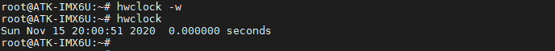

# 3.8 系统时钟与RTC时钟

&emsp;&emsp;小提示：
测试RTC时钟要安装上钮扣电池。

&emsp;&emsp;Linux系统分两个时钟，一个是system time（软件时钟），一个是hardware clock（硬件时钟，6ULL芯片内部有RTC硬件时钟（可能不太精准））。使用date和hwclock命令可分别查看和设定系统时间和硬件时间。系统时钟掉电即会消失，RTC 时钟在有电池的情况下会长期运行。系统时钟会在系统重启时与 RTC 时钟同步。
查看系统时钟，使用指令date。

```c#
date
```

<center>
<br />
图3.8 1 查看系统时钟的时间
</center>

&emsp;&emsp;查看硬件（RTC）时钟，使用指令hwclock。

```c#
hwclock
```

<center>
<br />
图3.8 2 查看硬件时钟
</center>

&emsp;&emsp;设置系统时钟，设置当前时间，然后查看设置的系统时间。例如当前时间是2020年11月15日 下午20:00:00。指令如下：

```c#
date -s "2020-11-15 20:00:00"       // 设置当前系统时钟
date                                // 查看当前系统时钟
```

<center>
<br />
图3.8 3 设置系统时钟
</center>

&emsp;&emsp;将系统时钟写入硬件时钟。

```c#
hwclock -w                          // 将系统时钟同步至硬件时钟	
hwclock                             // 查看硬件时钟
```

<center>
<br />
图3.8 4 将系统时钟写入硬件时钟
</center>


