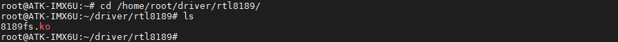
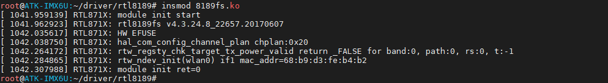
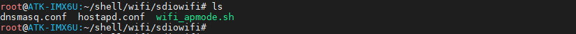

# 3.24 SDIO WIFI测试

实验前准备正点原子SDIO WIFI模块（RTL8189），非赠送，可以在正点原子官方淘宝店铺购买，推荐使用。


由于底板SDIO WIFI接口与TF卡槽接口共用了大部分管脚，所以在使用SDIO WIFI时不能使用TF卡。也就是说，我们测试SDIO WIFI时不能从TF卡启动系统。我们应该从eMMC或者Nand Flash启动系统。**注意，不要同时插入SDIO WIFI与USB WIFI。因为测试脚本里默认写的是wlan0，只能是其中一个WIFI**。

本次实验我们从eMMC启动系统，启动系统前，请将SDIO WIFI模块插进SDIO接口处，如下图所示：


RTL8189的驱动文件出厂默认放在/home/root/driver/rtl8189/目录下，执行下成的指令查看。
```c#
cd /home/root/driver/rtl8189/
ls
```



```c#
cd /home/root//driver/rtl8189
insmod 8189fs.ko #若提示已经装上就无需再装，出厂UI界面设置App启动时会加载驱动
```



## 3.24.1 Staion(上网) 模式

与[之前小节](./usbwifi_test.md#station上网模式)操作一样。请参考上述操作步骤。使用connmanctl命令行交互指令来连接WIFI。

## 3.24.2 SoftAP(热点) 模式

与[之前小节](./usbwifi_test.md#softap热点模式)操作一样。请参考上述的操作步骤，不同的是，需要进入如下路径！
```c#
cd /home/root/shell/wifi/sdiowifi/
```



需要修改热点名称及热点密码请修改/home/root/shell/wifi/sdiowifi/hostapd.conf文件！