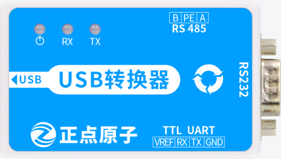
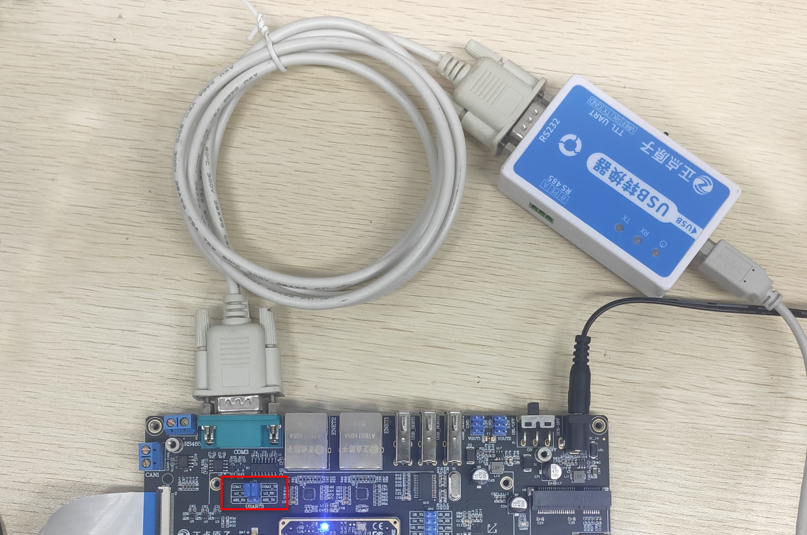
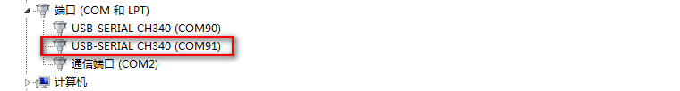
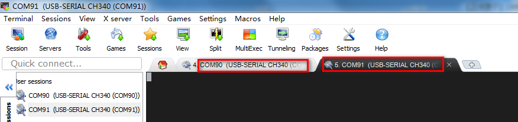
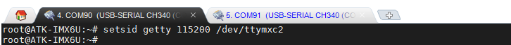
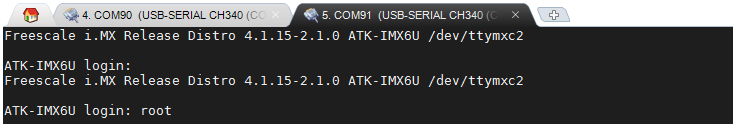
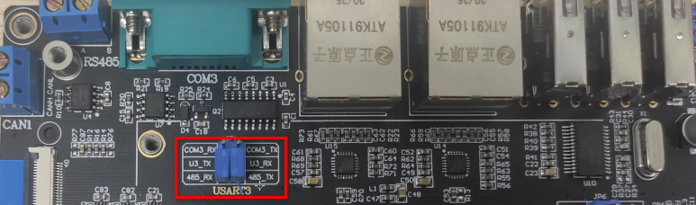

# 3.4 串口测试

## 3.4.1 RS232串口测试

&emsp;&emsp;底板上按键对应的管脚关系如下：

<div class="imx6u_center-table-div">
<table class="imx6u_center-table">
  <tr>
    <th>ALPHA</th>
    <th>MINI</th>
  </tr>
  <tr>
    <td>本实验支持</td>
    <td>本实验不支持，但是可以使用USB转换器模块的TTL UART直接接MINI板JP3处测试</td>
  </tr>
</table>
</div>


&emsp;&emsp;测试前准备正点原子USB转换器和RS232转接头（或者直接用USB转公头RS232串口线）。如下图，下图准备的是正点原子的USB转换器。可以测试RS232与RS485等。（注：[测试RS485](#rs485串口测试)也是用这个模块。）

<center>
<br />
图3.4.1 1 正点原子USB转换器模块
</center>

&emsp;&emsp;底板RS232接口与RS485接口的Tx与Rx是共用的，使用时需要使用跳线帽进行切换。RS232串口线的一头公头接到开发板底板的COM3接口处，另一头母头连接USB转换器再连接计算机的USB接口。测试前请将跳帽将U3_Tx与COM3_Rx连接，U3_Rx与COM3_Tx连接。连接方法示意及切换跳线帽的位置如下图。

<center>
<br />
图3.4.1 2 RS232接口与切换跳线帽的位置
</center>

&emsp;&emsp;在计算机的设备查看USB转换器的端口号。编者的端口号有两个，一个是开发板USB调试串口的，另一个就是USB转换器的端口号了。

<center>
<br />
图3.4.1 3 在设备管理器查看USB转换器的端口号
</center>

&emsp;&emsp;在MobaXterm里连接COM91，和调试串口设置的方法一样，设置波特率为115200，8N1。可以看到COM90为编者的调试串口（USART1），COM91为开发板底板的COM3(USART3)串口。

<center>
<br />
图3.4.1 4 连接的RS232串口COM3
</center>

&emsp;&emsp;在USART1串口调试终端COM90输入下面的指令，将RS232也设置成一个串口终端。

```c#
setsid getty 115200 /dev/ttymxc2
```

<center>
<br />
图3.4.1 5 使用指令设置RS232为一个串口终端
</center>

&emsp;&emsp;这样可以像调试串口一样输入登录用户名root，即可进入系统。这样能输入指令并返回结果，表明RS232串口正常。

<center>
<br />
图3.4.1 6 输入“root”指令登录开发板
</center>

## 3.4.2 RS485串口测试

&emsp;&emsp;与RS232测试方法一样，使用USB转换器测试RS485接口（或者用户手上有其他RS232转RS485的模块亦可）。测试前请将跳帽将U3_Tx与485_Rx连接，U3_Rx与485_Tx连接。切换跳线帽的位置如下图。

<center>
<br />
图3.4.2 1 切换跳线帽的位置
</center>

&emsp;&emsp;将USB转换器上的**RS485端口的A**用铜线接到**开发板RA485端口的A处**，USB转换器上的**RS485端口的B**用铜线接到**开发板RA485端口的B处**。
在计算机的设备查看USB转换器的端口号。编者的端口号有两个，一个是开发板USB调试串口的，另一个就是USB转换器的端口号了。

&emsp;&emsp;剩余测试步骤和[前小节](#rs232串口测试)的一样，不再重复累赘了。

