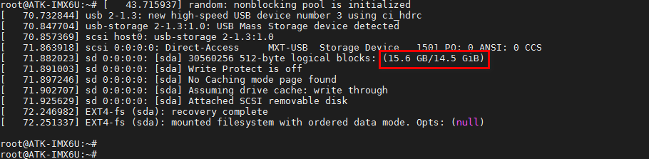
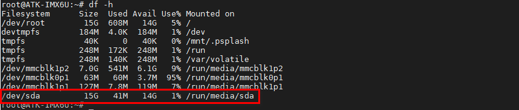
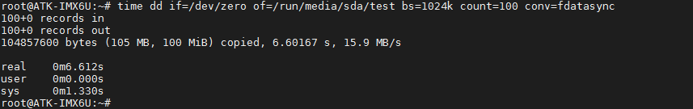
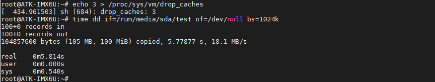
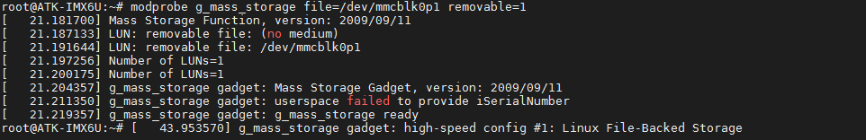
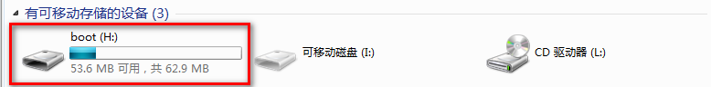
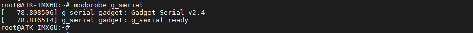
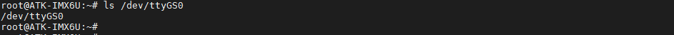
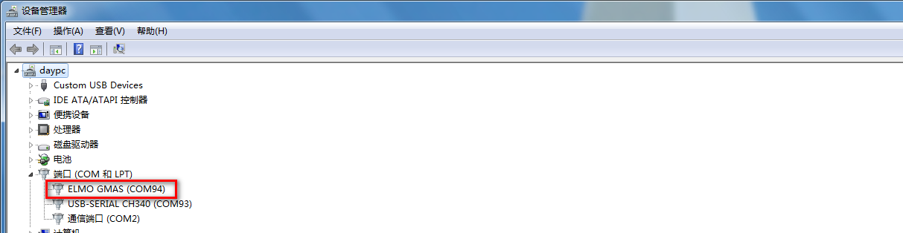
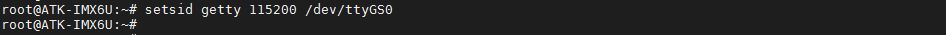

# 3.13 USB接口测试

&emsp;&emsp;ALPHA底板USB/OTG接口说明：
+ USB_HOST1~USB_HOST3为HOST模式，默认为HOST模式；
+ USB1_HOST支持 HOST模式；USB_OTG1支持切换为 HOST/DEVICE 

&emsp;&emsp;Mini底板只有一个USB_HOST

## 3.13.1 HOST模式读写测试

&emsp;&emsp;以下实验根据使用的U盘或TF卡的不同和实验环境不同，测试结果会有所差异。

&emsp;&emsp;将U盘 或TF卡用读卡器插到开发板 USB_HOST1~USB_HOST3/USB1_HOST其中一个接口。

&emsp;&emsp;插入后会打印如下信息，可以从中看到 U 盘大小和挂载名，如下图所示：

<center>
<br />
图3.13.1 1 挂载的U盘信息
</center>

&emsp;&emsp;使用df -h 查看U盘的挂载路径，可以看到下图U盘已经挂载在/run/media/下，挂载名为sda。

```c#
df -h
```

<center>
<br />
图3.13.1 2　查看U盘的挂载路径
</center>

写速度测试：
```c#
time dd if=/dev/zero of=/run/media/sda/test bs=1024k count=100 conv=fdatasync
```

<center>
<br />
图3.13.1 3写速度测试
</center>

&emsp;&emsp;本次写100MiB，速度为15.9 MB/s。

&emsp;&emsp;读速度测试：

小提示：

&emsp;&emsp;因为LINUX的内核机制，一般情况下不需要特意去释放已经使用的cache。这些cache内容可以增加文件的读写速度。

&emsp;&emsp;执行下面指令清除缓存。

```c#
echo 3 > /proc/sys/vm/drop_caches
```

&emsp;&emsp;执行下面的指令读取前面用dd指令写入的test文件。

```c#
time dd if=/run/media/sda1/test of=/dev/null bs=1024k
```

<center>
<br />
图3.13.1 4 读速度测试
</center>

&emsp;&emsp;这里一共读出了100 MiB test文件，速度为18.1 MB/s。

## 3.13.2 DEVICE模式测试

&emsp;&emsp;本实验将TF卡的第一个分区“boot”分区模拟成U盘，请使用一根USB转串口线接在USB_OTG1处，并连接PC端USB接口。

&emsp;&emsp;在串口终端执行下面指令，就可以将开发板的TF卡模拟成U盘挂载在PC上。

```c#
modprobe g_mass_storage file=/dev/mmcblk0p1 removable=1
```

<center>
<br />
图3.13.2 1 将开发板boot分区模拟成一个U盘
</center>

&emsp;&emsp;如下图，已经将TF卡的第一个分区成功的挂载在PC上。可以当作U盘一样使用。

<center>
<br />
图3.13.2 2 模拟成一个U盘成功
</center>

## 3.13.3 USB SERIAL测试

&emsp;&emsp;本实验将USB_OTG1当作串口使用。将另一根USB转串口线接到USB_OTG1处，然后连接PC，在串口终端下执行如下指令。(注:如果使用了上小节的DEVICE模式，需要重启开发板再做此实验)。

```c#
modprobe g_serial
```

<center>
<br />
图3.13.3 1 将USB_OTG1模拟成一个串口
</center>

&emsp;&emsp;查看是否生成/dev/ttyGS0节点。

```c#
ls /dev/ttyGS0
```

<center>
<br />
图3.13.3 2 查看生成的节点
</center>

&emsp;&emsp;同时可以在PC设备管理器处，查看端口号

<center>
<br />
图3.13.3. 3 在设备管理器查看端口号
</center>

&emsp;&emsp;开启守护进程。

```c#
setsid getty 115200 /dev/ttyGS0 
```

<center>
<br />
图3.13.3 4 开启守护进程，设置模拟成一个串口终端
</center>

&emsp;&emsp;然后用SecureCRT或者MobaXterm软件工具连接到该端口号。打开串口调试终端，选择正确的 COM 口，波特率为 115200，8N1，无检验位，并建立串口连接，按下回车键，可以后其他串口终端一样使用了。


