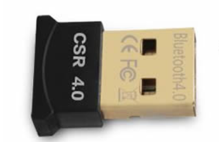
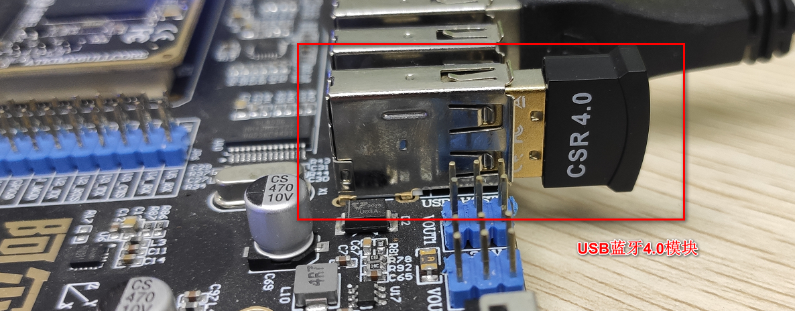
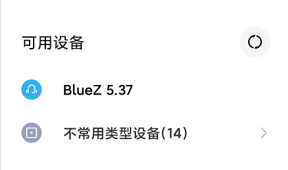
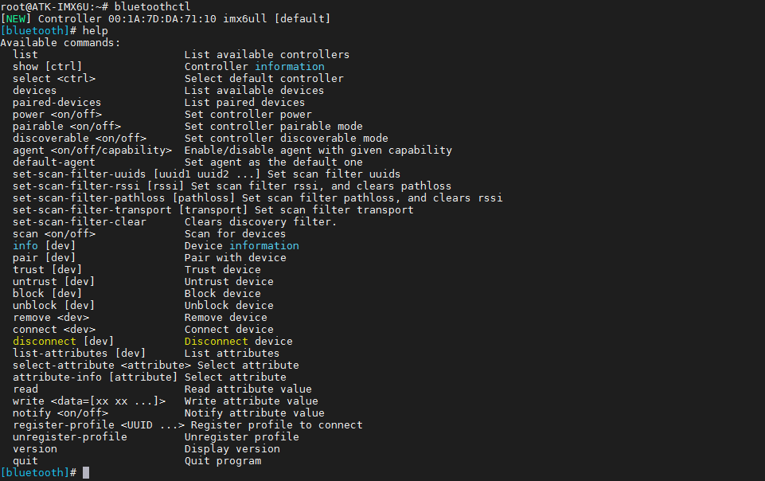
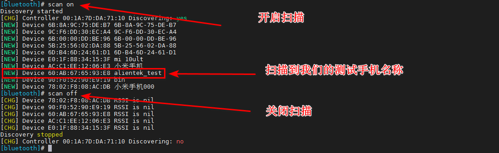
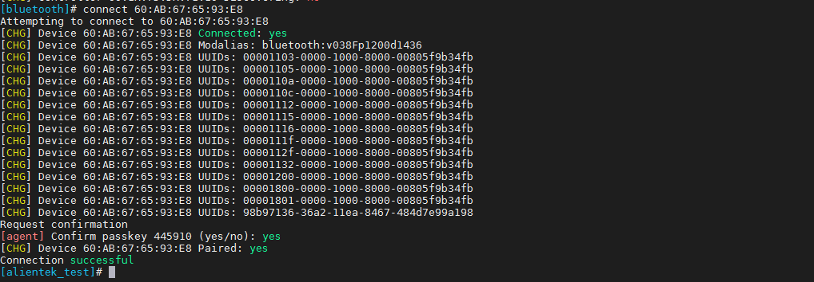
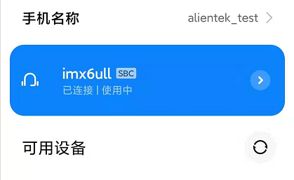
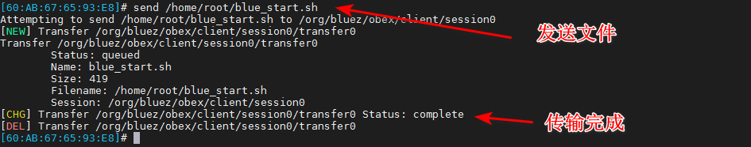
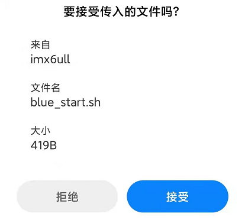

# 3.29 USB蓝牙测试

&emsp;&emsp;（**本小节非必须测试，有兴趣的可测试，笔者在这里不建议测试，若要无线通信，建议使用USB WIFI或者SDIO WIFI即可！**）准备一个USB蓝牙，请自行在网上购买（十几二十块RMB就可以买到一个），如下图。使用的是CSR蓝牙芯片，一般免驱动（**请结合实际情况，网上售卖的USB蓝牙模块不全部适用，请咨询卖家是否可以在linux上使用**）。

&emsp;&emsp;可在Window/Linux下直接使用。下图的测试的是蓝牙4.0版本的蓝牙模块（蓝牙5.0请自行测试）。

<center>
<br />
图3.29 1 USB蓝牙模块
</center>

&emsp;&emsp;在正点原子的出厂文件系统里有BlueZ，一种开源的蓝牙协议栈，并带有相关的蓝牙测试工具，可以很方便的测试蓝牙。

&emsp;&emsp;蓝牙支持热插拨，所以在开发板开机后插上USB蓝牙模块如下图。

<center>
<br />
图3.29 2 ALPHA开发板插上USB蓝牙模块
</center>

&emsp;&emsp;开启蓝牙，编辑一个脚本。v2.3版本文件系统里/home/root/shell/bluetooth/已经提供了bluetooth_start.sh脚本，可以直接执行，如果您的文件系统不是v2.3版本，需要用户自己制作bluetooth_start.sh脚本。
```c#
vi bluetooth_start.sh
```

&emsp;&emsp;在blue_start.sh添加以下内容，按Esc键后，再按:wq保存退出。注意有个“:”号不要漏了。
```c#
#!/bin/sh 
#由于出厂系统已经使用rfkill管射频之类的设备，在没有用到这类设备时是关闭它的射频的， 
#达到省电的目的，现在我们解锁射频 
rfkill unblock all 
sleep 1 
#开启蓝牙网络（使能USB蓝牙设备） 
hciconfig hci0 up
sleep 1 
#启动bluetoothd服务 
/etc/init.d/bluetooth start
sleep 2
#开启蓝牙被扫描
hciconfig hci0 piscan
```
&emsp;&emsp;赋予bluetooth_start.sh脚本可执行权限
```c#
chmod +x bluetooth_start.sh
```
&emsp;&emsp;启动蓝牙。
```c#
./bluetooth_start.sh
```

<center>
<br />
图3.29 3 启动蓝牙相关服务
</center>

&emsp;&emsp;在上面启动了蓝牙之后，用手机可扫描到蓝牙名称BlueZ 5.37。如下图。

<center>
<br />
图3.29 4 手机识别到的蓝牙名称
</center>

&emsp;&emsp;之所以会扫描出BlueZ 5.37这个名称，是系统里BlueZ的版本为5.37。我们可以修改这个蓝牙的名称。

&emsp;&emsp;使用hciconfig指令，关于hciconifg指令的用法，可输入“hciconfig -h”自行查看，这里不多解释，尽量把常用的写出来。

&emsp;&emsp;查看当前蓝牙的名称。
```c#
hciconfig hci0 name
```

<center>
<br />
图3.29 5 查看当前蓝牙名称
</center>

&emsp;&emsp;输入下面的指令修改蓝牙的名称，再查看。（注意：可能有些蓝牙模块可能修改不能成功，手机扫描出的名称还是BlueZ 5.37）
```c#
hciconfig hci0 name imx6ull
hciconfig hci0 name
```

<center>
<br />
图3.29 6 修改蓝牙名称
</center>

## 3.29.1 蓝牙建立连接

&emsp;&emsp;我们可以使用bluetoothctl蓝牙工具进行与蓝牙进行交互，输入指令后可以看到蓝牙的MAC地址。
```c#
bluetoothctl
```

<center>
<br />
图3.29.1 1 进入bluetoothctl交互
</center>

&emsp;&emsp;输入help查看bluetoothctl的用法。

<center>
<br />
图3.29.1 2 查看bluetoothctl相关用法
</center>

&emsp;&emsp;继续输入下面的指令，开启蓝牙的电源、代理。
```c#
power on
agent on
default-agent
```

<center>
<br />
图3.29.1 3 开启相关指令
</center>

&emsp;&emsp;开启蓝牙扫描。输入scan on等待扫描之后结果，输入scan off关闭扫描。主要得到我们的测试手机的蓝牙MAC地址与名称。
```c#
scan on
scan off
```

<center>
<br />
图3.29.1 4 扫描测试手机的蓝牙
</center>

&emsp;&emsp;主动连接我们的测试手机蓝牙。输入connect指令。
指令格式为connect XX:XX:XX:XX:XX:XX，XX:XX:XX:XX:XX:XX请填上个人手机蓝牙的MAC地址。
```c#
trust 60:AB:67:65:93:E8         // 连接前最好信任这个设备
connect 60:AB:67:65:93:E8
```

<center>
<br />
图3.29.1 5 连接手机蓝牙
</center>

&emsp;&emsp;默认确认PIN码，或者不需要输入PIN码，根据蓝牙的不同类型而不同。选择购买的蓝牙最好是不需要输入PIN码，方便连接。

&emsp;&emsp;当我们的代理开启时，蓝牙自动发送随机PIN码到手机（有些蓝牙模块可能需要手动输入PIN码），我们点击配对即可连接。

<center>
<br />
图3.29.1 6 与手机配对
</center>

&emsp;&emsp;连接成功后，手机上也显示已经连接。如下图。

<center>
<br />
图3.29.1 7 与手机连接成功
</center>

## 3.29.2 蓝牙音乐

<div class="imx6u_center-table-div">
<table class="imx6u_center-table">
  <tr>
    <th>ALPHA</th>
    <th>MINI</th>
  </tr>
  <tr>
    <td>本实验支持</td>
    <td>不支持，无音频。可以用USB声卡尝试做本实验</td>
  </tr>
</table>
</div>


&emsp;&emsp;查看文件系统版本，请在[1.2.2小节](../introduction%20to%20software%20and%20hardware%20resources/Introduction%20to%20Software%20Resources.md)查看文件系统历史版本，文件系统需要在V2.0以上版本才支持蓝牙音乐。

&emsp;&emsp;如下图，在手机与板子上的USB蓝牙模块连接后，手机会识别蓝牙成一个耳机设备，SBC是一种音频格式，音频一般，大多数蓝牙耳机都是这种格式。

<center>
<br />
图3.29.2 1 手机显示蓝牙为SBC耳机类型设备
</center>

&emsp;&emsp;此时手机打开音乐，ALPHA的底板喇叭就会播放手机上的歌曲。

## 3.29.3 蓝牙传送文件

&emsp;&emsp;在bluetoolctl交互终端输入discoverable on，配置蓝牙可被发现。如果没有在bluetoolctl开启可被发现，手机向板子上的蓝牙发送文件时，可能会找不到蓝牙设备。

<center>
<br />
图3.29.3 1 开启蓝牙被发现
</center>

&emsp;&emsp;退出bluetoolctl，输入exit或者quit退出。因为我们在[3.29.1小节](#蓝牙建立连接)已经了配对，我们可以直接连接。

&emsp;&emsp;在终端输入如下指令，先开启dbus服务，启动obexctl，配置蓝牙发送与接收，使用的是OBEX协议协输。注意“`”这个符号，是键盘左上角数字1隔壁的字符“`”。开启成功和连接成功如下。
```c#
eval `dbus-launch --sh-syntax`
/usr/libexec/bluetooth/obexd -r /home/root -a -d & obexctl   // 进入obexctl交互模式
connect 60:AB:67:65:93:E8     // 连接手机蓝牙，请填写个人手机蓝牙MAC
```
obexd参数解释：

（1）  -r：设置用于接收的路径<br />
（2）  -a：设置自动接收<br />
（3）  -d：打印 debug 信息

&emsp;&emsp;开启命令行测试工具 obexctl

<center>
<br />
图3.29.3 2 进入obexctl交互模式
</center>

&emsp;&emsp;发送/home/root/blue_start.sh这个脚本到手机，输入下面的指令。由于脚本文件较小，传输比较快。
```c#
send /home/root/blue_start.sh
```

<center>
<br />
图3.29.3 3 发送文件
</center>

&emsp;&emsp;手机接收到发来的文件弹窗，我们点击接受即可。

<center>
<br />
图3.29.3 4 手机收到板子的USB蓝牙发送的文件
</center>

&emsp;&emsp;反过来也一样，手机也可以向板子发送文件，默认存放在/home/root目录下。

## 3.29.4 更多蓝牙工具

&emsp;&emsp;使用l2ping可以像ping命令一样检查蓝牙是否能在线
```c#
l2ping 蓝牙地址
```
&emsp;&emsp;查看蓝牙设备的可用服务
```c#
sdptool browse 蓝牙地址
```


