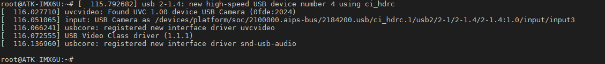
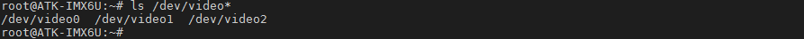
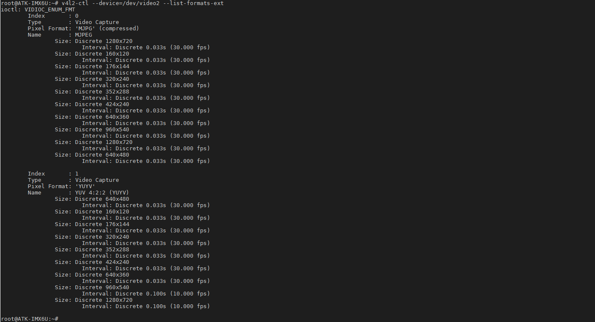
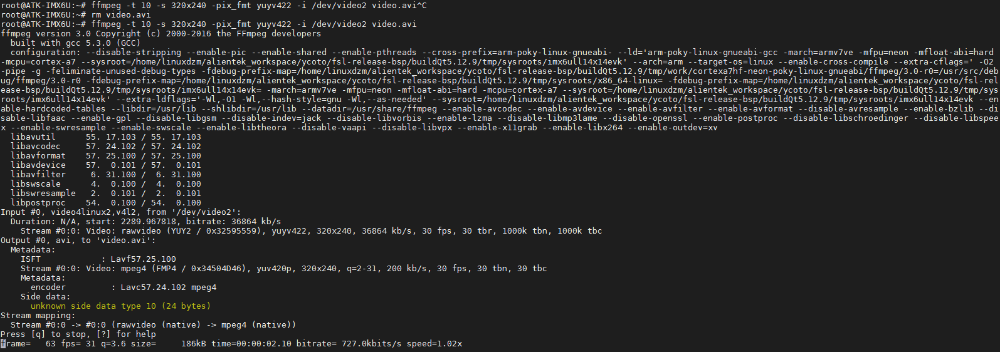

# 3.17 USB 摄像头测试

&emsp;&emsp;实验前请准备USB摄像头，符合UVC（USB video device class）协议的摄像头均可。

&emsp;&emsp;UVC，全称为：USB video class 或USB video device class，是Microsoft与另外几家设备厂商联合推出的为USB视频捕获设备定义的协议标准。符合UVC规格的硬件设备在不需要安装任何的驱动程序下即可在主机中正常使用。

&emsp;&emsp;插上USB摄像头到USB接口处，USB设备驱动打印如下信息

<center>
<br />
图3.17 1 USB摄像头打印的信息
</center>

&emsp;&emsp;查看设备节点，video1是ov5640/ov7725/ov2640节点，video2是USB摄像头节点。（注这里video1不一定是ov5640节点，这与ov5640驱动和USB摄像头它们驱动的加载顺序相关）。
```c#
ls /dev/video*
```

<center>
<br />
图3.17 2查看USB摄像头的节点
</center>

&emsp;&emsp;查看摄像头支持格式、分辨率及帧率。本次video1是ov5640设备节点，video2是USB摄像头的节点。
```c#
v4l2-ctl --device=/dev/video2 --list-formats-ext
```

<center>
<br />
图3.17 3查看USB摄像头支持的格式
</center>

## 3.17.1 使用gstreamer采集

&emsp;&emsp;由上图可知看到USB摄像头支持两种格式采集，一种是“YUYV”别外一种是“MJPG”。由于使用gstreamer使用元件imxv4l2src（可用v4l2src）不能设置MJPG格式采集，它只能设置YUYV格式采集。传入字符参数是format=(string)YUY2。

&emsp;&emsp;本次采集的图像大小为640*480 30fps，如果需要设置其他分辨率采集需要严格按照上面的参数。执行下面指令开始采集，并显示到LCD上面，按“Ctrl + c”终止指令。
```c#
gst-launch-1.0 -v imxv4l2src device=/dev/video2 ! "video/x-raw, format=(string)YUY2, \
width=(int)640, height=(int)480, framerate=(fraction)30/1" ! imxv4l2sink
```
&emsp;&emsp;演示效果图略。

&emsp;&emsp;使用usb摄像头保存录像，请参考如下指令，注意usb摄像头对应的节点名称。录像完成后在当前目录保存了一个video.mkv文件，使用gst-play-1.0或者gplay-1.0直接播放即可。**特别注意，由于没有硬件编码，只能使用CPU编码，导致编码的帧数下降，所以你播放录制的视频时间短很多！**
```c#
gst-launch-1.0 -vvv -e v4l2src num-buffers=1000 device=/dev/video2 ! image/jpeg,width=640, \
height=480,framerate=30/1,rate=30 ! matroskamux ! filesink location=video.mkv 
```

## 3.17.2 使用ffmpeg采集

```c#
ffmpeg -t 10 -s 320x240 -pix_fmt yuyv422 -i /dev/video2 video.avi
```

<center>
<br />
图3.17.2 1 使用ffmpeg保存USB摄像头录像保存视频
</center>

指令解释：

（1）	ffmpeg:	ffmpeg指令<br />
（2）	-t 10:	设置采集时间为10s<br />
（3）	-s 340x240:		设置采集的分辨率大小，与ov5640不一样，USB摄像头可以使用      ffmpeg设置采集的分辨率大小。采集的图像分辨率越大，可能采集时性能不足。<br />
（4）	-pix_fmt yuyv422: 设置采集的格式，支持(YUYV)yuyv422。<br />
（5）	-i /dev/video2: 指定USB摄像头设备节点。<br />
（6）	video.avi:		输出文件名，不同的格式会自动选择不同的编码，目前测试avi格式流畅。

&emsp;&emsp;使用ffmpeg设置编码指令请执行ffmpeg -help查看相关帮助与用法，本手册不再详细说明。
