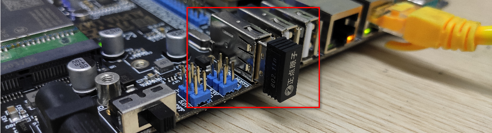
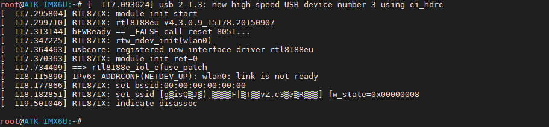
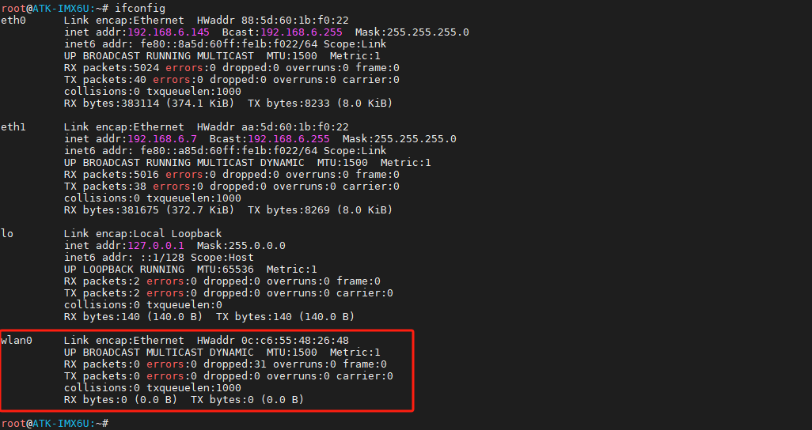
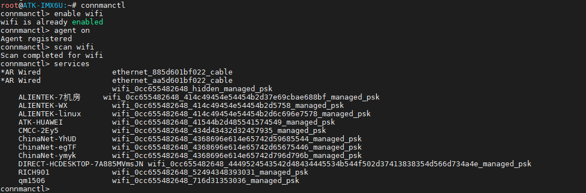
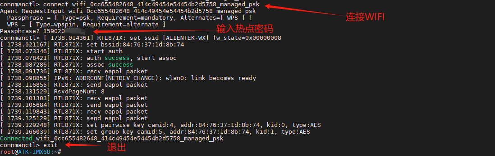
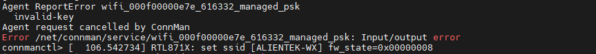
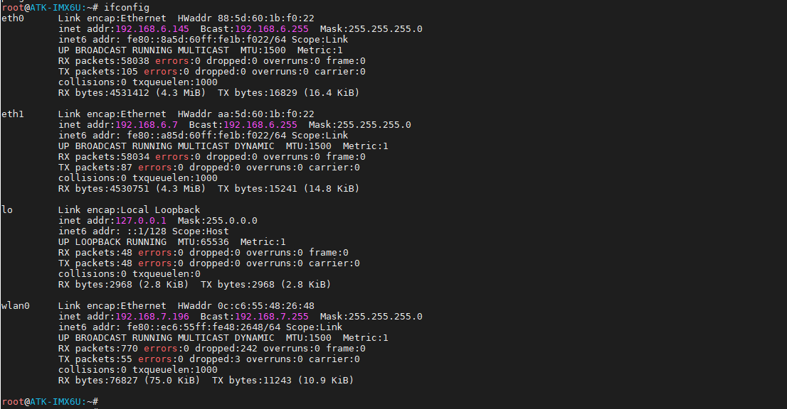
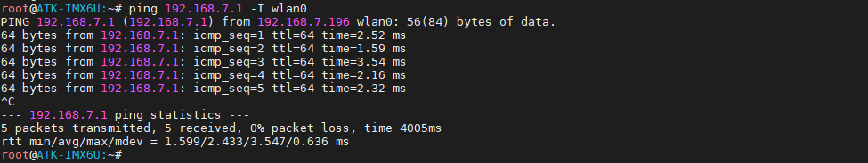
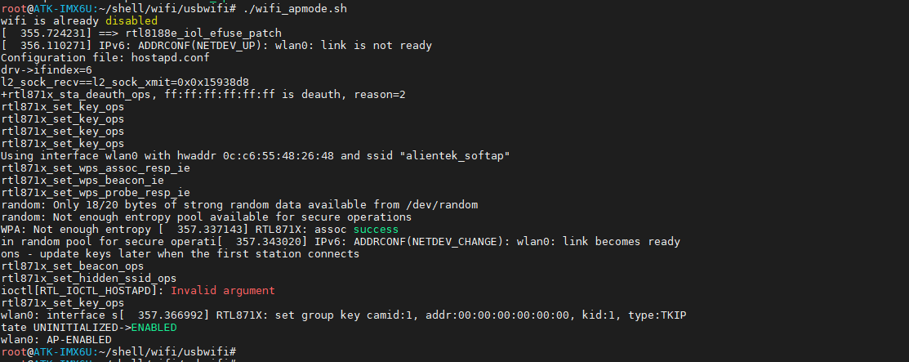
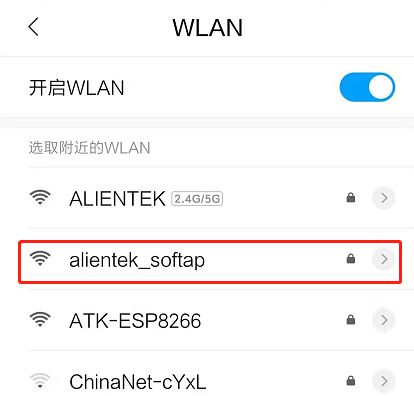

# 3.22 USB WIFI模块测试

&emsp;&emsp;本实验使用 USB WIFI RTL8188EUS/RTL8188CUS模块（正点原子购买ALPHA开发板赠送的USB WIFI模块，可直接插到电脑上联网测试好坏，若需要安装USB WIFI驱动则需要安装驱动精灵安装相应的驱动即可！），使用 USB 2.0 HOST接口，ALPHA底板4个USB接口都可以。

&emsp;&emsp;测试前准备USB WIFI RTL8188EUS/RTL8188CUS 模块，一般USB设备都是可带电插拔的，同理我们的RTL8188EUS/RTL8188CUS模块也是支持热插拔的，可在系统起来后再插上USB WIFI模块。**测试前请插上12v电源！**

&emsp;&emsp;开发板在USB接口处插上USB WIFI RTL8188EUS模块，如下图（下图为ALPHA底板）。

<center>
<br />
图3.22 1 USB WIF连接示意图
</center>

&emsp;&emsp;开机启动系统后插上USB WIFI，驱动打印信息如下：

<center>
<br />
图3.22 2打印的驱动信息
</center>

&emsp;&emsp;查看USB WIFI 的网卡信息，使用ifconfig指令，如下图示，wlan0是USB WIFI的节点。
```c#
ifconfig
ifconfig wlan0 up		// 若默认没打开wlan0则需要执行此项。
rfkill unblock all		// 若提示被rfkill管理时输入这个指令。
```

<center>
<br />
图3.22 3查看网卡信息
</center>

## 3.22.1 Station（上网）模式

&emsp;&emsp;本次实验目的：使用USB WIFI连接无线网络并测试网络是否能上网。WiFi 的 Station 模式是一种工作模式，它使 WiFi 设备能够连接到一个 WiFi 网络并与其他设备进行通信。

&emsp;&emsp;在 Station 模式下，WiFi 设备可以作为一个客户端连接到一个已有的 WiFi 网络，这个网络可以是家庭、办公室或公共场所提供的无线网络。

&emsp;&emsp;在连接上 WiFi 网络后，设备就可以通过这个网络与其他设备进行数据传输和通信。通常，Station 模式适用于需要将设备连接到已有的 WiFi 网络中的场景，例如手机、电脑、智能家居设备等。

&emsp;&emsp;在Linux中常见的网络托管有nmcli和ConnMan都是用于管理和配置网络连接的守护进程。可以用它们来连接网络，在IMX6ULL的根文件系统中有ConnMan。

&emsp;&emsp;请更新到2024年发布的根文件系统，否则可能使用不了connmanctl命令行。只有2024年以后发布的根文件系统才可以使用！

&emsp;&emsp;我们可以使用下面指令来连接 wifi。
```c#
connmanctl  #进入 WIIF 交互式操作命令行
connmanctl> enable wifi #使能 WIFI，默认已经使能
connmanctl> agent on  #开启代理
connmanctl> scan wifi #开启 WIFI 扫描，可以多次扫描
connmanctl> services #列出扫描到的 WIFI 列表
```
&emsp;&emsp;命令运行结果如下所示：

<center>
<br />
图3.22.1 1 扫描到的WIFI热点
</center>

&emsp;&emsp;从扫描到 WIFI 列表中，使用 connect XXXX 进行连接，再输入密码按回车确认。比如笔者要连接“ALIENTEK-WX”，那么就写成 **connect wifi_0cc655482648_414c49454e54454b2d5758_managed_psk。** 

&emsp;&emsp;右边对应那个就是“ALIENTEK-WX”的特定的WIFI网络标识符。

&emsp;&emsp;（若使用 IOS 手机热点，开启 IOS 热点时可能需要选择兼容性，同时也要注意，如果 WIFI 信号很差（离太远），或者输入密码都有可能连接不上 WIFI，同时USB WIFI只支持2.4G频段，不要尝试连接5G频段的热点，测试时请确认这三个因素）运行结果如下命令：
```c#
connect wifi_0cc655482648_414c49454e54454b2d5758_managed_psk #连接
exit                                                         #退出命令行
```

<center>
<br />
图3.22.1 2 连接热点
</center>

&emsp;&emsp;**若出现连接被取消（提示如下图），排除密码错误的情况，可能WIFI旧配置的影响。请执行指令rm -rf /var/lib/connman/wifi_*删除配置文件再尝试连接！也可能是列表被刷新了，WIFI扫描不到相应的热点了。**

<center>
<br />
图3.22.1 1 连接错误现象
</center>

&emsp;&emsp;再使用ifconfig指令查看。可以看到wlan0已经获取到ip地址了。
```c#
ifconfig
```

<center>
<br />
图3.22.1 4 wlan0获取到IP
</center>

&emsp;&emsp;测试是否能通主机，使用ping指令ping路由，可按ctrl+c终止执行指令。如上笔者的wlan0设备ip地址为192.168.7.196，网关一般为192.168.7.1。

&emsp;&emsp;这里笔者不Ping百度，因为存在多网卡的时候，不同网段时，DNS容易解释失败。若要测试ping百度请关闭eth0和eth1再测试！使用ifconfig eth0 down和ifconfig eth1 down!
```c#
ping 192.168.7.1 -I wlan0
```
&emsp;&emsp;看到如下信息，就代表能网络连通。

<center>
<br />
图3.22.1 4 ping网关测试
</center>

## 3.22.2 SoftAP（热点）模式

&emsp;&emsp;本次实验目的：测试USB WIFI开启热点，与手机连接，手机与开发板组成一个局域网可以相互通信。（注意由于USBWIFI与IOS系统兼容性问题，比较难连上），**8测试时尽量用安卓手机！**
```c#
cd /home/root/shell/wifi/usbwifi/
```
&emsp;&emsp;直接执行./wifi_apmode.sh开启热点，如下图。
```c#
./wifi_apmode.sh
```

<center>
<br />
图3.22.2 1 把USB WIFI设置成热点模式
</center>

&emsp;&emsp;打开手机设置，可以看到USB WIFI发出的热点，名称为“alientek_softap”，密码默认为12345678。输入密码后点击连接，即可连接到无线热点。

<center>

</center>

&emsp;&emsp;需要修改热点名称及热点密码请修改/home/root/shell/wifi/usbwifi/hostapd.conf文件！
