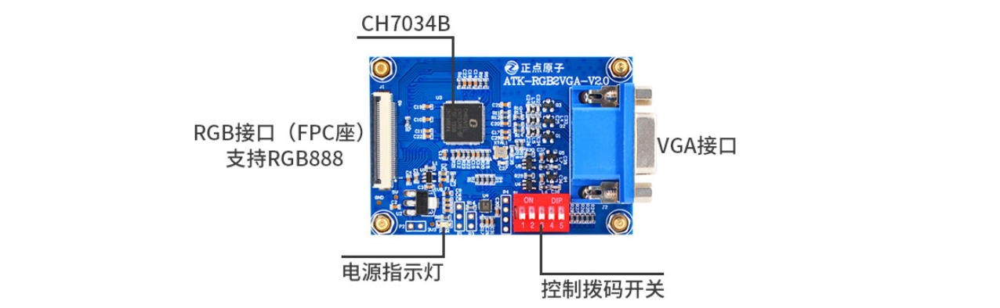

# 3.26 RGB转VGA模块测试

&emsp;&emsp;准备ATK-RGB2VGA-V2.0模块（此模块最大支持1920*1080 60Hz输出），模块需要另外购买。如下图，搭配一段5cm左右的fpc软排线。

&emsp;&emsp;请不要使用长于5cm的fpc软排线，防止因为fpc软排线太长，信号受到干扰。相对于RGB转HDMI模块来说，RGB转VGA模块更加稳定。

&emsp;&emsp;因为它不需要Linux驱动，支持热插拨。RGB信号直接输入到这个模块上就可以自动转换成VGA信号输出。供有需要VGA信号输出的用户使用。

 
3.26 1 正点原子RGB转VGA模块

&emsp;&emsp;和正点原子所有RGB屏一样，RGB转VGA模块可以被出厂的系统识别，无需更换设备树。因为IMX6U最大支持1366*768 60Hz的LCD输出。

&emsp;&emsp;分辨率再高时钟就会波形失真，不能高于这个分辨率。ALPHA开发板RGB转VGA模块设备树默认配置了1366*768 60Hz的输出。

&emsp;&emsp;将RGB转VGA模块拨码至10000，其他分辨率需要看ATK-RGB2VGA 模块用户手册，请在淘宝买页处下载RGB转VGA模块用户手册资料。开发板上电，开发板自动识别VGA模块，VGA信号自动输出。

