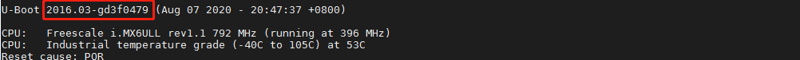
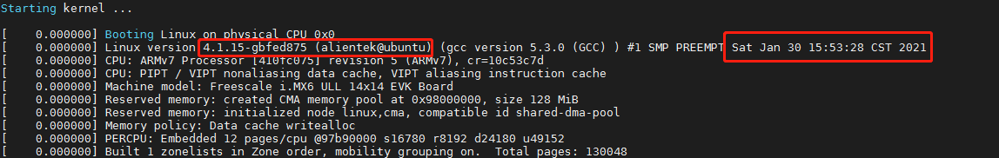

# 1.2 软件资源简介

## 1.2.1 软件资源一览表

| 类型             | 描述                                                         | 备注                                                         |
| ---------------- | ------------------------------------------------------------ | ------------------------------------------------------------ |
| uboot            | Uboot版本为2016.03                                           | 提供源码。 支持LCD显示、支持SD卡和EMMC、支持网络、支持NANDFlash、支持环境变量修改等。 |
| Linux内核        | 内核版本为4.1.15                                             | 提供源码                                                     |
| 根文件系统rootfs | 提供busybox、buildroot、yocto、ubuntu这四种根文件系统及其制作方法 | 提供详细的制作教程                                           |
| 交叉编译器       | 提供两种交叉编译器 （1）通用ARM交叉编译器arm-linux-gnueaihf- 版本4.9.4 （2）Poky交叉编译器arm-poky-linux-gnueabi-版本5.3.0 | 提供软件                                                     |
| Qt5 根文件系统   | Qt版本为5.12.9（资料版本V1.6之前是Qt 5.6.2）                 | 提供详细的教程                                               |
| 系统烧写方法     | MFGTOOL和SD卡两种                                            | 提供详细的使用教程                                           |

…等等

详细请看我们的[I.MX6U 硬件参考手册](../../I.MX6U%20硬件参考手册/resource_note.md)。

## 1.2.2 出厂系统软件版本历史

出厂Uboot版本在Uboot启动时会打印Git版本号，如下图。

**出厂Uboot历史版本**

| 版本 | Git版本  | 历史记录                                                     | 日期       |
| ---- | -------- | ------------------------------------------------------------ | ---------- |
| v1.0 | g9bd38ef | 无                                                           | 2019.10.26 |
| v1.1 | gd9420c3 | 1.添加ddr校准参数                                            | 2019.11.28 |
| v1.2 | g4e04879 | 1.去掉uboot的Logo显示。   1.去掉uboot的Logo显示。  2.添加rgb转vga模块和rgb转hdmi模块识别设备树的代码支持。 | 2020.01.15 |
| v1.3 | g4475ea1 | 1.添加驱动指南教程的uboot配置文件，支持以驱动指南教程的方法编译出厂uboot源码。 | 2020.04.29 |
| v1.4 | gd3f0479 | 1.修复uboot读取CPU主频错误问题。 2.修改板卡名字为I.MX6U ALPHA\|MINI | 2020.08.07 |
| v1.5 | ge468cdc | 1.关闭Uboot中LCD的背光，避免某些屏开机瞬间白屏的现象。       | 2021.03.29 |
| v1.6 | gee88051 | 1.禁用lcd。                                                  | 2021.11.05 |
| v1.7 | g0ae7e33 | 1.兼容sr8021f phy。                                          | 2022.08.15 |

在进入内核时会打印内核的版本号，或者进入文件系统后，使用uname -r指令查看内核Git版本号，及编译的时间。

**出厂内核历史版本**

| 版本 | Git版本  | 历史记录                                                     | 日期       |
| ---- | -------- | ------------------------------------------------------------ | ---------- |
| v1.0 | g49efdaa | 无                                                           | 2019.10.26 |
| v1.1 | gbedf008 | 1.优化网络                                                   | 2019.11.28 |
| v1.2 | g52f6b26 | 1.添加rgb转vga模块和rgb转hdmi模块识别设备树的代码支持。 2.修复gt9xx驱动和edt-ft5x06驱动上报坐标错误问题。 | 2020.01.05 |
| v1.3 | gb8ddbbc | 1.添加rtl_bt蓝牙驱动支持。 2.添加rtl 8188cus的支持 3.修复Lan 870 phy芯片输入时钟峰峰值超过额定值。 | 2020.04.29 |
| v1.4 | g8a704c6 | 1.修复rtl 8182CU驱动不能正常使用的问题 2.添加RGB LCD屏幕触控芯片gt1151的驱动支持。 | 2020.08.07 |
| v1.5 | g871ccc8 | 1.修复4.3寸屏（800x480, 480x272）的RGB屏gt9147系列触控芯片不能触摸的问题。维护gt1151的触摸驱动。 | 2020.12.23 |
| v1.6 | gbfed875 | 1.添加正点原子ov5640模块支持多种格式采集的功能及正点原子ov2640、ov7725（不带FIFO）摄像头模块的支持。 | 2021.01.30 |
| v1.7 | gad512fa | 1.优化Uboot到内核阶段某些LCD闪屏的问题。                     | 2021.03.29 |
| v1.8 | g14132a2 | 1.去除ONOFF功能。 2.设备树添加DHT11与DS18B20的配置。    | 2021.06.18 |
| v1.9 | gc0de9f6 | 1.开启ch341 usb转serial驱动。 2.开启cp210x uart驱动。   | 2021.07.22 |
| v2.0 | gc353ffb | 1.优化ov5640驱动，匹配应用教程。 2.其他摄像头摄像优化。 | 2021.11.05 |
| v2.1 | g06f53e4 | 1.优化gt9xx驱动，新增gt911芯片支持，同时优化该驱动支持多点触摸。 | 2021.11.27 |
| v2.2 | g0423506 | 修复了OV772x摄像头查询支持格式问题。                         | 2021.12.16 |
| v2.3 | g59913b0 | 1.修复内核logo不能全屏的问题 2.修复邮票孔核心板reboot不能马上复位的问题 3.修复某些emmc不能识别的问题 4.ov5640增加自动对焦功能 5.修改lcd io驱动能力 | 2022.06.16 |
| v2.4 | g0d2381d | 1.修复ov2640色彩问题 2.修复ov5640af.h头文件缺失的问题   | 2022.07.04 |
| v2.5 | gb8dc0d4 | 1.修复上一版本修改导致mini板hdmi模块不能显示的bug            | 2022.07.05 |
| v2.6 | g371b70f | 1.支持sr8021f phy 2.设备树添加i2c1 wm8960节点 3.添加挂载U盘FAT32格式支持UTF8字符 | 2022.08.15 |
| v2.7 | g3dc0a4b | 1.修复某些eMMC启动失败的问题                                 | 2022.08.18 |

文件系统历史版本，在进入文件系统后，输入cat /etc/version即可查看历史版本。为了您更好的体验，请更新到最新系统。

**出厂文件系统历史版本**

| 版本 | 历史记录                                                     | 日期       |
| ---- | ------------------------------------------------------------ | ---------- |
| v1.0 | 无                                                           | 2019.10.26 |
| v1.1 | 1.重新排版qt桌面，优化桌面滑动，写成精简桌面。取消各个程序下拉退出的功能，添加退出按钮。 2.修复可能不能录音的问题。 3.在文件系统/home/root/目录下添加测试所用的文件。 4.文件系统添加免输入root登录功能。 | 2019.11.28 |
| v1.2 | 1.重新设计Qt桌面 2.修复Qt打开文件夹拖动文件导致系统不能启动的问题 3.添加Qt桌面子进程进场、出场动画 4.其他优化 | 2019.11.30 |
| v1.3 | 1.修改开机界面 2.修复开机进入桌面程序时闪屏的问题 3.qt界面的优化修改，详细请看qt综合例程源码处的说明 4.去除触摸坐标参考文件，修改qt运行时的环境变量 | 2020.01.15 |
| v1.4 | 1.修改Qt桌面为第一版本时Qt桌面，添加音量控制                 | 无         |
| v1.5 | 无                                                           | 2020.11.14 |
| v1.6 | 1.升级文件系统里的Qt版本为Qt5.12.9，Qt桌面重新打造，优化用户体验。文件系统的功能及资源请看I.MX6U快速体验第五章。 | 2020.11.18 |
| v1.7 | 1.修复开机耳机默认没有音量的问题 2.修复Qt设置App里音量条70%以下没有声音的问题 3.优化Qt相册滑动切换流畅度 | 2021.01.08 |
| v1.8 | 修复文件系统使用Qt无法显示gif图片的问题                      | 2021.01.12 |
| v1.9 | 1.添加rsync指令 2.添加qt mysql支持 3.添加正点原子camera_settings ov5640_camera、ov772x_camera、ov2640_camera应用程序 4.添加mysql，sqlite3，cups，hplip的支持 | 2021.01.30 |
| v2.0 | 1.移除mysql 2.其他优化                                  | 2021.2.23  |
| v2.1 | 1.删除UI界面上的关机功能 2.添加若USB WIFI连接不上网络的提示。 | 2021.03.25 |
| v2.2 | 1.添加devmem2,memtool工具 2.添加Nginx web服务器 3./home/root/driver/添加ds18b20,dht11驱动文件 | 2021.06.18 |
| v2.3 | 1.添加qt支持mysql的driver(默认不安装Mysql,因为体积太大,需要额外安装包) 2.添加pip,git指令 3.添加SDIO WIFI测试脚本/home/root/shell/wifi/alientek_sdio_wifi_setup.sh 4.添加USB蓝牙测试脚本/home/root/shell/bluetooth/bluetooth_start.sh 5.优化网络，固定MAC地址，防止多次开机获取不同的IP 6.添加USB bluetooth测试脚本 7.优化SDIO WIFI与USB WIFI开启热点 8.优化串口终端显示颜色，保存指令记录 9.添加SDIO WIFI初始化脚本/home/root/shell/wifi/alientek_sdio_wifi_init.sh | 2021.07.22 |
| v2.4 | 1.添加me3630 4G模块ecm上网程序，此方式更方便上网。 2.添加me3630 4G模块ecm上网程序，此方式更方便上网。 | 2021.11.05 |
| v2.5 | 1.修复Qt桌面获取不到天气的问题。                             | 2022.08.09 |
| v2.6 | 1.出厂UI大更新，更改为多进程例子，提供丰富示例，给用户更好的体验。 2.修复了SD卡/eMMC可能挂载不上的问题。 3.更新/home/root/shell/wifi脚本，优化wifi开启AP脚本。 | 2024.12.04 |

