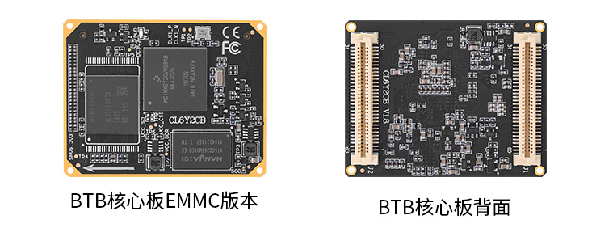
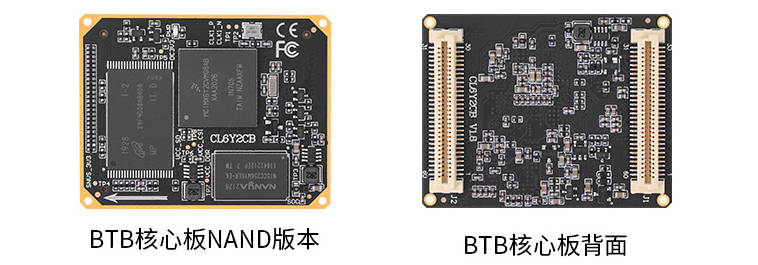
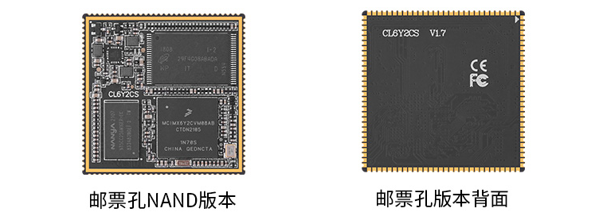
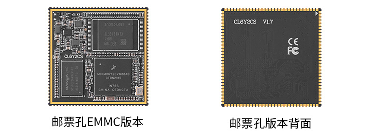

# 1.1 核心板简介

&emsp;&emsp;I.MX6ULL系列核心板是正点原子基于NXP的I.MX6ULL芯片（MCIMX6Y2CVM08AB）而研发的，用于嵌入式 Linux领域的核心板。

&emsp;&emsp;MCIMX6Y2CVM08AB是NXP出品的一款针对HMI、IOT等领域的MPU，主频最高可以达800MHz，内核釆用ARM的 Cortex-A7，集成电源管理。RAM方面I.MX6ULL支持16位 LPDDR2、DDR3和DDR3L，Flash方面支持 NAND Flash、eMMC等。外设资源丰富，支持I2C、SPI、CAN、NET、UART、ADC、SAI等接口。

&emsp;&emsp;正点原子为I.MX6ULL核心板提供了丰富的开发文档和软件资源，正点原子官方出品的I.MX6ULL- ALPHA开发板目前已经发布了数百讲开发视频以及3300多页开发教程。所有软件资源全部免费开源，方便大家开发、提高开发效率、缩短开发周期。

&emsp;&emsp;目前正点原子在售的I.MX6ULL核心板有BTB接口和邮票孔接口两种形式，存储有eMMC和NAND Flash两种。

# 1.2 I.MX6ULL系列核心板对比

## 1.2.1 BTB和邮票孔区别

&emsp;&emsp;正点原子I.MX6ULL核心板接口有两种，分别为ATK-CL6Y2CB（BTB板对板接口）和ATK-CL6Y2CS（邮票孔接口）。

&emsp;&emsp;BTB接口的核心板方便插拔，适用于正点原子I.MX6ULL系列的阿尔法开发板和MINI开发板。

&emsp;&emsp;邮票孔接口的核心板需要焊接到自行设计的底板上，结构稳定，节省空间。

&emsp;&emsp;正点原子I.MX6ULL核心板根据存储种类来分，又分为eMMC版本和NAND Flash版本。

&emsp;&emsp;eMMC版本使用的是8G的eMMC存储+512MB的DDR内存配置。

&emsp;&emsp;NAND Flash版本使用的是512MB的NAND Flash存储+256MB的DDR内存配置。

&emsp;&emsp;实物图片：

 
图 1.2 1 eMMC版本BTB核心板

 
图 1.2 2 NAND flash版本BTB核心板

 
图 1.2 3 NAND flash版本邮票孔核心板

 
图 1.2 4 eMMC版本邮票孔核心板

# 1.3 商业级和工业级区别

&emsp;&emsp;根据使用场景工作温度不同，核心板分为商业级版本和工业级版本。

&emsp;&emsp;其中，正点原子店铺核心板购买链接里，eMMC版本是商业级的，NAND Flash版本是工业级的。正点原子也有提供工业级eMMC版本的核心板，具体可以在正点原子淘宝店铺咨询客服。

&emsp;&emsp;商业级核心板工作温度：0℃ ~ 70℃

&emsp;&emsp;工业级核心板工作温度：-40℃ ~ 80℃

## 1.3.1 核心板版本号区别

&emsp;&emsp;因为设计和物料的需要，正点原子I.MX6ULL核心板会迭代升级，但改动不大，都是优化走线和散热、物料替换、去掉logo丝印此类的，原理图上没有改动，可以直接参考网盘里提供的以往版本的核心板原理图资料。

&emsp;&emsp;核心板出厂都是做过测试的，BTB核心板可以直接接正点原子底板使用。

# 1.4 核心板购买渠道

&emsp;&emsp;天猫：正点原子官方旗舰店
https://detail.tmall.com/item.htm?spm=a1z10.5-b.w4011-22300975877.90.3af05bfblL6QbZ&id=609757539839&rn=d1350f46f57c4110c006df8ed0f13ca2&abbucket=5

&emsp;&emsp;淘宝：正点原子官方专卖店
https://item.taobao.com/item.htm?spm=a1z10.5-c-s.w4002-18401048749.11.526e26f365J3dR&id=604344387572

# 1.5 资料下载

&emsp;&emsp;开发板&核心板资料资料链接： https://pan.baidu.com/s/1inZtndgN-L3aVfoch2-sKA 提取码：m65i

&emsp;&emsp;下载中心http://www.openedv.com/docs/boards/arm-linux/zdyz-i.mx6ull.html

