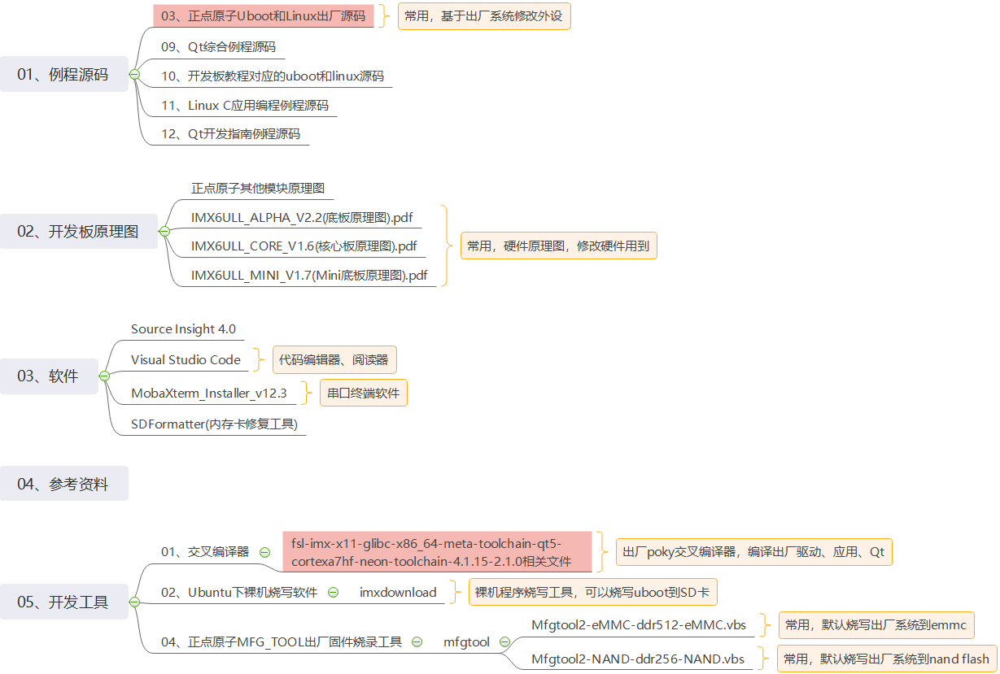

# 6.1 开发资料

&emsp;&emsp;核心板资料和开发板资料在同一份网盘里，阿尔法板和MINI板的资料是通用的。也就是说，正点原子I.MX6ULL相关产品共用一份网盘资料。
开发板&核心板资料资料链接： https://pan.baidu.com/s/1inZtndgN-L3aVfoch2-sKA 提取码：m65i
下载中心http://www.openedv.com/docs/boards/arm-linux/zdyz-i.mx6ull.html

&emsp;&emsp;下面列举一些产品设计过程中常用的核心板相关资料。

 
 

&emsp;&emsp;资料会持续更新，后续可以在下载中心更新最新资料。