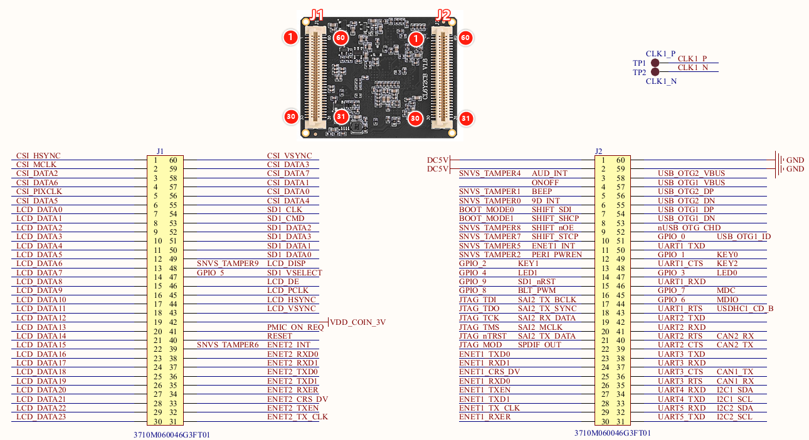

# 2.1 BTB核心板

## 2.1.1 硬件参数

|   **参数项**   |                    **参数**                    | **备注**                                                     |
| :------------: | :--------------------------------------------: | :----------------------------------------------------------- |
|    尺寸规格    |                    46*36mm                     |                                                              |
|      CPU       |    MCIMX6Y2CVM08AB（800MHz），单核cortexA7     | BGA289封装                                                   |
|      内存      | eMMC版本的DDR: 512MB NAND版本的DDR: 256MB | 贴片封装，可自行替换。受芯片供货影响，可能会有多种不同厂家的芯片，一切以实际贴片的型号为准。 |
|      存储      | eMMC版本的存储：8GB NAND版本的存储：512MB | 贴片封装，可自行替换。受芯片供货影响，可能会有多种不同厂家的芯片，一切以实际贴片的型号为准。扩容极限：256GB的eMMC或者2GB的NAND。 |
|    工作电压    |                    5V 0.25A                    | 输入核心板                                                   |
|      功耗      |                     ＜ 1W                      | 只使用核心板                                                 |
|    运行温度    |     商业级0℃~+70℃ 工业级：-40℃ ~ 80℃      |                                                              |
|     引脚数     |                     120Pin                     |                                                              |
|    引脚间距    |                     0.8mm                      | 座子引脚间距                                                 |
| 核心板连接方式 |       两个2*30的防反插BTB座，板对板连接        |                                                              |
|    PCB工艺     |         6层，沉金工艺，独立接地信号层          |                                                              |

## 2.1.2 引脚顺序及引出接口信号

 
图 2.1 1 BTB引脚顺序及定义

&emsp;&emsp;出厂系统默认配置信号：

&emsp;&emsp;出厂系统是指BTB核心板默认自带的基于开发板的出厂内核固件，具体配置可以参考出厂设备树文件。

| **外设功能** | **数量** | **备注**                                                     |
| :----------: | :------: | :----------------------------------------------------------- |
| 网口         | 2路      | 百兆以太网                                                   |
| 串口         | 2路      | UART1串口调试，UART3教程串口                                 |
| I2C          | 2路      | 一路配置底板光环境传感器AP3216C，一路配置LCD触摸             |
| SPI          | 1路      | 配置底板六轴传感器icm20608                                   |
| CAN          | 1路      | FlexCAN1                                                     |
| I2S          | 1路      | 音频外设在阿尔法底板，I2S与JTAG管脚冲突                      |
| USB OTG      | 1路      | 用于烧写固件，配合底板支持做主\从机                          |
| Camera       | 1路      | 支持OV5640\2640\7725（不带FIFO）                             |
| JTAG         | 1路      | 接口在MINI底板上                                             |
| LCD          | 1路      | RGB888接口，最大支持1366*768分辨率                           |
| ADC          | 1路      | GPIO1，配合底板可接DHT11或者DS18B20                          |
| PWM          | 1路      | 配置LCD背光                                                  |
| USB          | 2路      | 阿尔法使用USB HUB（1转4）拓展USB口成4路，其中一路用于4G      |
| SDIO         | 1路      | 用于SDIO WIFI或者microSD卡                                   |
| GPIO         | 多路     | GPIO3用于底板LED，底板可以自定义使用GPIO1。可以修改设备树复用更多路IO。 |

## 2.1.3 核心板引脚可复用资源

&emsp;&emsp;核心板引出了处理器上的所有IO，用户可以根据自己需要，自行设计底板来运用核心板上IO资源，将IO复用成自己所需要的功能。

&emsp;&emsp;根据外设功能，此处列举I.MX6ULL核心板可复用的单项外设最大资源数，具体选型可以结合芯片数据手册。（单项外设最大资源数：指的是在不使用其他外设的前提下，核心板所能使用的某项外设的最大数量，比如在裁剪LCD或者一个网口情况下，UART可以复用8路）

| **管脚外设功能** | **单项外设最大复用数** | **备注**                                                     |
| :--------------: | :--------------------: | :----------------------------------------------------------- |
|       GPIO       |         105路          |                                                              |
|       网口       |          2路           | 百兆以太网                                                   |
|       串口       |          8路           | 可以外接RS232\485等                                          |
|       I2C        |          4路           |                                                              |
|       SPI        |          4路           |                                                              |
|       CAN        |          2路           |                                                              |
|       ADC        |          10路          |                                                              |
|       PWM        |          8路           |                                                              |
|       I2S        |          3路           |                                                              |
|     USB OTG      |          2路           | 可以外接USB HUB拓展更多USB口                                 |
|       LCD        |          1路           | RGB888接口，最大支持1366*768分辨率。可接芯片转成HDMI或者VGA接口。 |
|       JTAG       |          1路           |                                                              |
|      Camera      |          1路           | 8路并行摄像头接口                                            |
|       SDIO       |          1路           | 用接SDIO WIFI或者microSD卡                                   |

# 2.2 邮票孔核心板

## 2.2.1 硬件参数

| **参数项**     | **参数**                                       | **备注**                                                     |
| -------------- | ---------------------------------------------- | ------------------------------------------------------------ |
| 尺寸规格       | 38*38mm                                        |                                                              |
| CPU            | MCIMX6Y2CVM08AB（800MHz），单核cortexA7        | BGA289封装                                                   |
| 内存           | eMMC版本的DDR: 512MB NAND版本的DDR: 256MB | 贴片封装，可自行替换。受芯片供货影响，可能会有多种不同厂家的芯片，一切以实际贴片的型号为准。 |
| 存储           | eMMC版本的存储：8GB NAND版本的存储：512MB | 贴片封装，可自行替换。受芯片供货影响，可能会有多种不同厂家的芯片，一切以实际贴片的型号为准。扩容极限：256GB的eMMC或者2GB的NAND。 |
| 工作电压       | 5V 0.25A                                       | 输入核心板                                                   |
| 功耗           | ＜ 1W                                          | 只使用核心板                                                 |
| 运行温度       | 商业级：0℃ ~ 70℃ 工业级：-40℃ ~ 85℃       |                                                              |
| 引脚数         | 120Pin                                         |                                                              |
| 引脚间距       | 1.2mm                                          |                                                              |
| 核心板连接方式 | 邮票孔                                         |                                                              |
| PCB工艺        | 8层，沉金工艺，独立接地信号层                  |                                                              |

## 2.2.2 引出接口信号

图 2.2 1 邮票孔引脚顺序及定义

&emsp;&emsp;出厂系统默认配置信号：

&emsp;&emsp;出厂系统是指核心板烧写出厂固件后的功能配置，具体配置可以参考出厂设备树文件。

&emsp;&emsp;注意：邮票孔没有底板售卖，需要自行设计底板，或者用邮票孔转BTB转接板接正点原子Linux底板。

| **外设功能** | **数量** | **备注**                                                     |
| :----------: | :------: | :----------------------------------------------------------- |
| 网口         | 2路      | 百兆以太网                                                   |
| 串口         | 2路      | UART1串口调试，UART3教程串口                                 |
| I2C          | 2路      | 一路配置光环境传感器AP3216C，一路配置LCD触摸                 |
| SPI          | 1路      | 配置六轴传感器icm20608                                       |
| CAN          | 1路      | FlexCAN1                                                     |
| I2S          | 1路      | I2S与JTAG管脚冲突                                            |
| USB OTG      | 1路      | 用于烧写固件，配合底板支持做主\从机                          |
| Camera       | 1路      | 支持OV5640\2640\7725（不带FIFO）                             |
| JTAG         | 1路      |                                                              |
| LCD          | 1路      | RGB888接口，最大支持1366*768分辨率                           |
| ADC          | 1路      | GPIO1，可接DHT11或者DS18B20                                  |
| PWM          | 1路      | 配置LCD背光                                                  |
| USB          | 2路      |                                                              |
| SDIO         | 1路      | 用于SDIO WIFI或者microSD卡                                   |
| GPIO         | 多路     | GPIO3用于底板LED，可以自定义使用GPIO1。可以修改设备树复用更多路IO。 |

## 2.2.3 核心板引脚可复用资源

&emsp;&emsp;核心板引出了处理器上的所有IO，用户可以根据自己需要，自行设计底板来运用核心板上IO资源，将IO复用成自己所需要的功能。

&emsp;&emsp;根据外设功能，此处列举I.MX6ULL核心板可复用的单项外设最大资源数，具体选型可以结合芯片数据手册。（单项外设最大资源数：指的是在不使用其他外设的前提下，核心板所能使用的某项外设的最大数量，比如在裁剪LCD或者一个网口情况下，UART可以复用8路）

| **管脚外设功能** | **单项外设最大复用数** | **备注**                                                     |
| ---------------- | ---------------------- | ------------------------------------------------------------ |
| GPIO             | 105路                  |                                                              |
| 网口             | 2路                    | 百兆以太网                                                   |
| 串口             | 8路                    | 可以外接RS232\485                                            |
| I2C              | 4路                    |                                                              |
| SPI              | 4路                    |                                                              |
| CAN              | 2路                    |                                                              |
| ADC              | 10路                   |                                                              |
| PWM              | 8路                    |                                                              |
| I2S              | 3路                    |                                                              |
| USB OTG          | 2路                    | 可以外接USB HUB拓展更多USB口                                 |
| LCD              | 1路                    | RGB888接口，最大支持1366*768分辨率。可接芯片转成HDMI或者VGA接口。 |
| JTAG             | 1路                    |                                                              |
| Camera           | 1路                    | 8路并行摄像头接口                                            |
| SDIO             | 1路                    | 用接SDIO WIFI或者microSD卡                                   |

