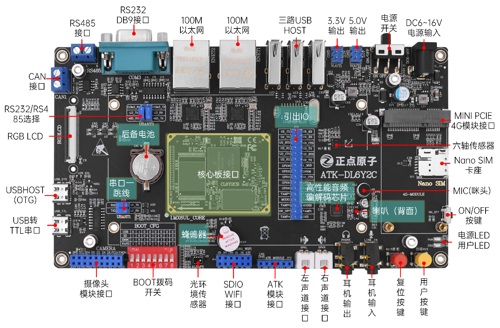
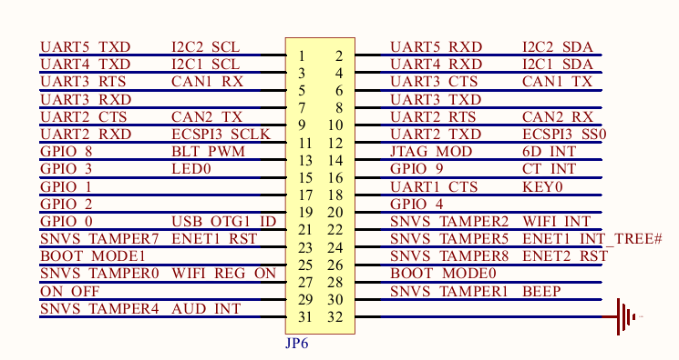
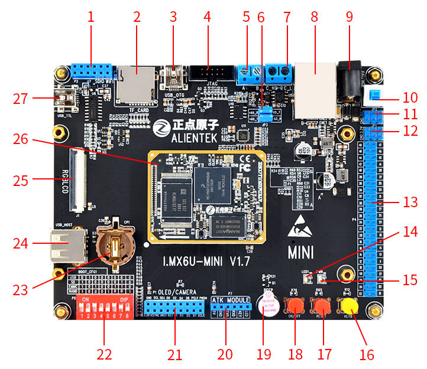
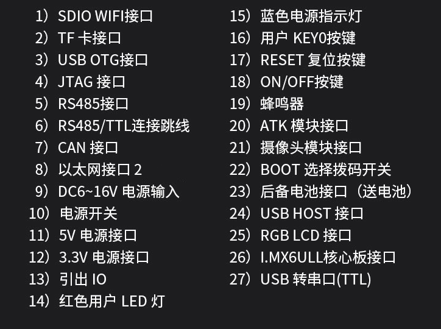
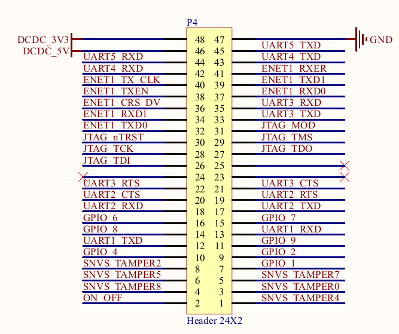

# 7.1 底板

&emsp;&emsp;正点原子I.MX6ULL的BTB核心板可以直接接到底板上使用，核心板+底板组成了开发板套件。根据外设分配情况，开发板分为ATK-DL6Y2C（阿尔法）开发板和MINI开发板。

&emsp;&emsp;ATK-DL6Y2C开发板购买链接：https://detail.tmall.com/item.htm?spm=a1z10.5-b.w4011-22300975877.65.74725bfbwL9cc3&id=609033604451&rn=e764e5f413053e127d44bcb3323aa732&abbucket=5

&emsp;&emsp;ATK-DL6Y2C底板如下图所示：

 
图 7.1 1  ATK-DL6Y2C开发板底板

&emsp;&emsp;ATK-DL6Y2C底板引出IO原理图：

 
图 7.1 2  ATK-DL6Y2C底板引出IO

&emsp;&emsp;核心板上大部分资源已经分配到ATK-DL6Y2C底板上各个外设了，引出的IO如上图所示。在出厂系统上可以直接使用的IO资源并不多，能直接使用的只有GPIO1。可以结合数据手册，进行出厂系统外设复用修改、裁剪，配置成多种方案，如五路串口（UART1\2\3\4\5）、多路GPIO、2路I2C、2路CAN等。

&emsp;&emsp;MINI板购买链接：
https://detail.tmall.com/item.htm?spm=a1z10.5-b.w4011-22300975877.85.74725bfbwL9cc3&id=614614102944&rn=e764e5f413053e127d44bcb3323aa732&abbucket=5

 
图 7.1 3 IMX6ULL MINI开发板

 
图 7.1 4 I.MX6ULL MINI底板资源

&emsp;&emsp;MINI底板引出IO原理图：

 
图 7.1 5 MINI底板引出IO

&emsp;&emsp;I.MX6ULL MINI相比ATK-DL6Y2C开发板裁剪掉以下功能：mini pcie接口及SIM卡槽，音频芯片及扬声器、麦克风，光纤音频接口及DB9接口，六轴传感器及环境传感器。

&emsp;&emsp;I.MX6ULL MINI板增加了JTAG接口。

&emsp;&emsp;核心板上大部分资源已经分配到MINI底板上各个外设了，引出的IO如上图所示。在出厂系统上可以直接使用的IO资源并不多，能直接使用的只有GPIO1。可以结合数据手册，进行出厂系统外设复用修改、裁剪，配置成多种方案，如五路串口（UART1\2\3\4\5）、多路GPIO、2路I2C、2路CAN等。

&emsp;&emsp;音频接口和JTAG接口冲突，因此MINI底板上裁剪了音频芯片后，就添加了JTAG接口。此外，由于MINI底板上还裁剪了ENET1，释放了更多IO，可以通过修改出厂系统外设复用来做别的功能。

&emsp;&emsp;ATK-DL6Y2C底板比较齐全，适合学习Linux驱动教程等资料，适合双网口、音频芯片等方案。MINI板比较精简，适合做裁剪，能配置更多IO，此外还有JTAG。两种开发板都适合做方案调研，可以直接使用正点原子的I.MX6ULL BTB核心板，也可以做转接板，把邮票孔转成BTB接口接到底板测试。

