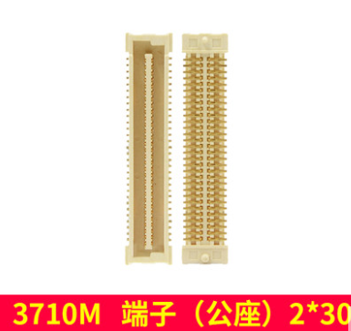

# 7.2 板对板连接器（BTB座子）

&emsp;&emsp;如果是用I.MX6ULL BTB核心板做产品设计的，需要在底板上使用一对板对板连接器（公座）2*30 端子，才能搭配I.MX6ULL BTB核心板使用。核心板自带的是母座，因此底板上要用公座。

 
图 7.2 1 板对板连接器

&emsp;&emsp;购买链接：
https://detail.tmall.com/item.htm?id=618056424889&spm=a8919.3000000002019401.0.1

