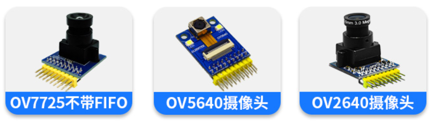

# 7.4 摄像头模组

&emsp;&emsp;正点原子Linux开发板支持多款摄像头模组，如下图：

 
图 7.4 1 Linux开发板支持摄像头

&emsp;&emsp;出厂系统默认配置OV5640摄像头驱动，可以直接使用。OV7725（不带FIFO）、OV2640需要修改出厂设备树来使用。

&emsp;&emsp;OV5640购买链接：
https://detail.tmall.com/item.htm?spm=a1z10.5-b.w4011-22300975877.66.44e748f5CiJmlw&id=609758211612&rn=e531d6e516b89557ce22be7a320c7533&abbucket=5

