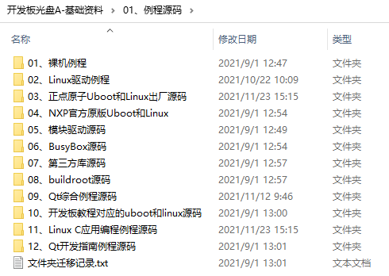
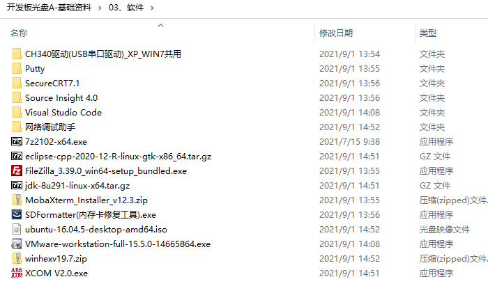
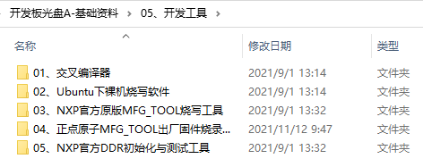

# 3.1 出厂固件资源

## 3.1.1 基本信息

|     **类型**     | **描述**                                                     |                           **备注**                           |
| :--------------: | :----------------------------------------------------------- | :----------------------------------------------------------: |
|      uboot       | Uboot版本为2016.03                                           |                           提供源码                           |
|    Linux内核     | 内核版本为4.1.15                                             |                           提供源码                           |
| 根文件系统rootfs | 提供busybox、buildroot、Debian、Ubuntu_base四种根文件系统及其制作方法。 提供出厂系统yocto文件系统。 |             除yocto系统外，提供详细的制作教程。              |
|    交叉编译器    | 提供两种交叉编译器 （1）通用ARM 交叉编译器arm-linux-gnueaihf- 版本4.9.4 （2）Poky 交叉编译器arm-poky-linux-gnueabi- 版本5.3.0 | arm-poky-linux-gnueabi- 交叉编译器用于基于出厂系统的开发。 arm-linux-gnueaihf- 交叉编译器用于基于busybox等系统的开发。 |
|  Qt5根文件系统   | Qt版本为5.12.9                                               |                        提供详细的教程                        |
|   系统烧写方法   | Mfgtool和SD卡两种                                            |                      提供详细的使用教程                      |

## 3.1.2 驱动及开发例程

&emsp;&emsp;○：表示提供源码 
&emsp;&emsp;◎：表示提供源码和教程资料 
&emsp;&emsp;□：表示提供系统和源码，出厂系统可以直接使用

| **外设功能**     | **出厂内核源码驱动** | **出厂内核源码驱动** | **应用开发** | **Qt开发** | **裸机开发** |
| ---------------- | -------------------- | -------------------- | ------------ | ---------- | ------------ |
| GPIO             | □                    | ◎                    | ◎            | ◎          | ◎            |
| LED              | □                    | ◎                    | ◎            | ◎          | ◎            |
| KEY              | □                    | ◎                    | ◎            | ◎          | ◎            |
| LCD              | □                    | ◎                    | ◎            | ◎          | ◎            |
| BackLight        | □                    | ◎                    | ◎            |            | ◎            |
| UART             | □                    | ◎                    | ◎            | ◎          | ◎            |
| I2C              | □                    | ◎                    | ◎            | ◎          | ◎            |
| SPI              | □                    | ◎                    | ◎            | ◎          | ◎            |
| USB              | □                    | ◎                    |              |            |              |
| FEC(NET)         | □                    | ◎                    | ◎            | ◎          |              |
| PWM              | □                    | ◎                    | ◎            |            | ◎            |
| OV5640           | □                    | ○                    | ◎            | ◎          |              |
| OV2640           | □                    | ○                    | ○            | ○          |              |
| OV7725(不带FIFO) | □                    | ○                    | ○            | ○          |              |
| WM8960           | □                    | ◎                    | ◎            | ◎          |              |
| RTC              | □                    | ◎                    |              |            |              |
| WDOG             | □                    |                      | ◎            |            |              |
| CAN              | □                    | ◎                    | ◎            | ◎          |              |
| ADC              | □                    | ◎                    | ◎            |            |              |
| DHT11            | □                    |                      |              |            |              |
| DS18B20          | □                    |                      |              |            |              |
| RTL8189          | □                    | ◎                    |              |            |              |
| BEEP             | □                    | ◎                    | ◎            | ◎          | ◎            |
| RS232            | □                    | ◎                    |              |            |              |
| RS485            | □                    | ◎                    |              |            |              |
| GPS              | □                    | ◎                    |              |            |              |
| ME3630           | □                    | ◎                    |              |            |              |
| EC20             | □                    | ◎                    |              |            |              |
| HDMI             | □                    | ◎                    |              |            | ◎            |
| USB bluetooth    | □                    |                      |              | ◎          |              |

# 3.2 其他软件资源

 
图 3.2 1 例程源码

 
图 3.2 2 软件工具

 
图 3.2 3 开发工具

&emsp;&emsp;更多资料可以下载开发板资料盘了解。

