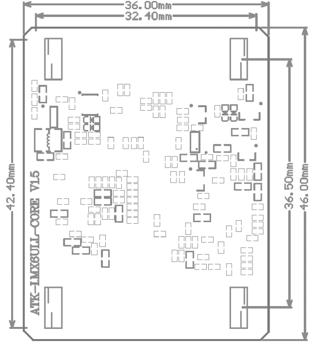
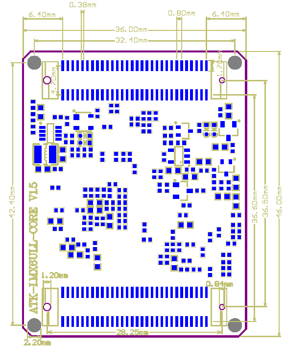
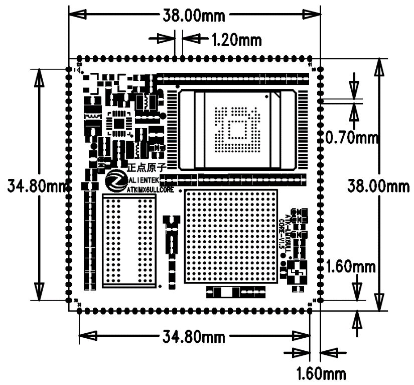
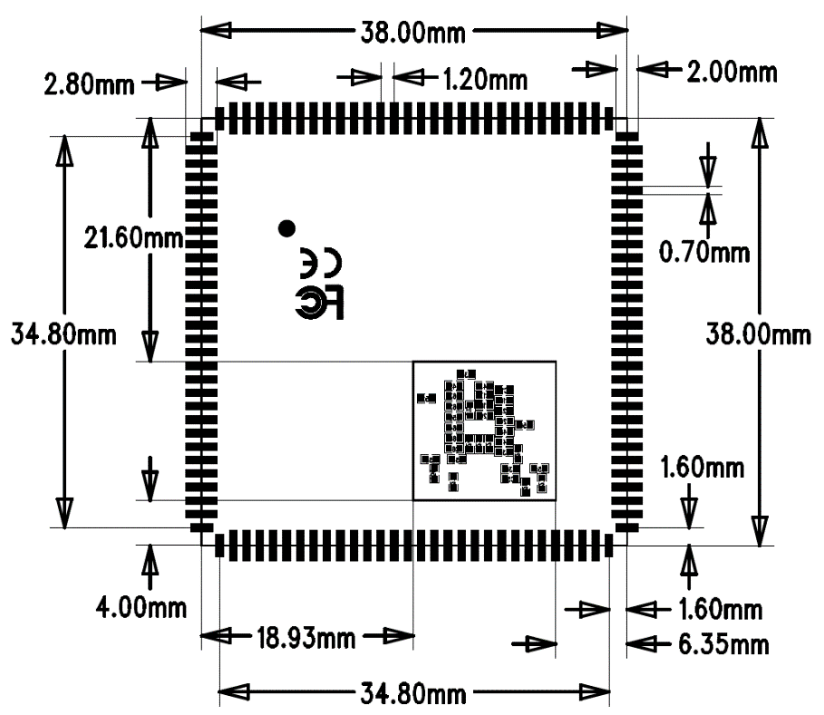

# 5.1 BTB核心板尺寸参数

 
图 5.1 1 BTB核心板机械尺寸图

 
图 5.1 2 BTB核心板封装信息

# 5.2 邮票孔核心板尺寸参数

 
图 5.2 1 邮票孔核心板机械尺寸图

 
图 5.2 2 邮票孔核心板封装图

&emsp;&emsp;注意：此处为V1.6版本以前的邮票孔封装图（包括V1.6），邮票孔背面是有元器件的，做底板的时候对应的孔位需要开槽，不然无法贴片。

&emsp;&emsp;V1.7版本开始的邮票孔核心板背面没有元器件，全部放到正面，封装规格和之前的版本保持一致，可以不需要开槽。

