# 1.3 I.MX6U-ALPHA开发板底板原理图详解

## 1.3.1 核心板接口

&emsp;&emsp;`I.MX6U-ALPHA`开发板采用底板+核心板的形式，`I.MX6U-ALPHA`开发板底板采用**2个2*30**的3710F（公座）板对板连接器来同核心板连接，接插非常方便，底板上面的核心板接口原理图如下图所示：

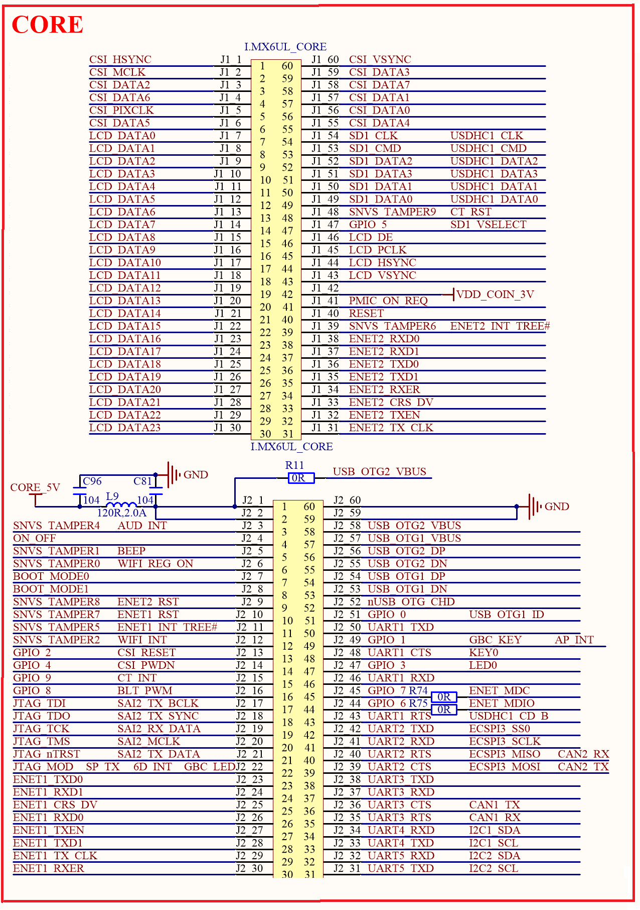 
图1.3.1.1 底板转接板接口部分原理图

&emsp;&emsp;图中的J1和J2就是底板上的转接板接口，由**2个2*30PIN**的3710F板对板公座组成，总共引出了核心板上面**105个IO口**，另外，还有：电源、PMIC_ON_REQ、ONOFF、USB、VBAT、RESET等信号。

## 1.3.2 引出IO口

&emsp;&emsp;I.MX6U-ALPHA开发板底板上面，总共引出了**31个IO口**，如下图所示：

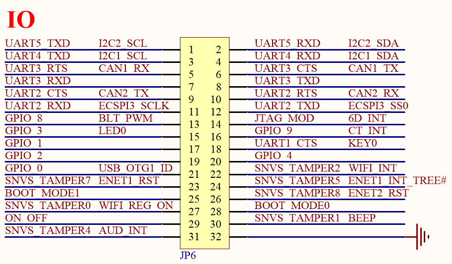 
图1.3.2.1 引出IO口

&emsp;&emsp;图中JP6就是引出的IO，一共**31个IO**，外加一个GND。Cortex-A系列的板子首要任务就是保证板子的稳定性，然后再考虑IO的引出。所以相比于STM32这种单片机，`I.MX6U-ALPHA`开发板引出的IO就要少很多了。

## 1.3.3 USB串口/串口1选择接口

&emsp;&emsp;`I.MX6U-ALPHA`开发板板载的USB串口和I.MX6U的串口是通过`JP5`连接起来的，如下图所示：

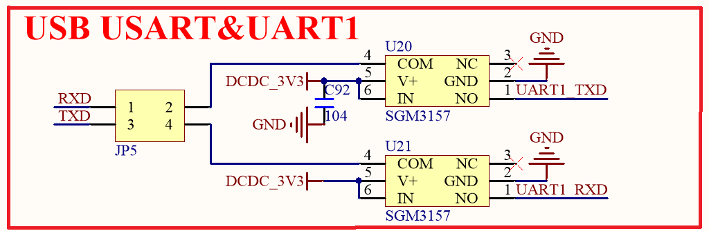 
图1.3.3.1 USB串口/串口1选择接口

&emsp;&emsp;图中TXD/RXD是相对CH340C来说的，也就是USB串口的发送和接收脚。而UART1_RXD和UART1_TXD则是相对于I.MX6U来说的。这样，通过对接，就可以实现USB串口和I.MX6U的串口通信了。

&emsp;&emsp;上图中的U20和U21是`SGM3157`模拟开关，在底板掉电以后将I.MX6U的UART1_TXD和UART1_RXD这两个IO与CH340C的TXD和RXD断开，因为`CH340C`的TXD和RXD这两个IO带有微弱的3.3V电压，如果不断开的话会将这微弱的3.3V电压引入到核心板上，可能会影响到启动。

## 1.3.4 RGB LCD模块接口

&emsp;&emsp;ALPHA底板载了RGB LCD接口，此部分电路如下图所示：

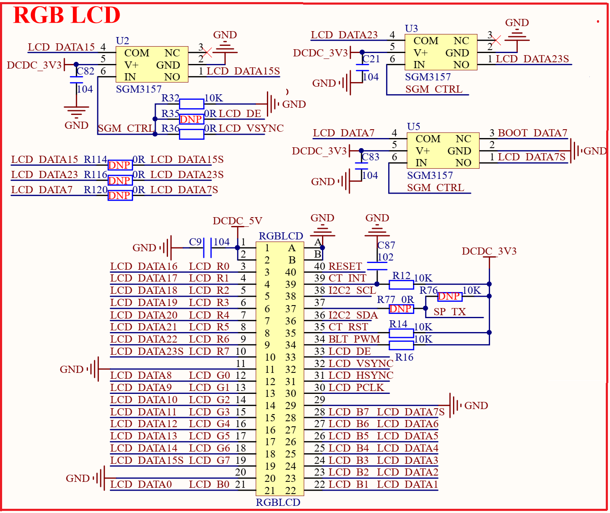 
图1.3.4.1 RGB LCD接口

&emsp;&emsp;图中，RGBLCD就是RGB LCD接口，采用`RGB888`数据格式，并支持触摸屏（支持电阻屏和电容屏）。该接口仅支持RGB接口的液晶（不支持MCU接口的液晶），目前正点原子的RGB接口LCD模块有：`4.3寸（ID:4342，480*272和ID:4384，800*480）`、`7寸(ID:7084，800*480和ID:7016，1024*600)`和`10寸(ID:1018，1280*800)`等尺寸可选。

&emsp;&emsp;图中3个`SGM3157`模拟开关，用于控制来自I.MX6U的`LCD_DATA23(LCD_R7)、LCD_DATA15(LCD_G7)和LCD_DATA7(LCD_B7)`和来自RGBLCD屏的`LCD_DATA23S、LCD_DATA15S和LCD_DATA7S`的通断。这是因为这几个信号有用来设置I.MX6U的`BOOT_CFG4[7]/BOOT_CFG2[7]/BOOT_CFG1[7]`，同时又是RGBLCD屏的ID信号，因此他们存在冲突。

&emsp;&emsp;如果不加切换，在启动的时候，I.MX6U就可能读到错误的启动配置信息，从而导致启动失败（不运行代码）。加这三个模拟开关，就是为了让I.MX6U在启动的时候可以正常读取BOOT_CFG4[7]/BOOT_CFG2[7]/BOOT_CFG1[7]的值，同时在启动后，用户代码又可以读取正确的RGBLCD ID值。互不影响。三个SGM3157的使能信号默认都是由LCD_VSYNC控制（刚好满足LCD时序）。

&emsp;&emsp;图中的I2C2_SCL和I2C2_SDA为I2C2的两根数据线，分别连接到UART5_TXD和UART5_RXD这两个IO上。BLT_PWM是LCD的背光控制IO，连接在I.MX6U的GPIO1_IO8上，用于控制LCD的背光。液晶复位信号RESET则是直接连接在开发板的复位按钮上，和MCU共用一个复位电路。

## 1.3.5 复位电路

&emsp;&emsp;I.MX6U开发板的复位电路如下图所示：

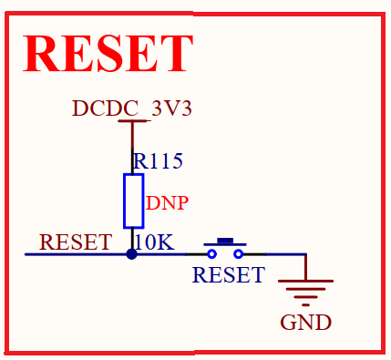 
图1.3.5.1 复位电路

&emsp;&emsp;因为I.MX6U是低电平复位的，所以我们设计的电路也是低电平复位的。

## 1.3.6 启动模式设置接口

&emsp;&emsp;I.MX6U开发板的启动模式设置端口电路如下图所示：

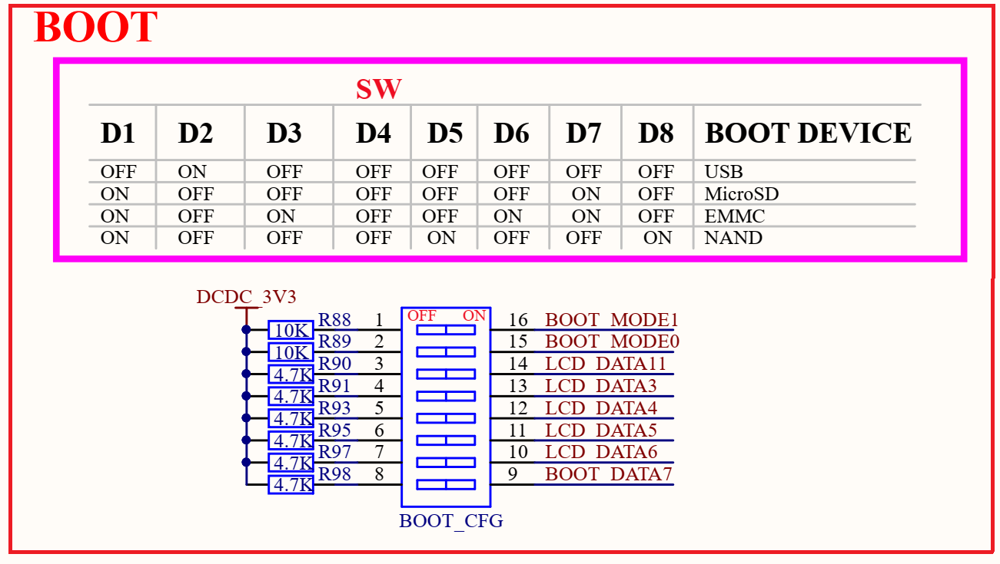 
图1.3.6.1 启动模式设置接口

&emsp;&emsp;I.MX6U支持从多种不同的设备启动，关于I.MX6U的详细启动方式请参考《第九章 I.MX6U启动方式详解》。

## 1.3.7 VBAT供电接口

&emsp;&emsp;I.MX6U-ALPHA开发板的`VBAT`供电电路如下图所示：

 
图1.3.7.1 启动模式设置接口

&emsp;&emsp;上图的`VDD_COIN_3V`通过核心板上的BAT54C，接VDD_SNVS_IN脚，从而给核心板的SNVS区域供电。这部分原理图在核心板上，如下图所示：

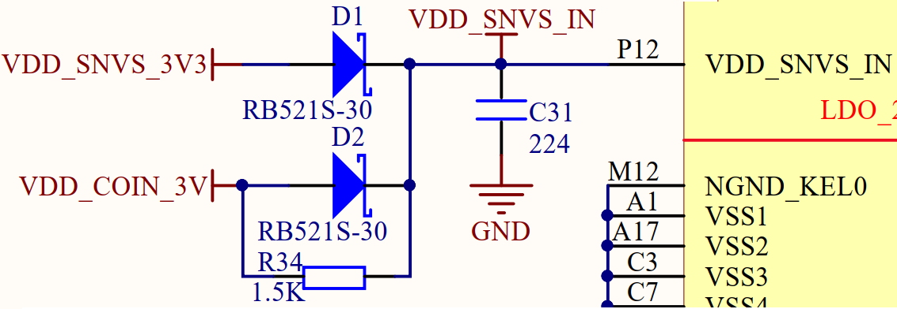 
图1.3.7.2 核心板VBAT供电原理图

&emsp;&emsp;如上图所示，VDD_SNVS_IN使用VDD_COIN_3V（接CR1220电池）和VDD_SNVS_3V3混合供电的方式，在有外部电源（VDD_SNVS_3V3）的时候，`CR1220`不给`VDD_SNVS_IN`供电，而在外部电源断开的时候，则由`CR1220`给其供电。这样，`VDD_SNVS_IN`总是有电的，以保证RTC的走时。

## 1.3.8 RS232串口

&emsp;&emsp;I.MX6U-ALPAH开发板板载了一个母头的`RS232`接口，电路原理图如下图所示:

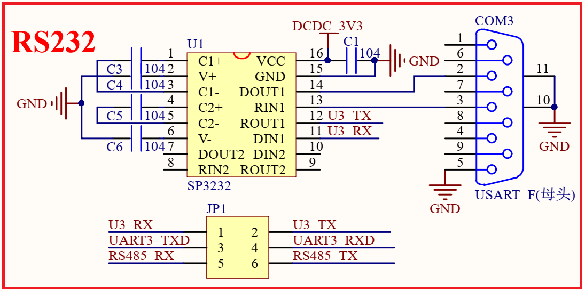 
图1.3.8.1 RS232串口

&emsp;&emsp;因为`RS232`电平不能直接连接到I.MX6U，所以需要一个电平转换芯片。这里我们选择的是`SP3232`（也可以用MAX3232）来做电平转接，同时图中的JP1用来实现RS232(UART3)/RS485的选择。

&emsp;&emsp;所以这里的RS232/RS485都是通过串口3来实现的。图中RS485_TX和RS485_RX信号接在SP3485的DI和RO信号上。

## 1.3.9 RS485串口

&emsp;&emsp;I.MX6U-ALPAH开发板板载的`RS485`接口电路如下图所示：

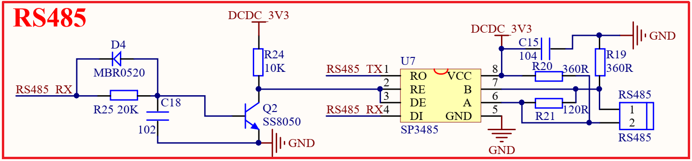 
图1.3.9.1 RS485接口

&emsp;&emsp;`RS485`电平也不能直接连接到I.MX6U，同样需要电平转换芯片。这里我们使用`SP3485`来做485电平转换，其中R21为终端匹配电阻，而R19和R20则是两个偏置电阻，以保证静默状态时485总线维持逻辑1。

&emsp;&emsp;`RS485_RX/RS485_TX`连接在JP1上面，通过JP1跳线来选择是否连接在I.MX6U上面，`SP3485`的RE引脚连接通过一系列的电路连接到了RS485_RX引脚上，这样就可以通过RS485_RX引脚来控制RS485的接收和发送状态，完全将RS485当做一个串口来使用。

## 1.3.10 CAN接口

&emsp;&emsp;正点原子I.MX6U-ALPHA开发板板载的`CAN`接口电路如下图所示：

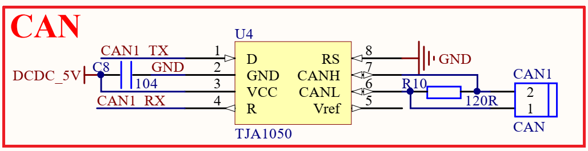 
图1.3.10.1 CAN接口电路

&emsp;&emsp;CAN总线电平也不能直接连接到I.MX6U，同样需要电平转换芯片。这里我们使用`TJA1050`来做CAN电平转换，其中R10为终端匹配电阻。

&emsp;&emsp;`CAN1_TX/CAN1_RX`直接连接在I.MX6U的`UART1_CTS/UART1_RTS`上面。

## 1.3.11 USB HUB接口

**1、V2.4版本以前底板USB HUB原理图** 

&emsp;&emsp;V2.4版本以前的正点原子`I.MX6U-ALPHA`开发板使用`GL850`这个一扩四的USB HUB芯片，用于将I.MX6U的USB2扩展为4个USB HOST接口，如下图所示：

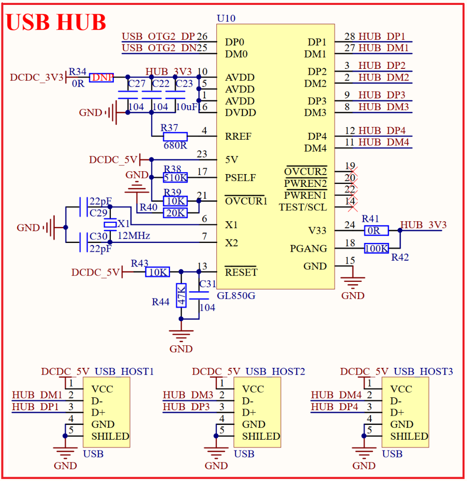 
图1.3.11.1 USB HUB接口电路

**2、V2.4及以后版本底板OTG原理图** 
&emsp;&emsp;V2.4及以后版本的正点原子`I.MX6U-ALPHA`开发板使用`SL2.1A`这个一扩四的USB HUB芯片，用于将I.MX6U的USB2扩展为4个USB HOST接口，如下图所示：

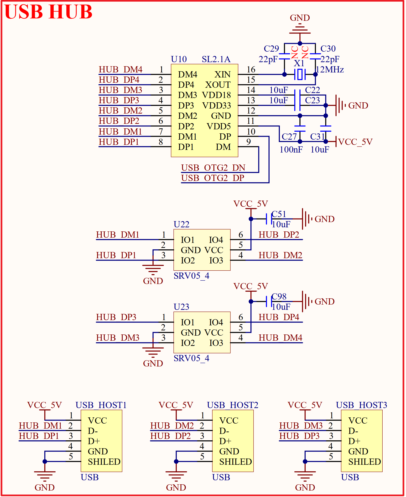 
图1.3.11.2 USB HUB接口电路

&emsp;&emsp;I.MX6U带有两个USB接口，但是对于Linux应用来说两个USB太少了，如果我们要连接鼠标、键盘、U盘等设备的时候两个USB口完全不够用。因此`I.MX6U-ALPHA`开发板通过`GL850G`或`SL2.1A`将I.MX6U的USB2外扩出了4个USB HOST接口，其中有一路(UHB_USB2)外接了4G模块，因此提供给用户的就只剩下了3个USB HOST接口，如果3个USB HOST还不够用的话就可以外接一个USB HUB。

## 1.3.12 USB OTG接口

**1、V2.4版本以前底板OTG原理图** 
&emsp;&emsp;`I.MX6U-ALPHA`也有一路USB OTG接口，USB OTG接口使用了I.MX6U的USB1，USB OTG接口如下图所示：

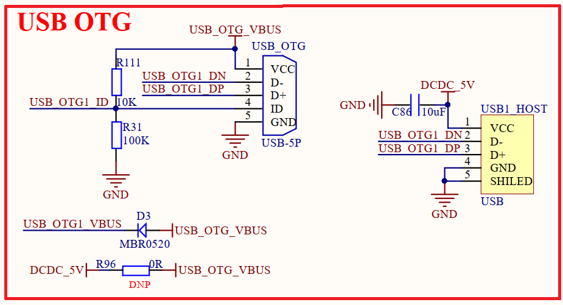 
图1.3.12.1 USB OTG接口

&emsp;&emsp;图中的USB_OTG就是USB SLAVE接口，可以将开发板作为USB从机，比如通过USB进行系统烧写等。右侧的USB1_HOST是USB HOST接口，可以将开发板作为USB主机，这样就可以外接USB键盘/鼠标、U盘等设备。这里正点原子将USB OTG的SLAVE和HOST接口都做到了开发板上，这样大家就不需要再额外去购买一个USB OTG线了，方便大家开发。

**2、V2.4及以后版本底板OTG原理图** 
&emsp;&emsp;`I.MX6U-ALPHA`也有一路USB OTG接口，USB OTG接口使用了I.MX6U的USB1，USB OTG接口如下图所示：

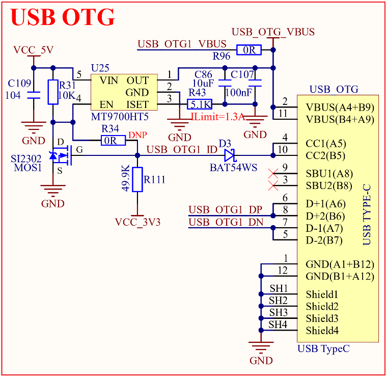 
图1.3.12.2 USB OTG接口

&emsp;&emsp;图中的USB_OTG就是`USB Type-C`接口，可以将开发板作为USB从机，比如通过USB进行系统烧写等。Type-C接口是支持主从机双模式的，通过Type-C OTG线可以将此可以将开发板作为USB HOST(主机)，这样就可以外接USB键盘/鼠标、U盘等设备。如果要用到USB OTG的HOST功能，需要另外购买一条Type-C OTG线。

## 1.3.13 光环境传感器

&emsp;&emsp;`I.MX6U-ALPHA`开发板板载了一个光环境传感器，可以用来感应周围光线强度、接近距离和红外线强度等，该部分电路如下图所示：

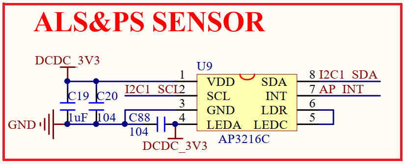 
图1.3.13.1 光环境传感器电路

&emsp;&emsp;图中的U9就是光环境传感器：`AP3216C`，它集成了光照强度、近距离、红外三个传感器功能于一身，被广泛应用于各种智能手机。该芯片采用IIC接口，连接在I.MX6U的I2C1接口上，IIC_SCL和IIC_SDA分别连接在UART4_TXD和UART4_RXD上，AP_INT是其中断输出脚，连接在I.MX6U的GOIO1_IO01上。

## 1.3.14 六轴传感器

&emsp;&emsp;I.MX6U-ALIPHA开发板板载了一个六轴传感器，电路如下图所示：

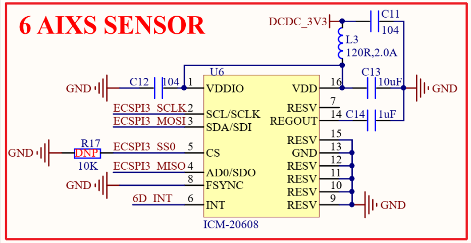 
图1.3.14.1 六轴传感器

&emsp;&emsp;六轴传感器芯片型号为：`ICM20608`，该芯片内部集成了：三轴加速度传感器和三轴陀螺仪，这里我们使用SPI接口来访问。

&emsp;&emsp;`ICM20608`支持IIC和SPI两种接口，`I.MX6U-ALPHA`开发板使用SPI接口，目的是为了在开发板上放一个SPI外设，学习Linux下的SPI驱动开发(因为笔者购买过很多Linux开发板，发现基本都没有SPI外设，不方便学习SPI驱动)。

&emsp;&emsp;`ICM20608`通过SPI接口连接到I.MX6U的ECSPI3接口上，SCLK、SDI、CS和SDO分别连接到I.MX6U的UART2_RXD(ECSPI3_SCLK)、UART2_CTS(ECSPI3_MOSI)、UART2_TXD(ECSPI3_SS0)和UART2_RTS(ECSPI3_MISO)。

## 1.3.15 LED

&emsp;&emsp;`I.MX6U-ALPHA`开发板板载总共有2个LED，其原理图如下图所示：

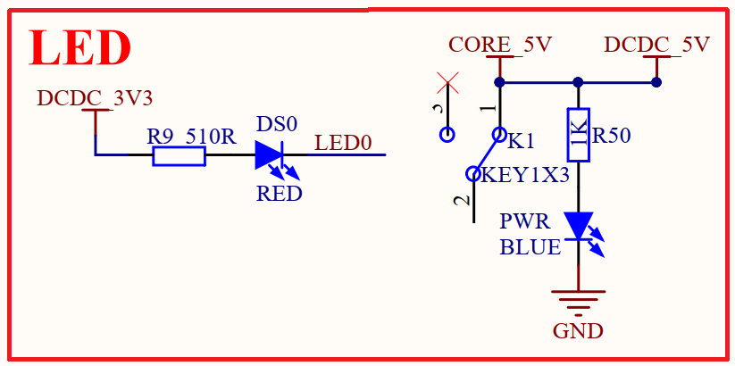 
图1.3.15.1 LED

&emsp;&emsp;其中右侧的`PWR BLUE`是系统电源指示灯，为蓝色。DS0为用户LED灯，连接在I.MX6U的`GPIO1_IO03`上，此灯为红色。

## 1.3.16 按键

&emsp;&emsp;I.MX6U-ALPHA开发板板载1个输入按键，其原理图如下图所示：

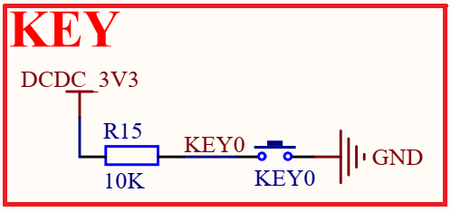 
图1.3.16.1 输入按键

&emsp;&emsp;KEY0用作普通按键输入，分别连接I.MX6U的`UART1_CTS`引脚上，这里使用外部**10K**上拉电阻。

## 1.3.17 摄像头模块接口

&emsp;&emsp;`I.MX6U-ALPHA`开发板板载了一个摄像头模块接口，连接在I.MX6U的硬件摄像头接口（CSI）上面，其原理图如下图所示：

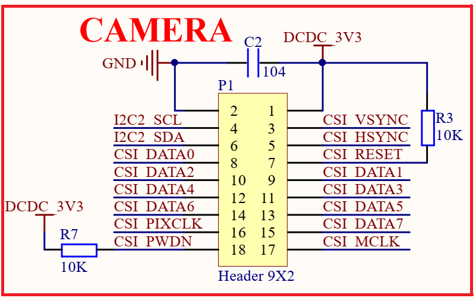 
图1.3.17.1 摄像头模块接口

&emsp;&emsp;图中`P1`接口可以用来连接正点原子摄像头模块。其中，`I2C2_SCL`和`I2C2_SDA`是摄像头的SCCB接口，分辨连接在I.MX6U的UART5_TXD和UART5_RXD引脚上。CSI_RESET 和CSI_PWDN这2个信号是不属于I.MX6U硬件摄像头接口的信号，通过普通IO控制即可，这两个线分别接在I.MX6U的`GPIO1_IO02和GPIO1_IO04`。

&emsp;&emsp;此外，`CSI_VSYNC/CSI_HSYNC/CSI_D0/CSI_D1/CSI_D2/CSI_D3/CSI_D4/CSI_D5/CSI_D6/CSI_D7/CSI_PCLK/CSI_MCLK`等信号，接I.MX6U的硬件摄像头接口。

## 1.3.18 有源蜂鸣器

&emsp;&emsp;I.MX6U-ALPHA开发板板载了一个有源蜂鸣器，其原理图如下图所示：

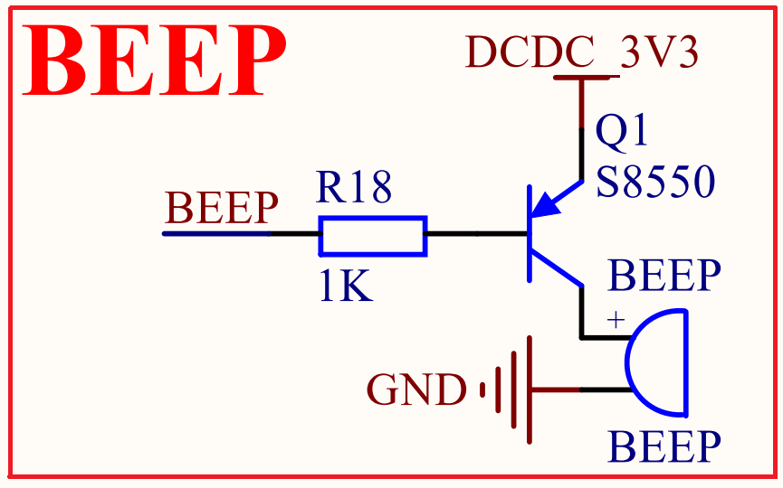 
图1.3.18.1 有源蜂鸣器

&emsp;&emsp;有源蜂鸣器是指自带了震荡电路的蜂鸣器，这种蜂鸣器一接上电就会自己震荡发声。而如果是无源蜂鸣器，则需要外加一定频率（`2~5Khz`）的驱动信号，才会发声。这里我们选择使用有源蜂鸣器，方便大家使用。

&emsp;&emsp;BEEP信号直接连接在I.MX6U的`SNVS_TAMPER1`引脚上，可以通过控制此引脚来控制蜂鸣器开关。

## 1.3.19 TF卡接口

&emsp;&emsp;正点原子ALPHA开发板板载了一个TF卡（小卡）接口，其原理图如下图所示：

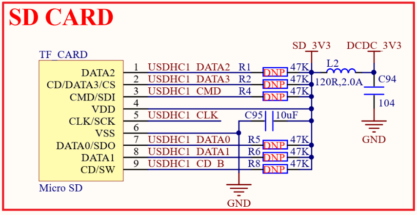 
图1.3.19.1 TF卡接口

&emsp;&emsp;图中`SD_CARD`为TF卡接口，该接口在开发板的底面。

&emsp;&emsp;TF卡采用4位uSDHC方式驱动，非常适合需要高速存储的情况。图中：`USDHC1_DATA0~DATA3/USDHC1_CLK/USDHC1_CMD`分别连接在I.MX6U的`SD1_DATA0~DATA3/SD1_CLK/SD1_CMD`引脚上。

&emsp;&emsp;USDHC1_CD_B是TF卡检测引脚，用于检测TF卡或SDIO WIFI插拔过程，连接到I.MX6U的UART1_RTS引脚上。**注意：TF卡接口和SDIO WIFI接口共用一个SDIO，因此TF卡和SDIO不能同时使用！**

## 1.3.20 SDIO WIFI接口

&emsp;&emsp;I.MX6U-ALPHA开发板板载一个SDIO WIFI接口，如下图所示：

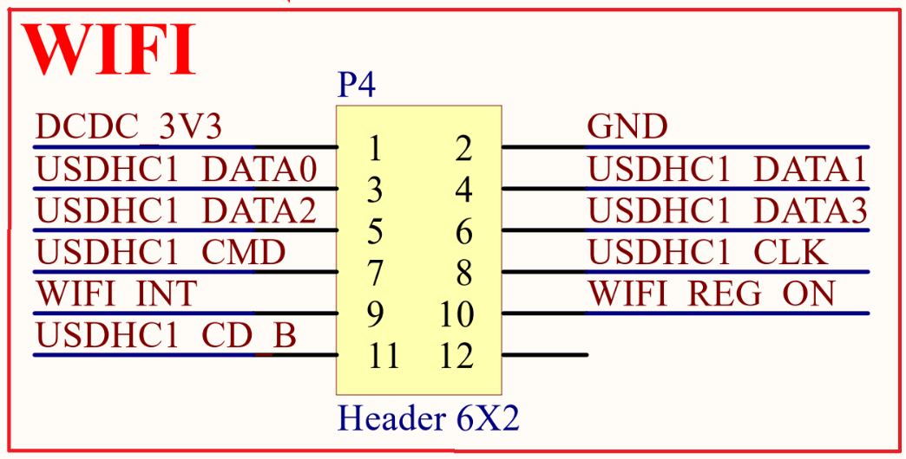 
图1.3.20.1 SDIO WIFI接口

&emsp;&emsp;`SDIO WIFI`接口用于连接正点原子出品的`RTL8189 SDIO WIFI`模块，`USDHC1_DATA0~DATA3/USDHC1_CLK/USDHC1_CMD`分别连接到I.MX6U的I.MX6U的`SD1_DATA0~DATA3/SD1_CLK/SD1_CMD`引脚上。WIFI_INT和WIFI_REG_ON连接到I.MX6U的SNVS_TAMPER2和SNVS_TAMPER0引脚上。

&emsp;&emsp;**注意：TF卡接口和SDIO WIFI接口公用一个SDIO，因此TF卡和SDIO不能同时使用！！**

## 1.3.21 4G模块接口

&emsp;&emsp;I.MX6U-ALPHA开发板板载`4G Mini PCIE`接口，如下图所示：

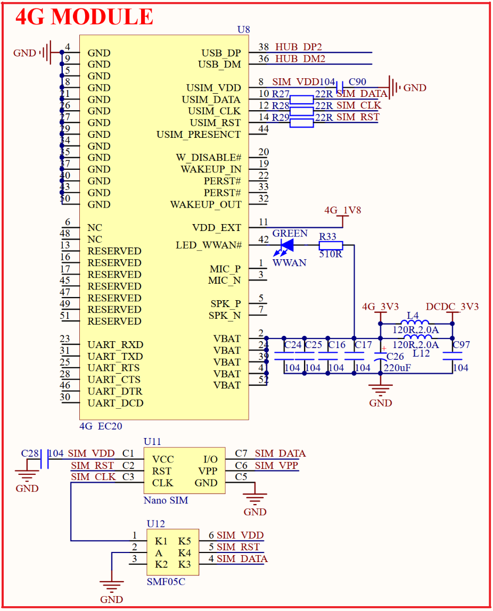 
图1.3.21.1 4G模块

&emsp;&emsp;U8就是`Mini PCIE`接口的4G模块座子，用于连接`Mini PCIE`接口的4G模块，比如高新兴的ME3630模块。U11是Nano SIM卡座，用于插入Nano SIM卡。

&emsp;&emsp;4G模块虽然采用`Mini PCIE`接口，但是实际走的USB接口，这里连接到了GL850G或SL2.1A扩展出来的一个USB HOST接口上(USB_HUB2)。

## 1.3.22 ATK模块接口

&emsp;&emsp;I.MX6U-ALPHA开发板板载了ATK模块接口，其原理图如下图所示：

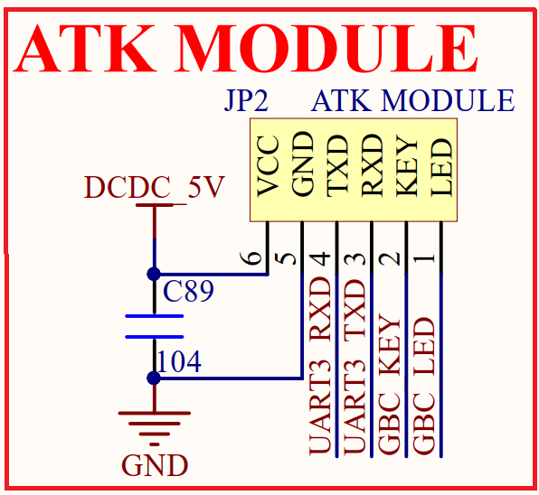 
图1.3.22.1 ATK模块接口

&emsp;&emsp;如图所示，JP2是一个**1*6**的排座，可以用来连接正点原子推出的一些模块，比如：蓝牙串口模块、GPS模块、MPU6050模块、激光测距模块、手势识别模块和RGB彩灯模块等。有了这个接口，我们连接模块就非常简单，插上即可工作。

&emsp;&emsp;图中：UART3_RXD/UART3_TXD连接到了I.MX6U的UART3上，和RS232、RS485共用一个串口，在使用ATK接口的时候需要将JP1跳线帽全部拔掉，防止RS232和RS485干扰到模块。而GBC_KEY和GBC_LED则分别连接在I.MX6U的GPIO1_IO01和JTAG_MOD这两个引脚上。**特别注意：GBC_LED/ GBC_KEY和AP_INT/6D_INT共用GPIO1_IO01和JTAG_MOD**。

## 1.3.23 以太网接口（RJ45）

&emsp;&emsp;**注意！正点原子I.MX6U-ALPHA开发板V2.4版本以前的底板使用的网络PHY为LAN8720，V2.4及其以后的版本使用的网络PHY为SR8201F，而且网络PHY地址有改变，大家一定要看准自己所使用的底板版本号！**

**1、V2.4以前版本的底板** 
&emsp;&emsp;I.MX6U-ALPHA开发板板载了两个以太网接口(RJ45)，分别为ENET1和ENET2，其中ENET1网口的原理图如下图所示：

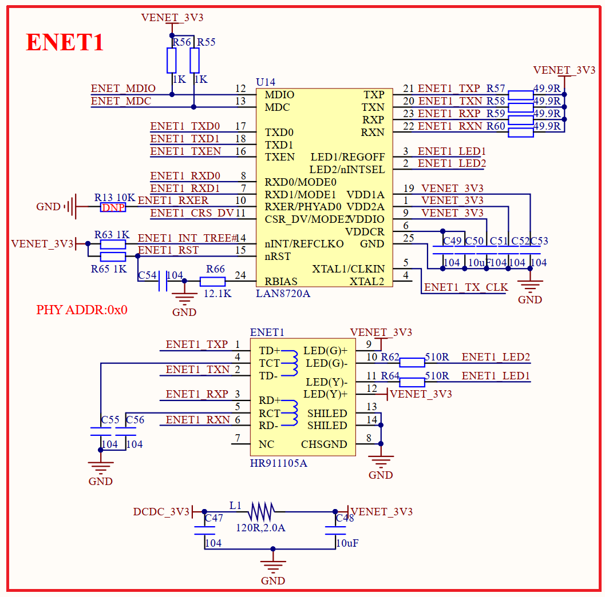 
图1.3.23.1 ENET1接口电路

&emsp;&emsp;ENET2网络接口原理图如下图所示：

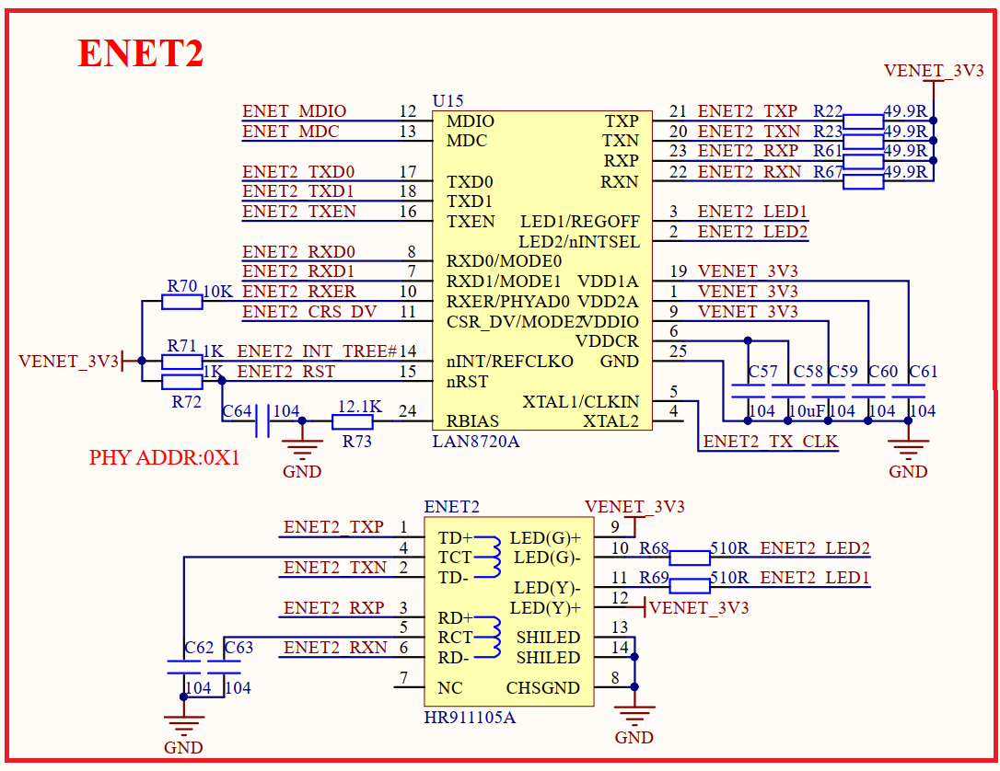 
图1.3.23.2 ENET2网络接口

&emsp;&emsp;I.MX6U内部自带两个网络MAC控制器，每个网络MAC需要外加一个PHY芯片来实现网络通信功能。V2.4版本以前的底板，采用`LAN8720A`这颗芯片作为I.MX6U的PHY芯片，该芯片采用RMII接口与I.MX6U通信，占用IO较少，且支持auto mdix（即可自动识别交叉/直连网线）功能。板载两个自带网络变压器的RJ45头（HR91105A），一起组成两个10M/100M自适应网卡。

**2、V2.4及以后的版本的底板** 
&emsp;&emsp;I.MX6U-ALPHA开发板板载了两个以太网接口(RJ45)，分别为ENET1和ENET2，其中ENET1网口的原理图如下图所示：

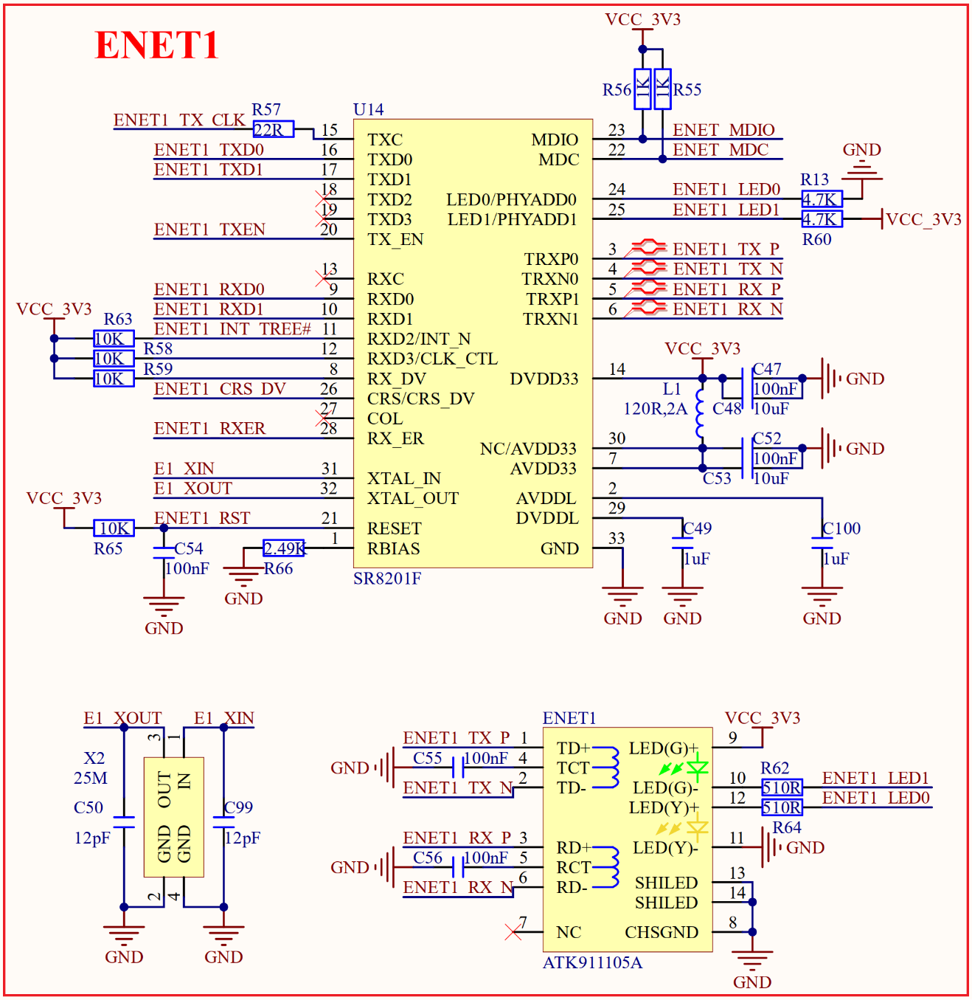 
图1.3.23.3 ENET1接口电路

&emsp;&emsp;ENET2网络接口原理图如下图所示：

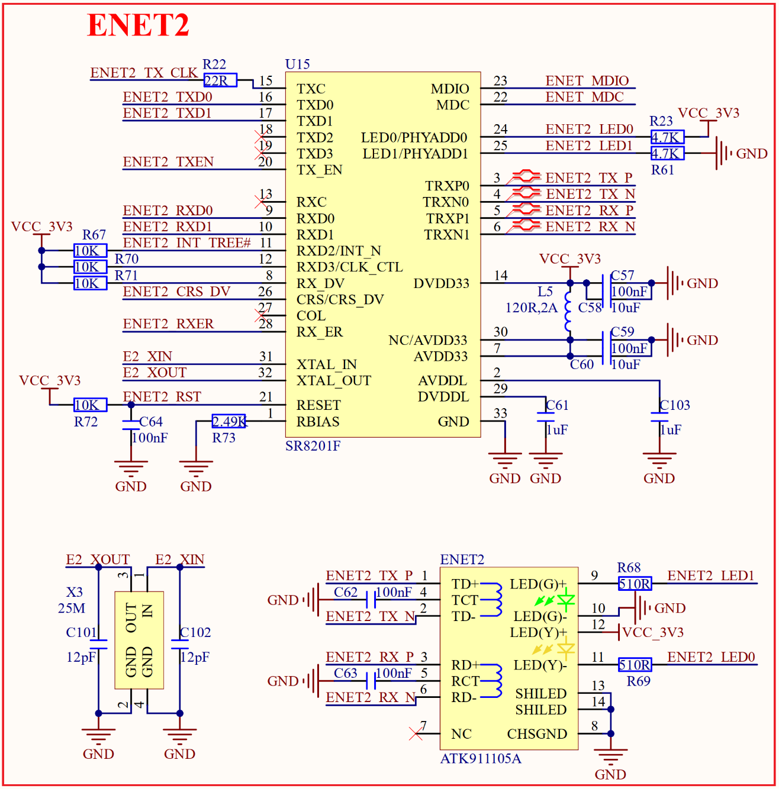 
图1.3.23.4 ENET2网络接口

&emsp;&emsp;I.MX6U内部自带两个网络MAC控制器，每个网络MAC需要外加一个PHY芯片来实现网络通信功能。

&emsp;&emsp;V2.4及其以后版本的底板采用`SR8201F`这颗芯片作为I.MX6U的PHY芯片，该芯片采用RMII接口与I.MX6U通信，这颗芯片占用IO也较少，也支持auto mdix（即可自动识别交叉/直连网线）功能。板载两个自带网络变压器的RJ45头（HR91105A），一起组成两个10M/100M自适应网卡。

&emsp;&emsp;不管是V2.4以前的还是以后的底板，对于ENET1和ENET2他们都共用ENET_MDIO和ENET_MDC这两根线，这两根线连接到了I.MX6U的GPIO1_IO06和GPIO1_IO07这两个IO上。

&emsp;&emsp;ENET1和ENET2都有一个复位引脚，分别为ENET1_RSET和ENET2_RESET，这两个IO分别连接到了I.MX6U的`SNVS_TAMPER7/SNVS_TAMPER8`这两个引脚上。

## 1.3.24 SAI音频编解码器

&emsp;&emsp;**V2.4版本以前的底板WM8960芯片接到I.MX6ULL的I2C2上，触摸屏也连接到了I2C2上，可能会出现触摸的时候干扰到WM8960音频芯片的情况。因此在V2.4及以后版本的底板上将WM8960芯片连接到了I.MX6ULL的I2C1上。**

&emsp;&emsp;V2.4版本以前的底板`WM8960`高性能音频编解码芯片其原理图如下图所示：

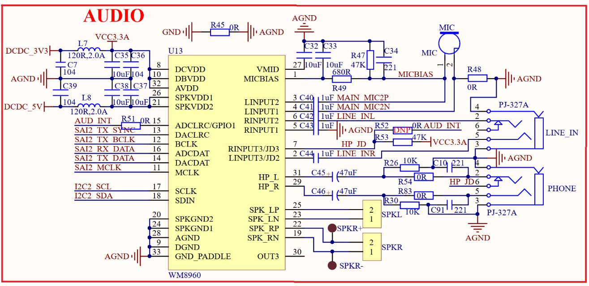 
图1.3.24.1 V2.4版本以前SAI音频编解码芯片

&emsp;&emsp;V2.4及以后版本底板的`WM8960`原理图如下图所示：

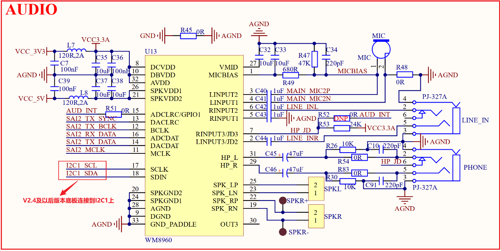 
图1.3.24.2 V2.4及以后版本SAI音频编解码芯片

&emsp;&emsp;WM8960是一颗低功耗、高性能的立体声多媒体数字信号编解码器。该芯片内部集成了**24位**高性能DAC&ADC，并且自段EQ调节，支持3D音效等功能。

&emsp;&emsp;不仅如此，该芯片还结合了立体声差分麦克风的前置放大与扬声器、耳机和差分、立体声线输出的驱动，减少了应用时必需的外部组件，直接可以驱动耳机（16Ω@40mW）和喇叭（8Ω/1W），无需外加功放电路。

&emsp;&emsp;图中，SPK-和SPK+连接了一个板载的**8Ω 1W**小喇叭（在开发板背面）。MIC是板载的咪头，可用于录音机实验，实现录音。PHONE是3.5mm耳机输出接口，可以用来插耳机。LINE_IN则是线路输入接口，可以用来外接线路输入，实现立体声录音。

&emsp;&emsp;该芯片采用SAI与I.MX6U的SAI接口连接，图中：`SAI2_TX_SYNC/SAI2_TX_BCLK/SAI2_RX_DATA/SAI2_TX_DATA/SAI2_MCLK/`分别接在MCU的：`JTAG_TDO/JTAG_TDI/JTAG_TCK/JTAG_nTRST/JTAG_TMS`上。

&emsp;&emsp;特别注意：WM8960和JTAG共用了很多信号，所以WM8960和JTAG接口不能同时使用！并且，经过实测，WM8960会干扰到JTAG，如果要使用JTAG那么就必须将与WM8960复用的这几根线断开！这也是为什么正点原子I.MX6U-ALPHA开发板开发板上面没有留JTAG接口的原因。

&emsp;&emsp;WM8960需要一个I2C接口去配置，V2.4以前底板使用I.MX6U的I2C2，I2C2_SCL和I2C2_SDA分别连接到了I.MX6U的UART5_TXD和UART5_RXD这两个引脚上。

&emsp;&emsp;V2.4及以后版本底板WM8960连接到了I2C1接口上，I2C1_SCL和I2C1_SDA分别连接到了I.MX6U的UART4_TXD和UART4_RXD这两个引脚上。

## 1.3.25 电源

&emsp;&emsp;I.MX6U-ALPHA开发板板载的电源供电部分，其原理图如下图所示：

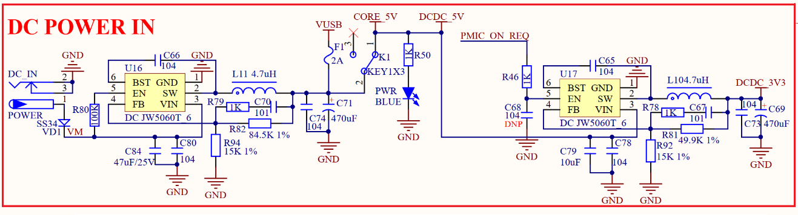 
图1.3.25.1 电源

&emsp;&emsp;图中，总共有2个稳压芯片：U16/U17，DC_IN用于外部直流电源输入，经过U16 DC-DC芯片转换为5V电源输出，其中VD1是防反接二极管，避免外部直流电源极性搞错的时候，烧坏开发板。

&emsp;&emsp;K1为开发板的总电源开关，F1为2A自恢复保险丝，用于保护USB。U17为3.3V稳压芯片，给开发板提供3.3V电源。 

&emsp;&emsp;这里还有USB供电部分没有列出来，其中VUSB就是来自USB供电部分，详见下一节。

## 1.3.26 电源输入输出接口

&emsp;&emsp;I.MX6U-ALPHA开发板板载了两组简单电源输入输出接口，其原理图如下图所示：

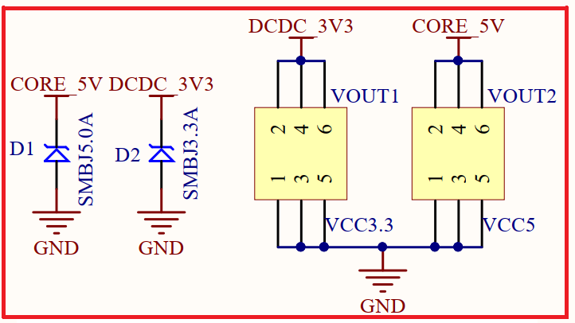 
图1.3.26.1 电源

&emsp;&emsp;图中，VOUT1和VOUT2分别是3.3V和5V的电源输入输出接口，有了这2组接口，我们可以通过开发板给外部提供 3.3V和5V电源了，虽然功率不大（最大1000mA），但是一般情况都够用了，大家在调试自己的小电路板的时候，有这两组电源还是比较方便的。同时这两组端口，也可以用来由外部给开发板供电。

&emsp;&emsp;图中D1和D2为TVS管，可以有效避免VOUT外接电源/负载不稳的时候（尤其是开发板外接电机/继电器/电磁阀等感性负载的时候），对开发板造成的损坏。同时还能一定程度防止外接电源接反，对开发板造成的损坏。

## 1.3.27 USB串口

&emsp;&emsp;I.MX6U-ALPHA开发板板载了一个USB串口，V2.4版本以前底板原理图如下图所示：

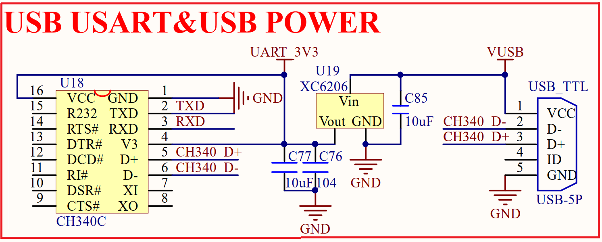 
图1.3.27.1 V2.4版本以前底板上的USB串口

&emsp;&emsp;V2.4及以后版本底板上的串口原理图如下图所示：

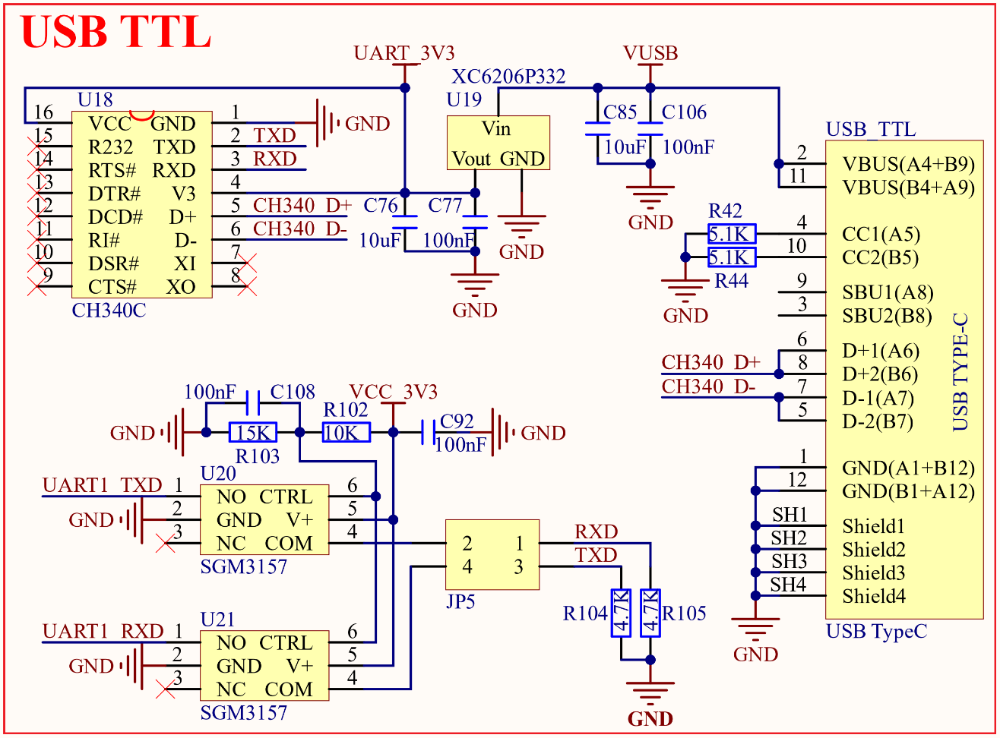 
图1.3.27.2 V2.4版本以前底板上的USB串口

&emsp;&emsp;以上两张图最大的区别就是，一个用的`Mini USB`座，一个用的`Type-C`座，其他部分完全相同。

&emsp;&emsp;USB转串口芯片，我们选择的是`CH340C`，是国内芯片公司南京沁恒的产品，稳定性非常不错所以还是多支持下国产。`CH340C`内置晶振，因此就不需要再在外面连接一个晶振。

&emsp;&emsp;图中可以看出CH340C的电源为3.3V，并且是独立供电的，U19是一个LDO芯片，负责给CH340C提供3.3V的电源。CH340C的电源不受开发板电源开关控制，只要接上USB线CH340就会上电。

&emsp;&emsp;图中RXD/TXD接JP5的RXD/TXD，是CH340芯片的串口接收和发送脚，可以通过跳线帽连接到I.MX6U的串口1上。

&emsp;&emsp;USB_TTL是`CH340C`和电脑通信的接口，V2.4版本以前是`Mini USB`口，V2.4及以后版本换为了Type-C接口。同时可以给开发板和CH340C供电，VUSB就是来自电脑USB的电源，USB_TTL是本开发板的主要供电口。

