# 1.4 I.MX6U核心板原理图详解

## 1.4.1 SOC

&emsp;&emsp;I.MX6U-ALPHA开发板配套的I.MX6U核心板，采用**MCIMX6Y2CVM08AB**（800MHz，实际792MHz）作为主控CPU，为工业级。自带32KB的L1指令和数据Cache、128KB的L2 Cache，集成NEON，集成双精度硬件浮点计算单元VFPv3，并具有128KB OCRAM、2个通用定时器（GPT）、4个周期定时器（EPIT）、8个PWM、1个SDMA控制器、4个ECSPI、3个看门狗、3个SAI、4个IIC、7个串口、2个USB（高速，带PHY）、2个FlexCAN、2个12位ADC、1个SPDIF接口、1个SRTC、1个RTC、2个USDHC接口、1个RGB LCD控制器（ELCDIF）、2个10/100M以太网MAC控制器、1个摄像头接口、1个硬件随机数生成器、以及124个通用IO口等，根据芯片型号的不同主频可以为528Mhz、700MHz(实际696MHz)、800MHz(实际792MHz)，轻松应对各种应用。

&emsp;&emsp;SOC部分的原理图如下图（因为原理图比较大，缩小下来可能有点看不清，请大家打开开发板光盘的原理图进行查看）所示：

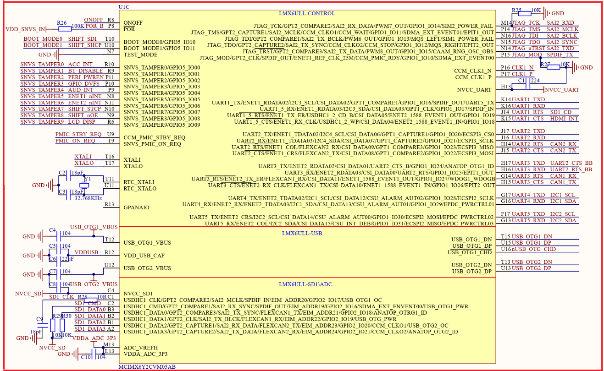 
图1.4.1.1 SOC部分原理图1

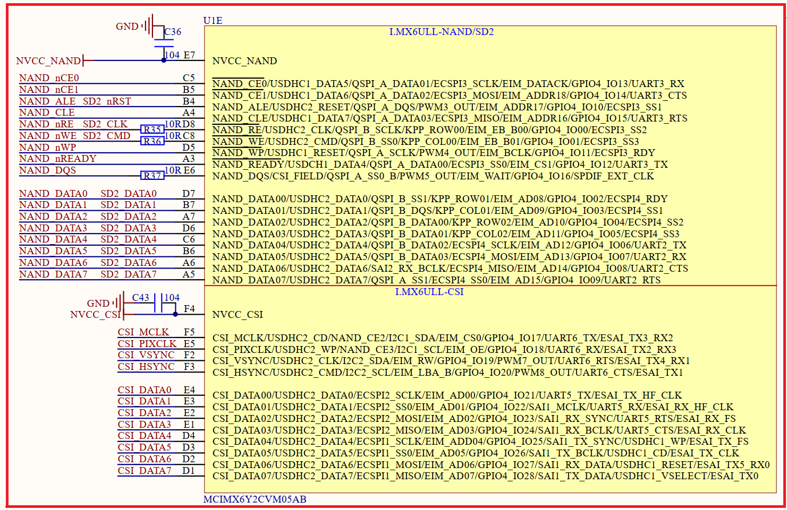 
图1.4.1.2 SOC部分原理图2

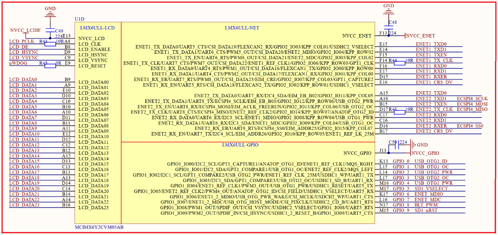 
图1.4.1.3 SOC部分原理图3

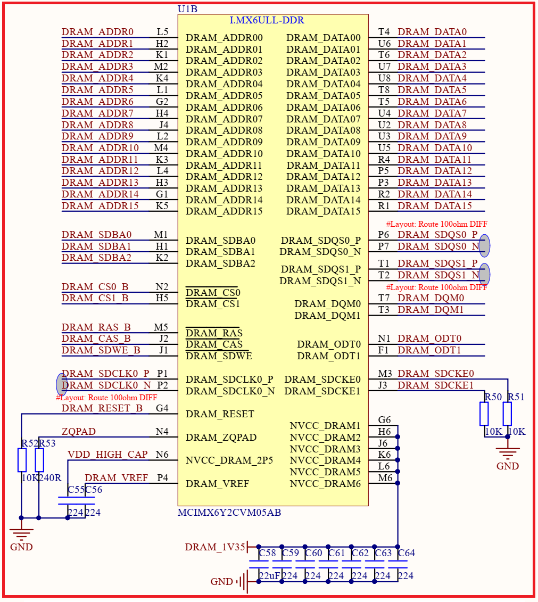 
图1.4.1.4 SOC部分原理图4

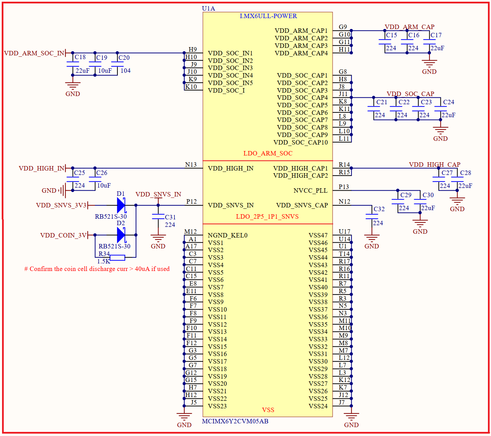 
图5.5.1.5 MCU部分原理图5

&emsp;&emsp;MCIMX6Y2CVM05AB/08AB芯片的原理图由5个部分组成，接下来依次看一下这五部分的具体内容： 
&emsp;&emsp;**图1.4.1.1**：此部分原理图主要是I.MX6U的部分IO原理图，比如SNVS_TAMPER0~9、JTAG外设IO、USDHC1外设IO、UART外设IO、USB外设IO等。

&emsp;&emsp;**图1.4.1.2**：此部分原理图也是I.MX6U的IO原理图，主要包括NAND Flash外设IO、USDHC2外设IO、CSI摄像头IO等。

&emsp;&emsp;**图1.4.1.3**：此部分原理图也是I.MX6U的IO原理图，包括LCD外设IO、ENET外设IO、GPIO1_IO01~09这一组GPIO。

&emsp;&emsp;**图1.4.1.4**：此部分原理图是I.MX6U的DRAM外设IO。用于连接DDR设备，比如正点原子ALPHA开发板所使用的DDR3L。

&emsp;&emsp;**图1.4.1.5**：此部分原理图是I.MX6U的电源部分。

## 1.4.2 BTB接口

&emsp;&emsp;I.MX6U核心板采用**2个2*30**的3710M（母座）板对板连接器来同底板连接(在转接板底面)，接插非常方便，转接板上面的底板接口原理图如下图所示：

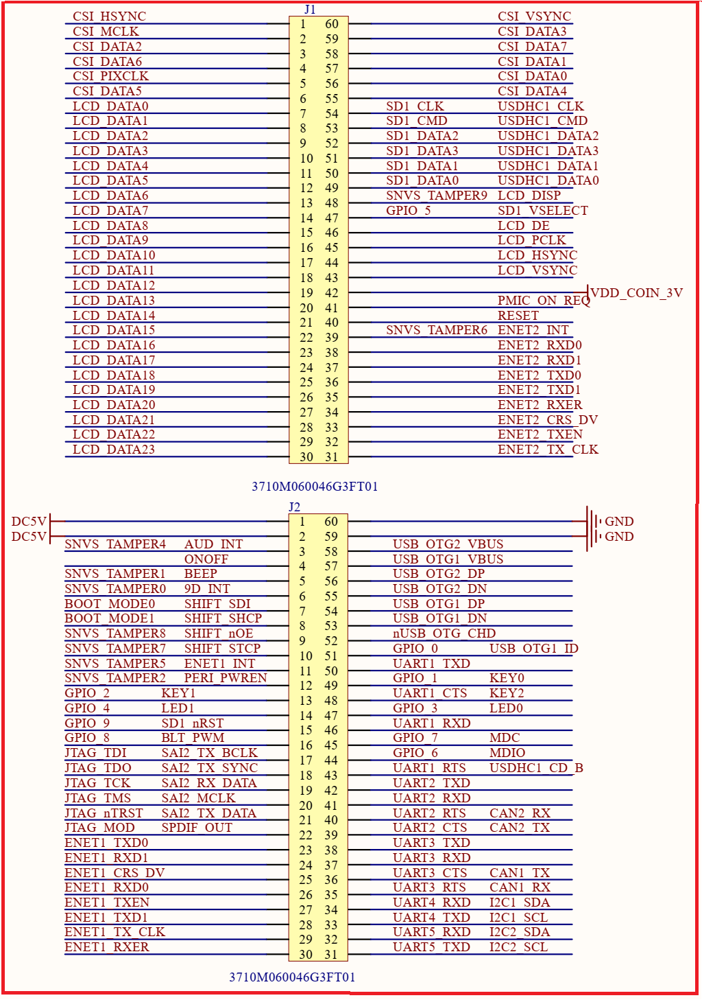 
图1.4.2.1 底板接口

&emsp;&emsp;图中，J1和J2是**2个2*30**的板对板母座（3710M），和底板的接插非常方便，方便大家嵌入自己的项目中去。该接口总共引出105个IO口，另外，还有USB、电源、复位、ONOFF等信号。

## 1.4.3 NAND FLASH

&emsp;&emsp;I.MX6U NAND版本核心板板载了一个NAND Flash，此部分电路如下图所示：

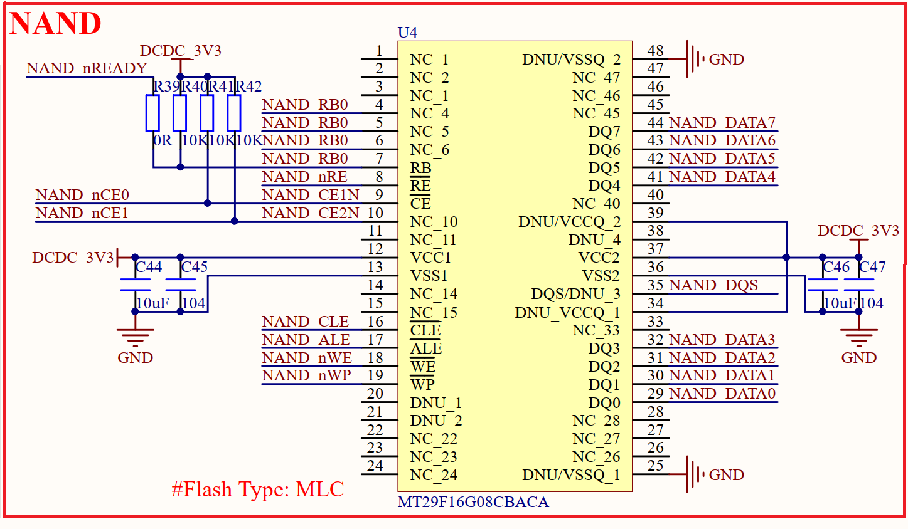 
1.4.3.1 NAND Flash

&emsp;&emsp;对于Linux系统而言，是需要一个存储数据、系统的存储芯片，比如QSPI Flash、NAND Flash、EMMC等。

&emsp;&emsp;正点原子的I.MX6U-ALPHA开发板有两种核心板，这两种核心板的FLASH存储芯片不同，一个使用的NAND FLASH、一个使用的EMMC。上图中的是NAND Flash的原理图，经过测试，可以支持256MB、512MB、2GB的NAND FLASH存储芯片。

## 1.4.4 EMMC

&emsp;&emsp;I.MX6U EMMC核心板板载了**8GB**的EMMC，此部分电路如下图所示：

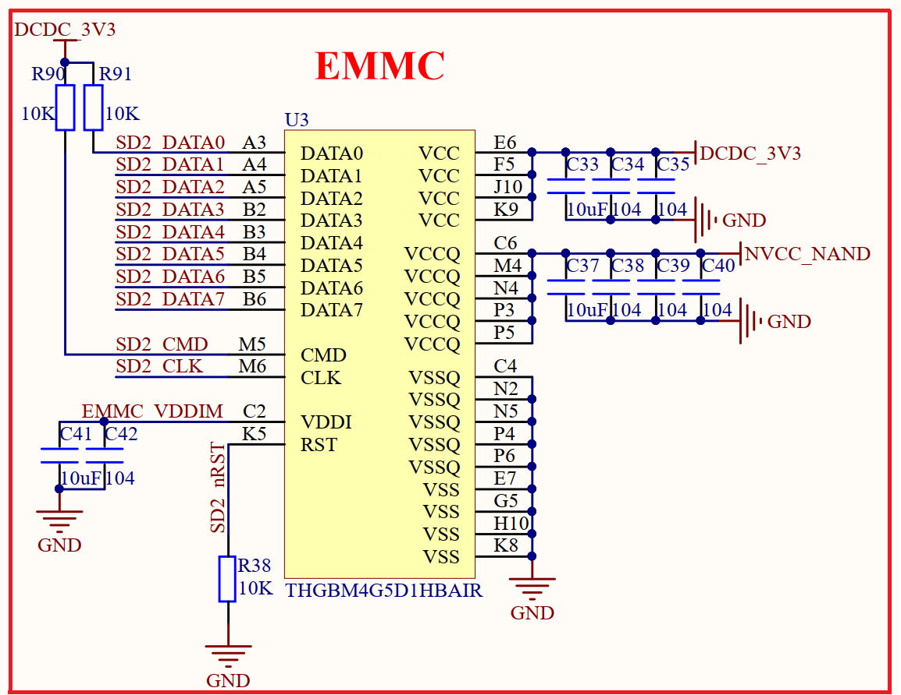 
1.4.4.1 EMMC

## 1.4.5 DDR3L

&emsp;&emsp;I.MX6U核心板板载了DDR3L，此部分电路如下图所示：

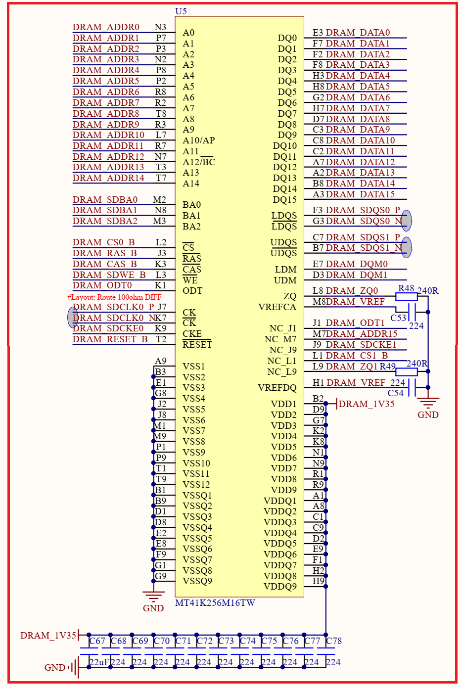 
1.4.5.1 DDR3L

&emsp;&emsp;图中，U5就是DDR3L芯片，根据配置的不同，一共有两种型号，分别为：NT5CC256M16EP-EK(512MB)和NT5CC128M16JR-EK(256MB)。该芯片挂在I.MX6U的MMDC接口上。 

## 1.4.6 核心板电源

&emsp;&emsp;I.MX6U对于供电有严格的要求，尤其是上电顺序，正点原子的I.MX6U核心板供电主要分5部分：SNVS供电、DCDC_3V3供电、ARM/SOC内核供电、DDR3L供电和SD卡供电，我们依次来看一下，首先是SNVS供电，I.MX6U的数据手册要求，SNVS必须最先上电，此部分供电电路如下图所示：

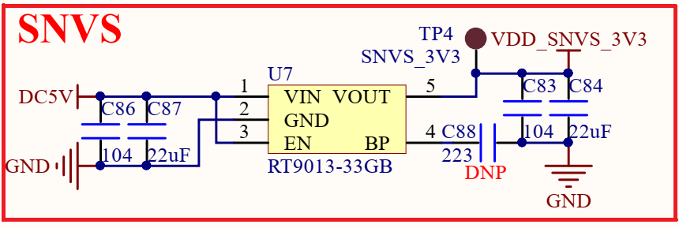 
图1.4.6.1 SVS_3V3供电

&emsp;&emsp;图中，U7是一颗LDO芯片，将5V转化为3.3V，作为SNVS_3V3，由于SNVS_3V3电流不大，所以一个LDO芯片就可以了。接下来是DCDC_3V3，也就是核心板的主电源，如下图所示：

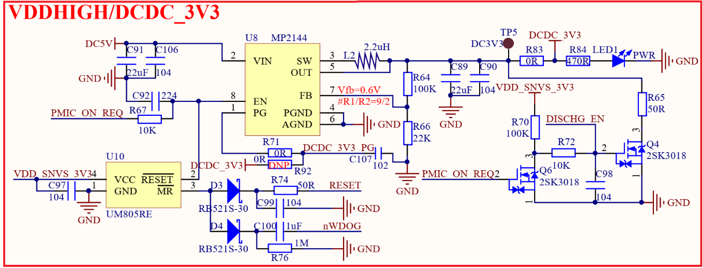 
图1.4.6.2 DCDC_3V3

&emsp;&emsp;U8是一个DCDC芯片，用于将5V转换为3.3V，但是电流大，MP2144最大输出2A大电流，因此作为核心板的3.3V主电源。

&emsp;&emsp;这里要注意，U8的使能引脚使用了I.MX6U的PMIC_ON_REQ引脚来控制，当SNVS_3V3供给I.MX6U的VDD_SNVS_IN引脚以后，I.MX6U的PMIC_ON_REQ引脚就会输出高电平，从而产生DCDC_3V3，DCDC_3V3也是I.MX6U的VDD_HIGH_IN电源。接下来就是ARM/SOC内核电源，如下图所示：

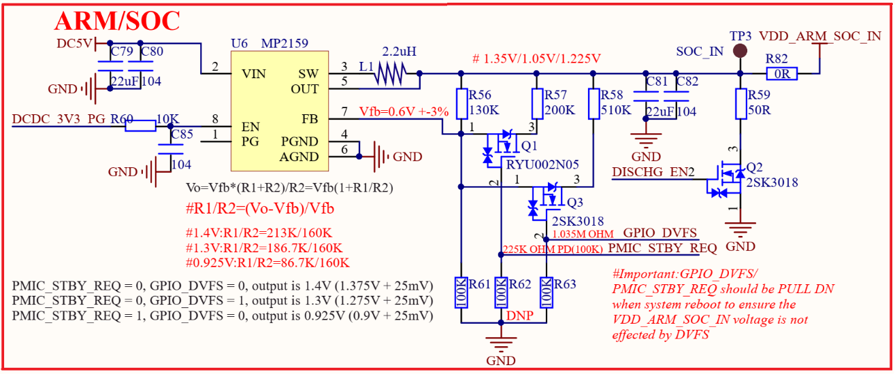 
图1.4.6.3 ARM/SOC电源

&emsp;&emsp;U6也是一片DCDC，用于产生ARM/SOC内核电压，此内核电压可以通过I.MX6U的GPIO_DVFS和PMIC_STBY_REQ来调节。

&emsp;&emsp;U6的使能脚连接到了DCDC_3V3_PG信号上，此信号是由U8产生的，当U8输出3.3V电压以后DCDC_3V3_PG信号就会产生，为一个高电平信号。

&emsp;&emsp;通过DCDC_3V3_PG来控制VDD_ARM_SOC_IN电源的产生，这样就保证了VDD_HIGH_IN比ARM_SOC_IN先上电的要求。

&emsp;&emsp;接下来看一下DDR3L电源，正点原子的I.MX6U核心板使用的是DDR3L，DDDR3L的工作电压为1.35V，此部分电源电路如下图所示：

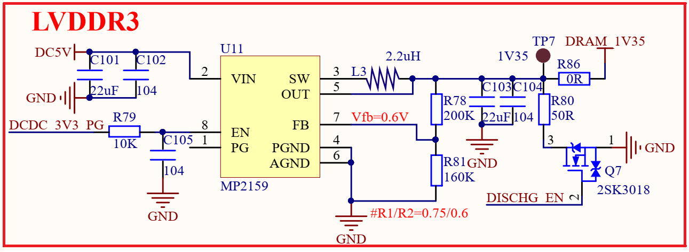 
图1.4.6.4 DDR3L电路

&emsp;&emsp;U11也是一个DCDC芯片，用于将5V电源转换为1.35V供DDR3L使用。接下来看一下SD卡部分电路，如下图所示：

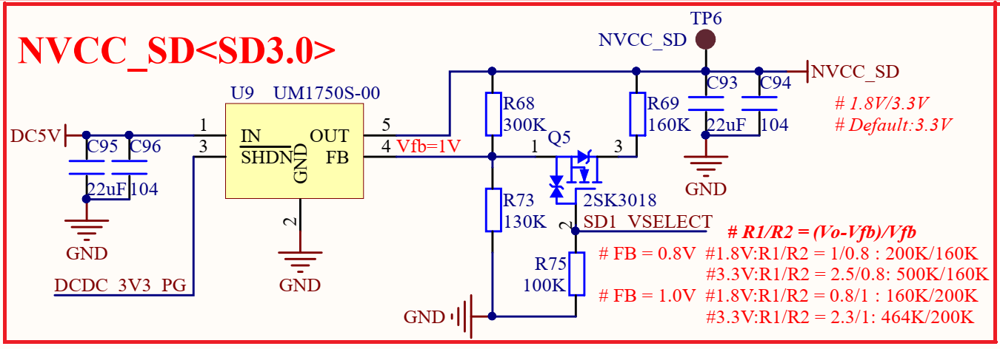 
图1.4.6.5 SD卡电源

&emsp;&emsp;U9是一片LDO，用于将5V电源转为3.3V或1.8V供SD卡使用，因为高速SD卡需要1.8V供电，因此此路电源电压是可调的，通过`SD1_VSELECT`来选择使用3.3V还是1.8V，SD1_VSELECT连接到了I.MX6U的GPIO1_IO05上。

&emsp;&emsp;最后还有I.MX6U其他外设电源，如下图所示：

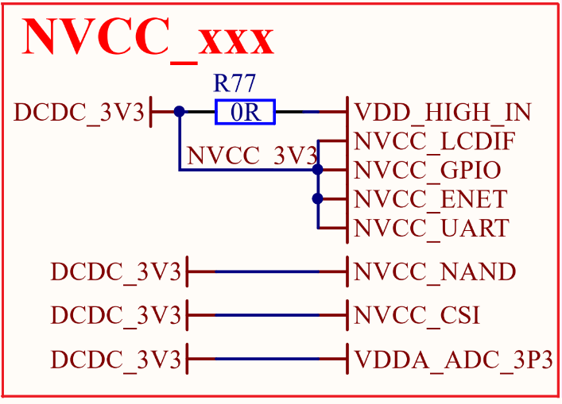 
图1.4.6.6 I.MX6U其他外设电源

