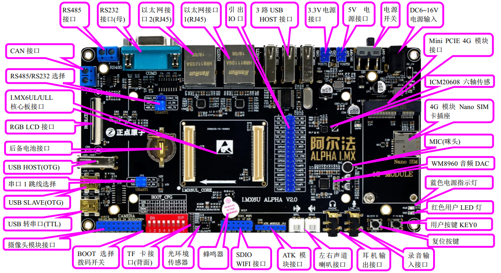
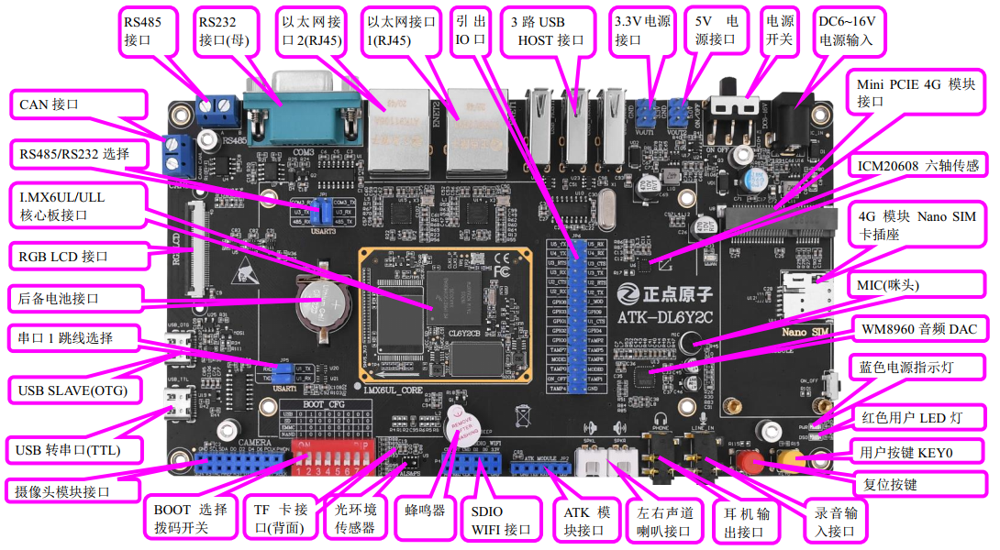
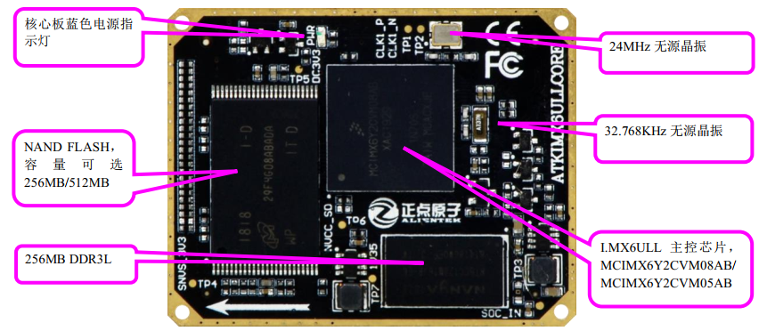
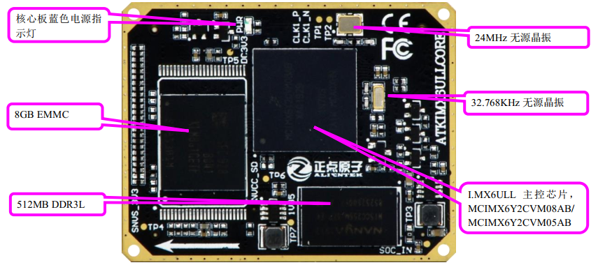

# 1.1 正点原子I.MX6U-ALPHA开发板资源初探

正点原子目前已经拥有多款STM32、I.MXRT以及FPGA开发板，这些开发板常年稳居淘宝销量冠军，累计出货超过10W套。这款`ALPHA`开发板，是正点原子推出的第一款Linux开发板，采用底板+核心板的形式。接下来我们分别介绍I.MX6U-ALPHA开发板的底板和核心板。

## 1.1.1 I.MX6U-ALPHA开发板底板资源

首先，我们来一下I.MX6U-ALPHA开发板的底板资源图，V2.4版本以前底板如图所示：

V2.4及以后版本底板资源如下图所示：

以上两张图这两个底板在外观上最主要的区别有两点：
①、USB_OTG座换成了Type-C，并且去掉了USB OTG的HOST座。
②、USB_TTL这个串口接口也更换成了Type-C。

I.MX6U-ALPHA开发板底板资源十分丰富，把I.MX6UL/ULL的内部资源发挥到了极致，基本所有I.MX6UL/ULL的内部资源都可以在此开发板上验证，同时扩充丰富的接口和功能模块，整个开发板显得十分大气。

开发板的外形尺寸为`100mm*180mm`大小，板子的设计充分考虑了人性化设计，并结合正点原子多年的开发板设计经验，经过多次改进，最终确定了这样的设计。

正点原子I.MX6U-ALPHA开发板底板板载资源如下： 
◆	1个核心板接口，支持I.MX6UL/6ULL等核心板 
◆	1个电源指示灯（蓝色） 
◆	1个状态指示灯（红色） 
◆	1个六轴（陀螺仪+加速度）传感器芯片，ICM20608 
◆	1个高性能音频编解码芯片，WM8960 
◆	1路CAN接口，采用TJA1050芯片 
◆	1路485接口，采用SP3485芯片 
◆	1路RS232串口（母）接口，采用SP3232芯片 
◆	1个ATK模块接口，支持正点原子蓝牙/GPS/MPU6050/手势识别等模块 
◆	1个光环境传感器（光照、距离、红外三合一） 
◆	1个摄像头模块接口 
◆	1个OLED模块接口 
◆	1个USB串口，可用于代码调试 
◆	1个USB SLAVE(OTG)接口，用于USB从机通信  
◆	1个有源蜂鸣器  
◆	1个RS232/RS485选择接口 
◆	1个串口选择接口 
◆	1个TF卡接口（在板子背面） 
◆	2个10M/100M以太网接口（RJ45）  
◆	1个录音头（MIC/咪头） 
◆	1路立体声音频输出接口 
◆	1路立体声录音输入接口 
◆	1个小扬声器（在板子背面） 
◆	2个扬声器外接接口，左右声道 
◆	1组5V电源供应/接入口 
◆	1组3.3V电源供应/接入口 
◆	1个直流电源输入接口（输入电压范围：DC6~18V）  
◆	1个启动模式选择配置接口 
◆	1个RTC后备电池座，并带电池 
◆	1个复位按钮，可用于复位MPU和LCD 
◆	1个功能按钮 
◆	1个电源开关，控制整个板的电源  
◆	1个Mini PCIE 4G模块接口 
◆	1个Nano SIM卡接口 
◆	1个SDIO WIFI接口 

正点原子I.MX6U-ALPHA开发板底板的特点包括： 
1）、接口丰富。板子提供十来种标准接口，可以方便的进行各种外设的实验和开发。 
2）、设计灵活。我们采用核心板+底板形式，板上很多资源都可以灵活配置，以满足不同条件下的使用；我们引出了105个IO口，极大的方便大家扩展及使用。  
3）、资源丰富。板载高性能音频编解码芯片、六轴传感器、百兆网卡、光环境传感器以及各种接口芯片，满足各种应用需求。 
4）、人性化设计。各个接口都有丝印标注，且用方框框出，使用起来一目了然；部分常用外设大丝印标出，方便查找；接口位置设计合理，方便顺手。资源搭配合理，物尽其用。

## 1.1.2 I.MX6U核心板资源

接下来，我们来看I.MX6ULL核心板资源图，正点原子的I.MX6ULL核心板根据存储芯片的不同分为EMMC和NAND两种，根据对外提供的接口可以分为邮票孔和BTB两种。本教程主要使用与教学的，所以只会讲解BTB接口的核心板，BTB接口的NAND版本核心板如下图所示：

从上图可以看出，I.MX6ULL核心板板载资源丰富，可以满足各种应用的需求。整个核心板的外形尺寸为46mm*36mm大小，非常小巧，并且采用了贴片板对板连接器，使得其可以很方便的应用在各种项目上。I.MX6ULL NAND版核心板为工业级工作温度，可以应用在温度要求严格的场合。

正点原子I.MX6ULL NAND版核心板板载资源如下： 
◆	CPU：`MCIMX6Y2CVM05AB`(工业级)或`MCIMX6Y2CVM08AB`（工业级），主频分别为**528MHz**和**800MHz**(实际为792MHz)，BGA289 
◆	外扩DDR3L：`NT5CC128M16JR-EK`，**256MB**字节，工业级 
◆	NAND FLASH：`MT29F2G08ABAEAWP-IT`或 `MT29F4G08ABADAWP-IT`，分别为**256MB/512MB**字节，均为工业级 
◆	两个`2*30`的防反插BTB座，共引出120 PIN 。 

BTB接口的EMMC版本核心板如下图所示：

从上图可以看出，EMMC版本的核心和NAND版本的基本一样，不同之处在于将NAND换成了EMMC，将DDR3L换成了512MB的商业级。因此正点原子的EMMC核心板为商业级的工作温度范围，如需工业级的请联系定制。 

正点原子I.MX6ULL EMMC版核心板板载资源如下： 
◆	CPU：`MCIMX6Y2CVM08AB`（工业级），**800MHz**(实际792MHz)，BGA289 
◆	外扩DDR3L：`NT5CC256M16EP-EK`，**512MB**字节，商业级。 
◆	EMMC：`KLM8G1GET`，这是一个**8GB**的EMMC芯片。 
◆	两个`2*30`的防反插BTB座，共引出**120** PIN 

正点原子I.MX6ULL核心板的特点包括： 
1）	体积小巧。核心板仅`46mm*36mm`大小，方便使用到各种项目里面。 
2）	集成方便。核心板使用120P BTB连接座，可以非常方便的集成到客户PCB上，更换简单，方便维修测试。 
3）	资源丰富。核心板板载：256MB/512MB DDR3L、可以选择NAND或EMMC等存储器，可以满足各种应用需求。 
4）	性能稳定。核心板采用6层板设计，单独地层、电源层，且关键信号采用等长线走线，保证运行稳定、可靠。 
5）	不管是NAND还是EMMC核心板均通过了CE和FCC认证。 
6）	人性化设计。底部放有详细丝印，方便安装；按功能分区引出IO口，方便布线。 

