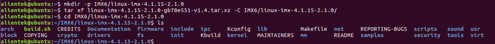
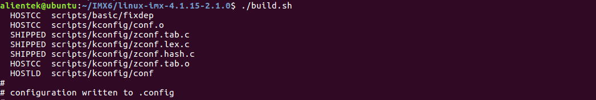
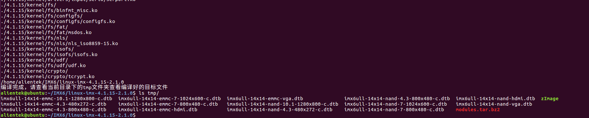

# 编译出厂源码内核及模块

将**开发板光盘A-基础资料->1、例程源码->3、正点原子Uboot和Linux出厂源码->linux-imx-4.1.15-2.1.0-gxxxxxx-vxx.tar.xz**（x代表未知版本，可能为.xz格式或者.bz2格式）Linux源码拷贝到Ubuntu拷贝到虚拟机Ubuntu家目录（当前用户目录）下，使用tar指令解压。

首先在家目录下创建IMX6/linux-imx-4.1.15-2.1.0目录，我们将Linux源码解压到此目录下。
```c#
mkdir -p IMX6/linux-imx-4.1.15-2.1.0
tar xf linux-imx-4.1.15-2.1.0-gb78e551-v1.4.tar.xz -C IMX6/linux-imx-4.1.15-2.1.0/
cd IMX6/linux-imx-4.1.15-2.1.0
ls
```



在编译内核之前，前提需要先安装4.2小节的Poky交叉编译工具链。

我们在Linux源码里写了一个脚本，脚本里已经配置好deconfig文件，和编译的目标文件。我们直接执行build.sh，即可编译Linux源码。编译的目标文件会在当前Linux源码顶层目录下的tmp文件夹里。
```c#
build.sh      // 开始编译出厂Linux源码，包括zImage，dtb和modules。
```



编译完成，及查看tmp目录下的编译目标文件，如下图，包含很多dtb文件（设备树），及Linux内核zImage，还有modules.tar.bz2（内核模块）。



更新内核的方法请参考【正点原子】I.MX6U 开发板文件拷贝及固件更新参考手册V1.x.pdf文档。
