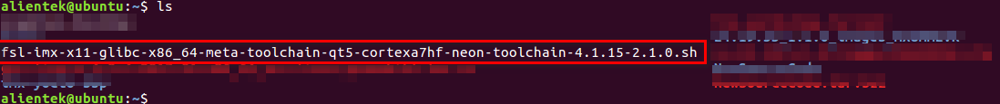
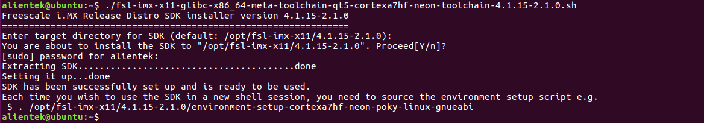
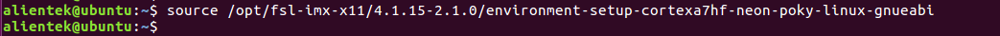
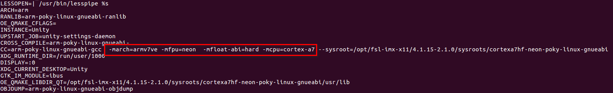
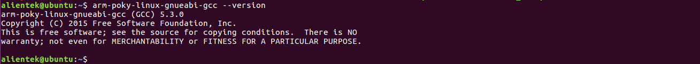

# 安装Poky交叉编译工具链

把**开发板光盘A-基础资料->5、开发工具->1、交叉编译器->fsl-imx-x11-glibc-x86_64-meta-toolchain-qt5-cortexa7hf-neon-toolchain-4.1.15-2.1.0.sh**拷贝到Ubuntu虚拟机

如下图本文已经把交叉编译工具拷贝到了Ubuntu虚拟机。



执行下面的指令修改脚本的权限，修改权限后可以看到此脚本颜色显示改变，说明修改成功。
```c#
chmod u+x fsl-imx-x11-glibc-x86_64-meta-toolchain-qt5-cortexa7hf-neon-toolchain-4.1.15-2.1.0.sh
```
直接执行脚本安装交叉编译工具，连续敲下两次回车键确认，再输入用户密码即可。本次安装的目录为脚本所指定的默认安装的目录，后面的内核编译环境的交叉编译都是按这个安装目录去操作，所以建议用户也是默认安装到/opt/fsl-imx-x11/4.1.15-2.1.0这个默认目录。
```c#
./fsl-imx-x11-glibc-x86_64-meta-toolchain-qt5-cortexa7hf-neon-toolchain-4.1.15-2.1.0.sh
```


使用方法也十分简单，根据上面打印出来的提示，直接使能环境变量就可以了。但是在不同终端或者切换用户时需要重新使能环境变量方可使用。
```c#
source /opt/fsl-imx-x11/4.1.15-2.1.0/environment-setup-cortexa7hf-neon-poky-linux-gnueabi
```



使能环境变量后可以使用env指令查看生效的环境变量，下图为部分截图，可以看出使能了这个环境变量后gcc已经配置好编译时所用的参数，如硬浮点参数-mfpu=neon -mfloat-abi=hard。使用硬浮点交叉编译，可以使用CPU自带FPU。下图为环境变量部分截图。
```c#
env
```



使用arm-poky-linux-gnueabi-gcc -v指令可以查看gcc版本，表明环境变量已经生效。
```c#
arm-poky-linux-gnueabi-gcc --version
```


要使用此编译器编译内核和U-boot还需要安装以下软件。
```c#
sudo apt-get update        // 先更新软列表（本地数据库）
sudo apt-get install lzop  // 安装lzop工具，用于生成压缩或解压镜像
sudo apt-get install libncurses* // 安装ncurese相关库，U-boot或者内核菜单显示时需要
```
