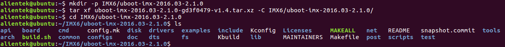
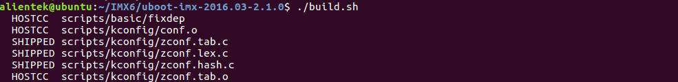
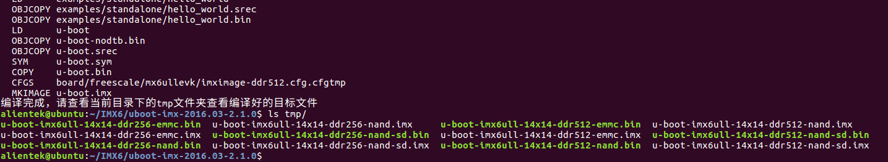

# 编译出厂源码U-boot

将**开发板光盘A-基础资料->1、例程源码->3、正点原子Uboot和Linux出厂源码->uboot-imx-2016.03-2.1.0-gxxxxxx-vxx.tar.bz**（x代表未版本，可能为.xz格式或者.bz2格式） U-boot源码解压到Ubuntu拷贝到虚拟机Ubuntu家目录（当前用户目录）下，使用tar指令解压。

先在家目录创建一个IMX6/uboot-imx-2016.03-2.1.0目录，并将U-boot源码解压到此目录。
```c#
mkdir -p IMX6/uboot-imx-2016.03-2.1.0
tar xf uboot-imx-2016.03-2.1.0-gd3f0479-v1.4.tar.xz -C IMX6/uboot-imx-2016.03-2.1.0/
cd IMX6/uboot-imx-2016.03-2.1.0
ls
```



在编译U-boot之前，前提需要先安装[上一小节](./install_poky.md)的Poky交叉编译工具链。

我们在Linux源码里写了一个脚本，脚本里已经配置好deconfig文件，和编译的目标文件。我们直接执行build.sh，即可编译U-boot源码。编译的目标文件会在当前U-boot源码顶层目录下的tmp文件夹里。
```c#
build.sh    // 开始编译出厂U-boot源码，生成u-boot.imx，第一级启动引导文件。
```


编译完成后查看当前目录下的tmp文件夹编译的文件目标，*imx是已经添加头部信息的U-boot镜像，可直接使用dd指令烧写到TF卡和开发板上的eMMC储存设备，详细请参考【正点原子】I.MX6U 开发板文件拷贝及固件更新参考手册V1.x.pdf；*bin是未添加状信息的U-boot镜像，需要使用【正点原子】I.MX6U嵌入式Linux驱动开发指南里所说的imxdownload工具烧写。




