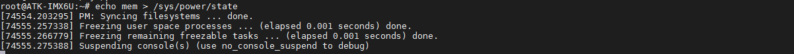

# 关机、重启和休眠

由于I.MX6ULL芯片使用挂起和关机指令都会对芯片内部寄存器写了某个值，而板子RTC电池与板子构成一个回路，所以如果需要输入挂起或者关机指令的用户，不能装RTC电池。否则需要长按ON_OFF按钮或者短接地ON_OFF管脚复位芯片内部寄存器的值才能重新开机。（注：2021年6月18日更新出厂系统后，可以使用关机指令或挂起指令来关机。）
```c#
init 0    // 挂起
init 6    // 重启
halt      // 挂起
poweroff  // 关机
reboot    // 重启
shutdown  // 挂起
```

常用的休眠方式有freeze，standby， mem， disk但是默认出厂系统不支持disk方式。

+ freeze: 冻结I/O设备,将它们置于低功耗状态,使处理器进入空闲状态，唤醒最快，耗电比其它standby， mem，disk方式高
+ standby:除了冻结I/O设备外，还会暂停系统，唤醒较快，耗电比其它 mem， disk方式高
+ mem:将运行状态数据存到内存，并关闭外设，进入等待模式,唤醒较慢，耗电比disk方式高
+ disk: 将运行状态数据存到硬盘，然后关机，唤醒最慢

输入下面指令，使用mem方式将系统休眠，唤醒时换KEY0按键。
```c#
killall apmd                  // 先杀掉进阶电源管理服务程序
echo mem > /sys/power/state
```




