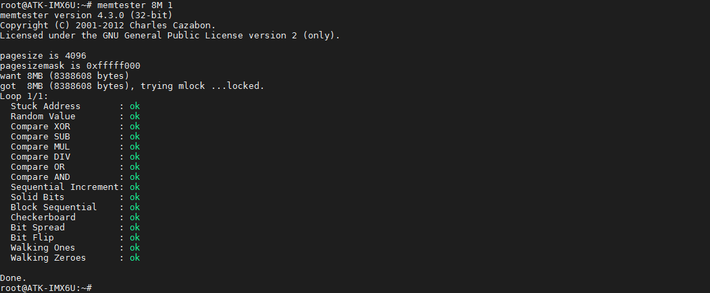

# DDR测试

Memtester简单介绍
Memtester主要是捕获内存错误和一直处于很高或者很低的坏位， 其测试的主要项目有随机值，异或比较，减法，乘法，除法，与或运算等等。 通过给定测试内存的大小和次数，可以对系统现有的内存进行上面项目的测试。
```c#
memtester [-p PHYSADDR] <MEMORY> [ITERATIONS]
```
参数说明：
+ MEMORY 申请测试内存的数量，单位默认是megabytes(兆)，也可以是B K M G。
+ ITERATIONS 测试的次数，默认是无限

使用文件系统自带的Memtester测试工具申请8MB内存数量测试做1次DDR测试。执行如下指令。
```c#
memtester 8M 1
```




