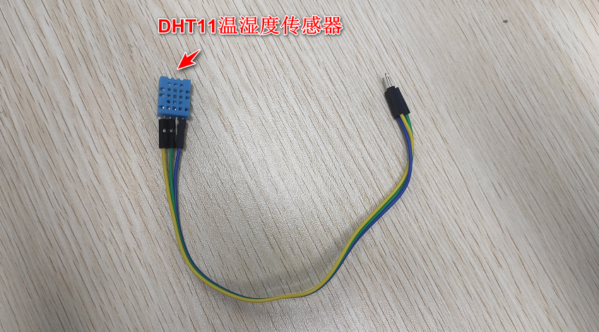
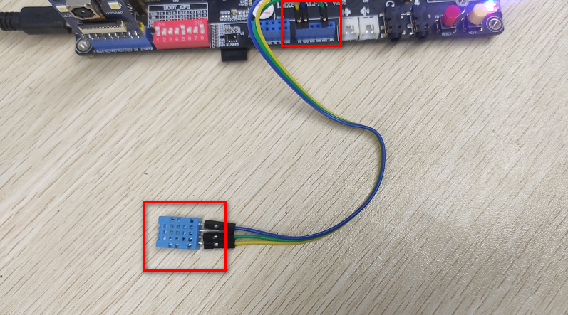
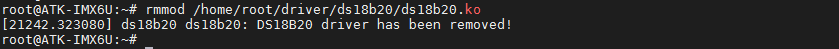
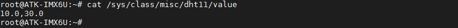

# DHT11测试

开发板用于测试DHT11对应的管脚关系如下：

| 开发板     | GPIO1  |
| ---------- | ------ |
| ALPHA/Mini | Dout   |

DHT11简介：
DHT11 是一款湿温度一体化的数字传感器。该传感器包括一个电阻式测湿元件和一个 NTC测温元件，并与一个高性能 8 位单片机相连接。通过单片机等微处理器简单的电路连接就能够实时的采集本地湿度和温度。DHT11 与单片机之间能采用简单的单总线进行通信，仅仅需要一个 I/O 口。传感器内部湿度和温度数据 40Bit 的数据一次性传给单片机，数据采用校验和方式进行校验，有效的保证数据传输的准确性。DHT11 功耗很低，5V 电源电压下，工作平均最大电流 0.5mA。

此实验需要准备DHT11模块，可在正点原子淘宝店购买。


正点原子淘宝DHT11的技术参数如下：<br />
工作电压范围：3.3V-5.5V<br />
工作电流： 平均0.5mA<br />
输出：单总线数字信号<br />
测量范围：湿度 20~90％RH，温度 0~50℃<br />
精度 ：湿度±5%，温度±2℃<br />
分辨率 ：湿度 1%，温度 1℃

DHT11模块的管脚排列如下图，下图为正面视图，有孔的一面为正面。


由于开发板管脚资源有限，使用紧张。没有单独留出一个座子给DS18B20和DHT11使用。查看原理图可知，GPIO1管理上ATK MODULE座子上。所以我们可以通过杜绑线来连接DHT11到ATK MODULE座子上的GPIO1管脚上。


那么我们就可以使用三根杜邦线（一头公，另一头母的），其中NC脚不用接，连接DHT11模块。如下图。



然后根据上文的DHT11的正视图，有孔的一面为正视图。将DATA脚接到ATK MODULE座子上丝印为KEY的座孔上。然后再将VCC，与GND都接在ATK MODULE的孔位上。如下图，正确的接法如下。注意，有孔的一面应朝上，不应被其他异物遮挡。下图为APLHA底板与DHT11接法，Mini底板同理。



如果您在上一小节，测试过DS18B20，已经加载过DS18B20驱动的话，我们应该卸载DS18B20的驱动，因为它们是共用同一个管脚的。不能同时加载。执行下面的指令卸载DS18B20驱动。
```c#
rmmod /home/root/driver/ds18b20/ds18b20.ko
```



接好模块后，我们需要加载驱动。正点原子为DHT11编写了驱动模块（`源码在01、例程源码->05、模块驱动源码->04、dht11&ds18b20驱动源码`）。驱动在文件系统路径/home/root/driver/dht11/ dht11.ko。所以我们直接加载这个驱动即可。（注：此驱动需要更新到v2.2版本的文件系统才有）。
```c#
insmod /home/root/driver/dht11/dht11.ko
```


读取DHT11的湿度与温度传感器的值。
```c#
cat /sys/class/misc/dht11/value
```



得出来的数值前面的数据为湿度，后面的数据为温度。注意精度湿度±5%，温度±2℃。数据有小数是为了数据好看。如果不能获取数据，请检查是传感器是否连接稳定，及接法是否正确。