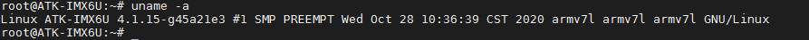
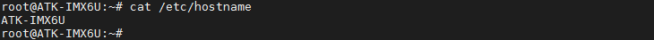
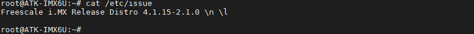
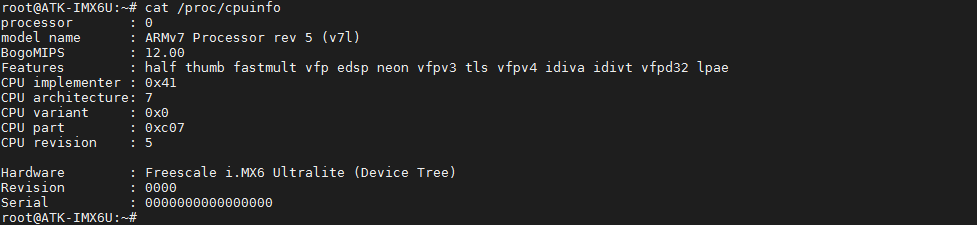
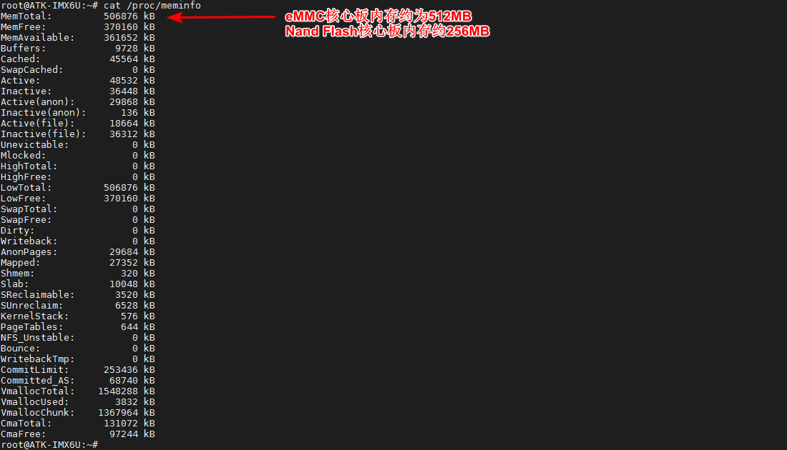

# 查看系统信息

显示操作系统的内核版本号。

```c#
uname -a
```



查看系统主机名。
```c#
cat /etc/hostname
```



查看系统登录开机信息，（备注：非自动登录时会打印开机信息）。
```c#
cat /etc/issue
```



查看CPU相关信息。
```c#
cat /proc/cpuinfo
```



查看内存相关信息。
```c#
cat /proc/meminfo
```




