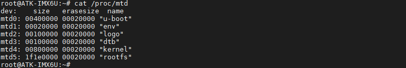
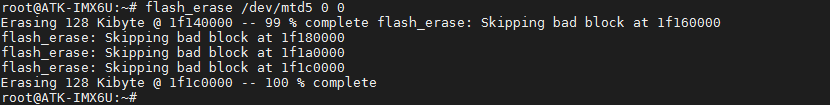
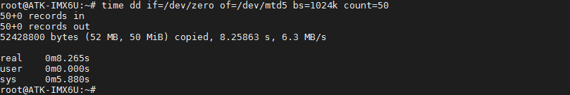
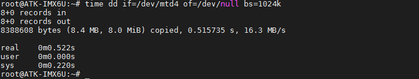

# NAND FLASH  读写速度测试

本实验测试要求用SD卡启动卡启动，使用NAND FLASH版本的核心板进行测试。实际上读写数据量越大，数据越平均，越接近实际值。
```c#
cat /proc/mtd
```



写数据前需要对操作的分区进行擦除，注意该操作会清除该操作分区的数据，请提前做好数据备份。
```c#
flash_erase /dev/mtd5 0 0
```



执行如下指令往 NAND FLASH 的 mtd5 文件系统分区写入 50MiB 数据，bs 大小为1024KB。
```c#
time dd if=/dev/zero of=/dev/mtd5 bs=1024k count=50
```



执行如下指令从 NAND FLASH 的 mtd4 内核分区（8MiB）读取 8MiB 数据。
```c#
time dd if=/dev/mtd4 of=/dev/null bs=1024k
```




