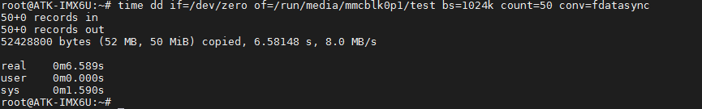
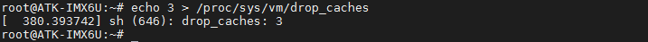
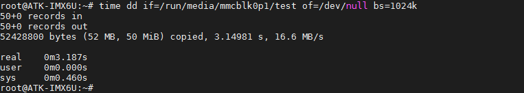

# TF(SD)卡读写测试

本实验测试SD卡读写速度，建议使用SD卡作为系统启动卡。

指令提示：
time命令常用于测量一个命令的运行时间，dd 用于复制，从 if(input file)文件读出，写到 of(output file)指定的文件，bs 是每次写块的大小，count 是读写块的数量。"if=/dev/zero"不产生 IO，即可以不断输出数据，因此可以用来测试纯写速度。

## TF(SD)卡写速度测试

本次对TF系统卡的第一个分区写50MiB数据（注意这里读写数据越大测试出来计算出来的结果越平均与接近实际值，但要注意TF卡第一个分区的实际大小）。执行下面的指令测试TF卡的写速度。

```c#
time dd if=/dev/zero of=/run/media/mmcblk0p1/test bs=1024k count=50 conv=fdatasync
```



这里一共写入50 MiB test文件，速度为8.0 MB/s。

## TF(SD)卡读速度测试

小提示：
因为LINUX的内核机制，一般情况下不需要特意去释放已经使用的cache。这些cache内容可以增加文件以及的读写速度。

执行下面指令清除缓存
```c#
echo 3 > /proc/sys/vm/drop_caches
```



执行下面的指令读取前面用dd指令写入的test文件
```c#
time dd if=/run/media/mmcblk0p1/test of=/dev/null bs=1024k
```



这里一共读出了50 MiB test文件，速度为16.6MB/s，测试完成后，可以把test文件使用rm指令删除。

备注：亦可使用**hdparm -t /dev/mmcblk0p1**指令测试读取SD卡读取速度。


