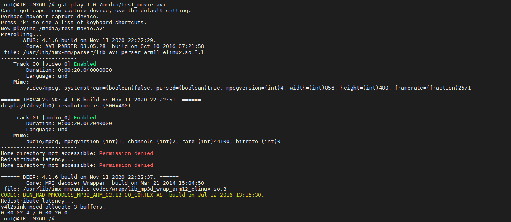

# 视频播放测试

文件系统含GStreamer（流媒体应用的开源多媒体框架），它采用基于插件（plugin）和管道（pipeline）体系结构，提供了GStreamer相关的库，同时提供了相关的应用程序。简单来说，用户可以把它当作一种多媒体播放器。然后我们就可以使用播放器播放我们的音频和视频了，但GStreamer的功能远远不仅仅是这些。

由于CPU没有硬件多媒体解码器且CPU资源有限，播放视频分辨率不能太高，帧率也不要太高，否则播放会有卡顿感。

播放视频测试，执行下面指令，播放系统目录/meida/test_movie.avi，分辨率为856x480，25帧的视频文件。按“Ctrl + c”结束播放。
```c#
gst-play-1.0 /media/test_movie.avi 
```



LCD屏幕上播放的视频：


