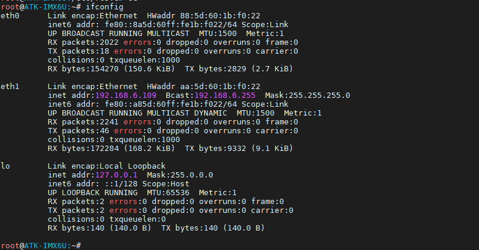
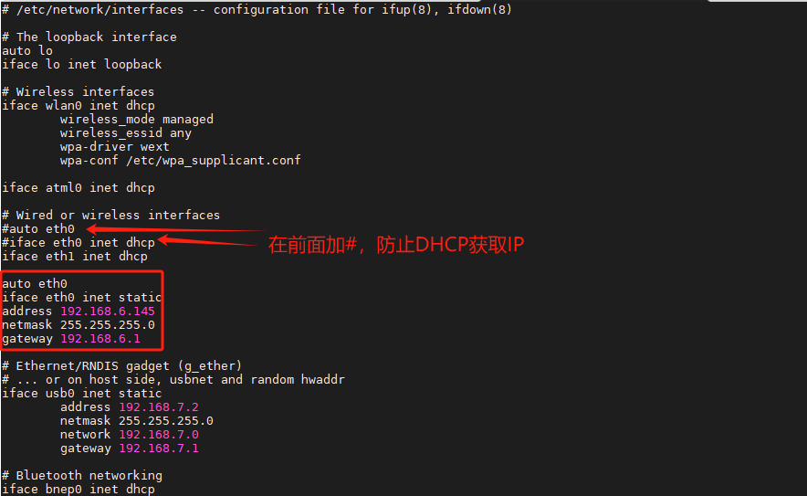
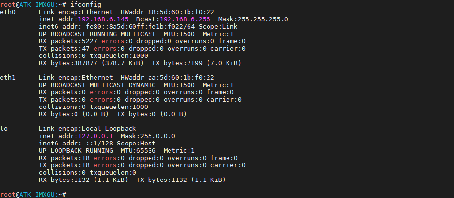
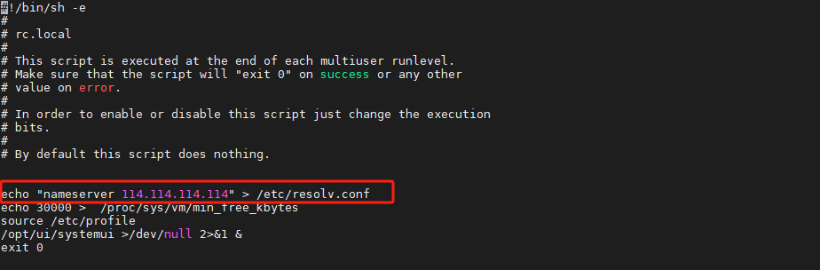

# 如何设置静态ip

设置静态 ip 是用户最需要的，这里我们提供方法，由于出厂系统是 connmand托管的，注仅适用正点原子系统！由 connmand 自动获取 ip。所以当我们设置了静态 ip 后，又被 connmand 重新获取 ip。所以这样子是不行的。我们需要告诉 connmand：“你不要托管我的网络啦，我需要设置静态 ip!”开个玩笑，实际原理就是这样。

配置 connman 的配置文件，默认没有创建对应的配置文件，需要自己手动在 etc 目录下创建 connman 文件夹，并创建 main.conf 文件，connman 在启动的时候会自动的读取这个配置文件。
```c#
mkdir /etc/connman
vi /etc/connman/main.conf
sync
```

在 main.conf 里写入以下内容，比如笔者将 eth1 写进黑名单，这样 eth1 就不会被托管了。
```c#
[General]
NetworkInterfaceBlacklist = eth0
# NetworkInterfaceBlacklist = eth0,eth1 #若要添加多个网卡时，用英文“,”隔开。
```

重启系统后，可以看到eth0没有IP地址。因为它没有被托管了。



现在我们来设置静态 ip。编辑/etc/network/interfaces 文件。
```c#
vi /etc/network/interfaces
```
追加以下内容，设置静态 ip 为 192.168.6.145，请根据自己的网段自行修改。
```c#
auto eth0
iface eth0 inet static
address 192.168.6.145
netmask 255.255.255.0
gateway 192.168.6.1
```



当然，上图中auto eth0已经存在，可以不用重复写。
```c#
sync
```

保存重启后，可以看到静态ip已经设置成功。



因为取消了eth0网络托管，无法自动DNS，所以是无法ping外网的。

编辑出厂文件系统里/etc/rc.local。
```c#
vi /etc/rc.local
```

添加以下内容，请根据个人使用的路由器，设置相应网段的ip地址。下图为设置eth0的静态ip地址。请注意这个ip不要与其他设备的ip冲突！**同时不要写在exit 0之后了！**
```c#
echo "nameserver 114.114.114.114" > /etc/resolv.conf
```




