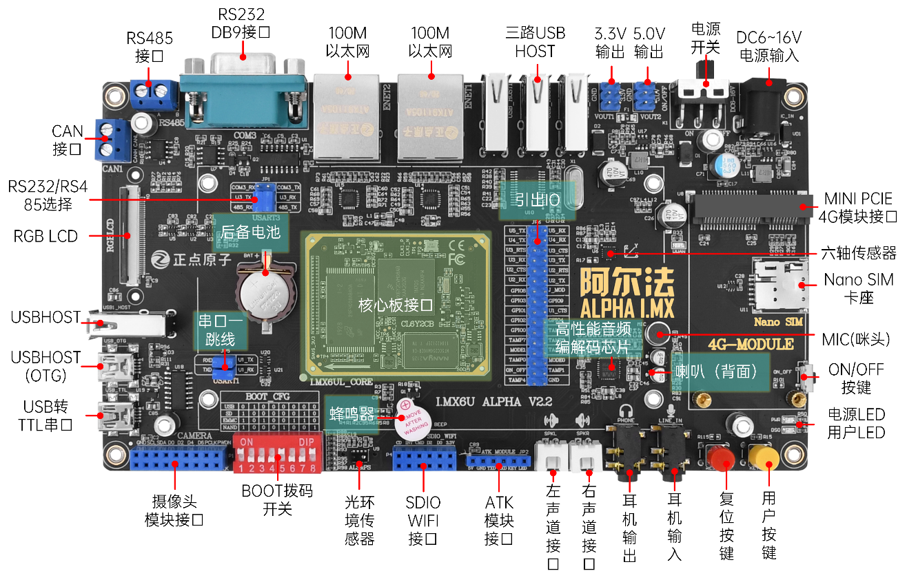

# 硬件资源简介

正点原子目前已经拥有多款 STM32、I.MXRT 以及 FPGA 开发板，这些开发板常年稳居淘宝销量冠军，累计出货超过 10W 套。这款 ALPHA 开发板，是正点原子推出的第一款 Linux 开发板，采用底板+核心板的形式。接下来我们分别介绍I.MX6U-ALPHA开发板的底板和核心板。

## I.MX6U-ALPHA开发板底板资源简介

如何区分自己的底板？可以看正面或者背面底板上的丝印，如下图是V2.2版本。（版本丝印在背面）

V2.2大底板及以前的底板版本没有很大区别，都适用下图。

V2.4大底板版本如下图。与前面的版本采用了不同的PHY芯片，但是我们都做了软件兼容，用一套固件即可！以及由T口Mini USB换成了USB Type-C接口。音频由I2C2改版到了I2C1。为什么这么修改？支持不同的PHY，可以让批量的客户有多种选择，同时也为了支持这个国产的PHY。

