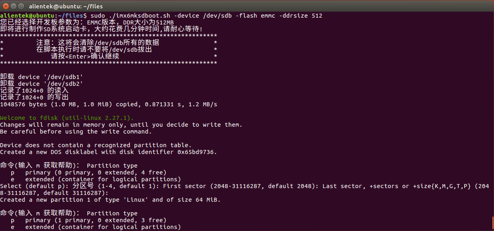
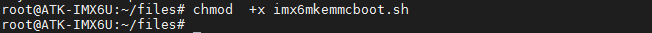

# 固化系统

开发板出厂已经固化系统到核心板上的eMMC或NandFlash存储介质里。建议自行更新系统固件（检查是不是最新系统，请看[出厂系统软件版本历史](../introduction%20to%20software%20and%20hardware%20resources/Introduction%20to%20Software%20Resources.md)），新的系统修复可能存在的bug、优化程序及添加新的功能。如果不需要重新固化系统，请直接到[登录开发板](#click)。

正点原子提供两种固化系统方式，第一种方式(NXP官方提供的方法)是使用正点原子修改过的NXP官方的上位机工具mfgtool。这种固化系统方式可以使用PC机在线直接固化系统。第二种方法（正点原子额外提供的方法）需要制作TF卡系统卡，插卡的方式固化系统。这两种方法都有各自的好处。下面将介绍它们的用法。


## 使用mfgtool上位机固化系统（OTG方式）

以ALPHA底板为例，请先插上开发板的12v电源，OTG接口不能供电给开发板。底板拨码开关BOOT_CFG设置如下，设置为USB连接方式，“1”代码ON，“0”代表“OFF”。将拨码数字2处拨到ON，其他的为OFF，如下图。


使用USB连接线连接底板的USB_OTG接口与PC机（电脑）。(注：MINI底板的位置不一样。)


进入开发板光盘A-基础资料->5、开发工具->4、正点原子MFG_TOOL出厂固件烧录工具->mfgtool文件夹下，查看vbs脚本信息，如下图。


用户不需要知道这么多vbs脚本怎么用，。目前正点原子在售的核心板类型只有两种，一种是eMMC（8GB）核心板类型，DDR大小为512MB。另一种是NandFlash（512MB），DDR大小为256MB。vbs脚本解释如下:
以Mfgtool2-eMMC-ddr512-eMMC.vbs为例。
-eMMC：代表核心板上的存储介质为eMMC
-ddr512：指核心板上的DDR大小为512MB
-eMMC：选择此脚本是把固件烧写到eMMC上

### 固化系统到TF卡

用户需要准备一张TF卡，按前面的vbs脚本命名解释，比如要固化系统到TF(SDCard)卡，那么需要确认用户手上的核心板类型是eMMC还是NandFlash。比如现在用户手上核心板类型为eMMC类型核心板。所以我们选择Mfgtool2-eMMC-ddr512-SDCard.vbs这个脚本来烧写 ，如果是用户手上核心板类型NandFlash核心板，则选择Mfgtool2-NAND-ddr256-SDCard.vbs。
比如编者手上的是eMMC核心板，要固化系统到TF卡上，按2.2.1小节拨码及连接方式，开发板上电，双击Mfgtool2-eMMC-ddr512-SDCard.vbs
常见问题：
1.	若没有任何反应，可能是被杀毒软件拦截，请退出杀毒软件！
2.	如果是第一次使用开发板OTG连接PC机（电脑），需要等待PC（电脑）机自动安装驱动。点击右下角正在安装驱动的小图标，不要让Winodws去从Windows update里去找驱动，点击跳过，驱动自然会装上。否则用了Windows update里的驱动，可能在烧写过程中会卡住，不往下跑。
3.	等待安装驱动完成后，mfgtool上位机界面会提示已经连接到设备HID-compliant device，注意请不要打开虚拟机，如果虚拟机正在开启，OTG会连接到虚拟机上去。在烧写时，如果遇到杀毒报错，建议关闭杀毒软件！
4.	若烧写到一半卡住，有可能是mfgtool的路径太长或者含中文路径！请拷贝mfgtool文件夹到桌面再烧写！ 


此时将TF卡插入卡槽（需开发板先上电后再将TF卡插进卡槽，否则上电时会检测TF卡，这样mfgtool会连接不到开发板设备），如下图插上SD卡（MINI底板卡槽的位置不一样）。


直接点击mfgtool的Start按钮进行固化系统到SD卡。下图为点击Start按钮后的截图。固化系统到SD卡需要几分钟时间，请耐心等待。


下图为固化过程中的一步，正在写入文件系统.


固化完成如下图，点击Stop后再点Exit退出mfgtool上位机软件即可。


测试从SD卡启动系统，拨码开关拨至SD卡启动方式10000010，启动系统即可。

### 固化系统到eMMC

使用前提:用户核心板类型带eMMC存储介质。目前原子在售的eMMC核心板ddr大小是512MB。请双击Mfgtool2-eMMC-ddr512-eMMC.vbs这个vbs脚本文件进行固化。
请参考2.2.1 1小节固化系统到SD卡的步骤（注：固化时不要插入SD卡），选择固化到eMMC的vbs文件，固化完成后，将拨码开关拨至eMMC启动方式10100110，启动系统即可。


###  固化系统到NAND FLASH

使用前提:用户核心板类型带NAND FLASH存储介质。目前原子在售的NAND FLASH核心板都是ddr大小是256MB。请双击Mfgtool2-NAND-ddr256-NAND.vbs这个vbs脚本文件进行固化。
请参考2.2.1.1小节固化系统到SD卡的步骤（注：固化时不要插入SD卡），选择固化到NAND FLASH的vbs文件，固化完成后，将拨码开关拨至NAND启动方式10001001，启动系统即可。


## 使用脚本固化系统

脚本固化系统一般可用于批量固化与升级系统，不像mfgtool上位机那样还需要PC机和USB T字口数据线，且每次只能打开一个mfgtool上位机，用户可以自行修改好固化系统脚本，进行自动化固化测试，那么可以无需专业人员参与，即可批量固化系统。
脚本由正点原子编写提供。

### 固化系统到TF(SD)卡

拷贝开发板光盘A-基础资料->5、开发工具->4、正点原子MFG_TOOL出厂固件烧录工具->mfgtool->Profiles->Linux->OS Firmware->files整个文件夹到Ubuntu虚拟机，如下图，本文档已经拷贝files文件夹到Ubuntu虚拟机。


使用chmod指令修改固化TF卡系统脚本imx6mksdboot.sh的权限

```c#
chmod +x imx6mksdboot.sh
```


TF卡用读卡器插到Ubuntu虚拟机，如果Ubuntu没提示连接可移动设备连接到虚拟机，按以下步骤连接到虚拟机。


输入如下指令查看SD卡挂载节点，如下图，编者的SD卡容量是14.9GB(16GB)，可以看到挂载的节点为/dev/sdb。

```c#
sudo fdisk -l
```


执行./imx6mksdboot.sh --help查看脚本的使用方法。

```c#
./imx6mksdboot.sh --help
```


用法说明：

```c#
用法: imx6mksdboot.sh [选项] <(必选)-device> <(可选)-flash> <(可选)-ddrsize>
```

(1)	-device：指明设备节点（TF卡挂载的节点如/dev/sdx），必需加这个参数
(2)	-flash：指明核心板上的媒体存储介质，可选为（emmc|nand）
(3)	-ddrsize：指明核心板上的ddr容量大小，可选为（512|256）MB
比如现在用户是核心板的ddr容量大小是512MB，媒体存储介质是eMMC。SD卡挂载节点为/dev/sdb。那么固化SD卡的指令如下，执行指令后脚本会有中文再次询问SD卡所挂载的节点是否对应，将会清空SD卡上的所有数据，请注意备份重要的数据。按Enter键确认后继续，固化SD卡需要大约需要几分钟时间，这里根据个人电脑不同和所用SD卡不同，可能花费的时间差异比较大。
	进入files目录后

```c#
sudo ./imx6mksdboot.sh -device /dev/sdb -flash emmc -ddrsize 512
```



在固化的过程中，会卸载TF卡，在脚本执行时，鼠标不要离开Ubuntu虚拟机，否则可能在脚本卸载TF卡时，TF卡连接到PC主机上去了，这样脚本就无法找到TF卡执行，就会提示“mount: special device /dev/sdb1 does not exist”这样的错误。固化时有中英文结合提示固化的过程，固化完成如下图。


按连接TF卡到Ubuntu的方法，再点击断开即可退出TF卡。固化完成后，将拨码开关拨至TF启动方式10000010，启动系统即可。

### 固化系统到eMMC

使用前提:用户核心板类型带eMMC存储介质，及2.2.1.1小节或者2.2.2.1小节制作好的TF卡启动系统。同样的，拷贝开发板光盘A-基础资料->5、开发工具->4、正点原子MFG_TOOL出厂固件烧录工具->mfgtool->Profiles->Linux->OS Firmware->files文件夹到制作好的TF系统启动卡里面的/home/root目录（本文拷贝到/home/root目录，用户可任意目录）。


修改eMMC固化脚本的权限

```c#
chmod +x imx6mkemmcboot.sh
```



执行./imx6mkemmcboot.sh --help查看脚本的使用说明

```c#
./imx6mkemmcboot.sh --help
```


使用fdisk指令查看eMMC挂载节点，一般挂载节点为/dev/mmcblk1，测试的eMMC为8GB存储容量的。可以看到下图/dev/mmcblk1就是eMMC的挂载节点。

```c#
fdisk -l
```


用法说明：
```c#
用法: imx6mkemmcboot.sh [选项] <(必选)-device> <(可选)-ddrsize>
```
（1）	-device：指明设备节点（eMMC挂载的节点如/dev/mmcblk1），必需加这个参数
（2）	-ddrsize：指明核心板上的ddr容量大小，可选为（512|256）MB
比如现在用户是核心板的ddr容量大小是512MB（原子在售的eMMC核心板ddr大小都为512MB），eMMC挂载节点为/dev/mmcblk1。那么固化的指令如下，执行指令后脚本会有中文再次询问eMMC所挂载的节点是否对应，将会清空eMMC上的所有数据，请注意备份重要的数据。按Enter键确认后继续，固化系统到eMMC需要大约需要几分钟时间。

```c#
./imx6mkemmcboot.sh -device /dev/mmcblk1 -ddrsize 512
```


固化系统完成如下图。


固化完成后，将拨码开关拨至eMMC启动方式10100110，启动系统即可。

### 固化系统到NAND FLASH

使用前提:用户核心板类型带Nand Flash存储介质，及2.2.1.1小节或者2.2.2.1小节制作好的TF卡启动系统。同样地，拷贝开发板光盘A-基础资料->5、开发工具->4、正点原子MFG_TOOL出厂固件烧录工具->mfgtool->Profiles->Linux->OS Firmware->files文件夹到制作好的TF系统启动卡里面的/home/root目录（本文拷贝到/home/root目录，读者可任意目录）。


使用cat指令查看MTD分区表，打印结果如下图表示存在Nand Flash。

```c#
cat /proc/mtd
```


赋予NandFlash固化脚本的可执行权限

```c#
chmod +x imx6mknandboot.sh
```


执行./imx6mknandboot.sh --help查看脚本的使用说明

```c#
./imx6mknandboot.sh --help
```


用法说明：
```c#
用法:imx6mknandboot.sh [选项] <(可选)-ddrsize>
```
-ddrsize：指明核心板上的ddr容量大小，可选为（512|256）MB
正点原子在售的NandFlash类型核心板的ddr容量大小都是256MB，那么固化的指令如下。这将会清空NandFlash上的所有数据，请注意备份重要的数据。按Enter键确认后继续，固化系统到NandFlash需要大约需要几分钟时间。

```c#
./imx6mknandboot.sh -ddrsize 256
```


固化系统完成如下图图2.2.2.3 6。


固化完成后，将拨码开关拨至Nand Flash启动方式10001001，启动系统即可。

## 登录开发板<a name="click"></a>

### 拔码开关设置

请根据个人核心板上的存储介质类型，选择不同的方式启动动系统。如下图参照底板原理图说明：


解释：OFF为0，ON为1。<br />
（1）	USB OTG烧写设置：0100 0000<br />
（2）	SD 卡启动设置：1000 0010<br />
（3）	EMMC启动设置：1010 0110<br />
（4）	NAND FLASH启动设置：1000 1001<br />

用户选择正确的启动方式后，开发板上电，进入系统后，开发板自动登录，无需输入用户名及密码，文件系统已经设置root用户自动登录。


