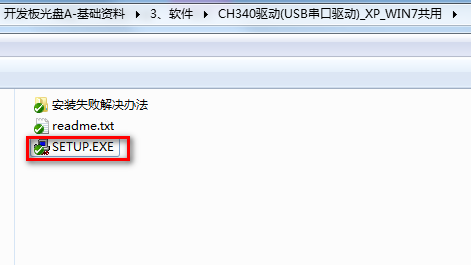
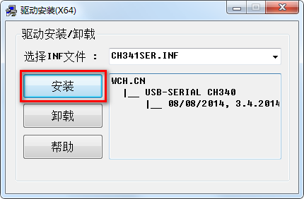
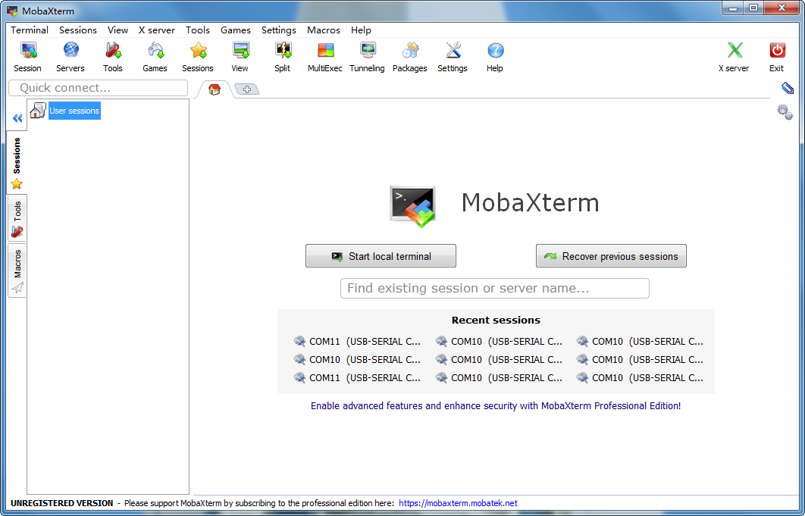
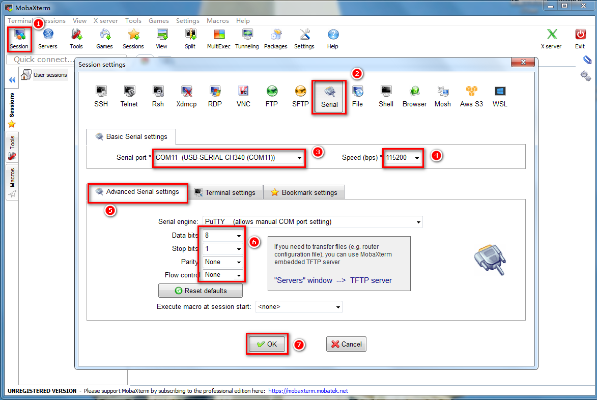
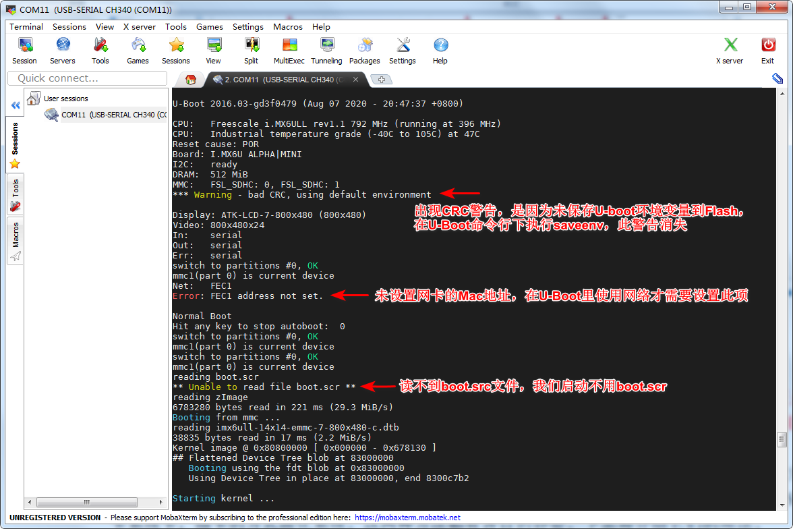

# 安装驱动和串口调试终端软件

## 安装CH340驱动

开发板的串口与电脑通信，需要安装CH340驱动，开发板光盘A-基础资料->3、软件->CH340驱动(USB串口驱动)_XP_WIN7共用找到SETUP.EXE双击进行安装。出现预安装成功或者安装成功则成功。如果Win10安装失败，请下载驱动精灵，先使用发货时提供的USB T字口数据线连接开发板底板的USB_TTL，USB接口端连接电脑，驱动精灵扫描硬件驱动，把相应的串口驱动装上就可以了。

## 如何使用串口调试终端软件

可以使用串口的终端软件有很多比如Xshell，SecureCRT，MobaXterm，甚至Ubuntu的终端都是可以连接开发板上的串口的。本文以MobaXterm安装为例，在众多终端软件来说算是对新手比较友好，因为界面比较好看，但是也有不足，不能自动重连串口。
在开发板光盘A-基础资料->3、软件-> MobaXterm_Installer_v12.3.zip双击解压进行安装即可，安装过程非常简单，默认下一步进行安装。这里不写安装过程了。
安装在桌面打开MobaXterm图标，软件界面如下图。

开发板接上USB T字口数据线到USB_TTL，连接电脑，开发板插上电源，出货时拨码开关已经拨好。MobaXterm按如下配置，点击Session（会话）->选择Serial（串口）类型->选择开发板设备对应的com口->选择波特率为115200（开发板默认波特率为115200）->高级设置->设置流控为None->点击确认。

开发板上电，串口终端打印的信息如下。其中U-Boot阶段打印的信息如下，报的警告或者错误解释如图，新手常常担心打印信息出现错误，以为是什么毛病。这里我们作了解释。不过Linux里经常是需要打印信息，用来提示硬件初始化失败或用户操作不当等。

