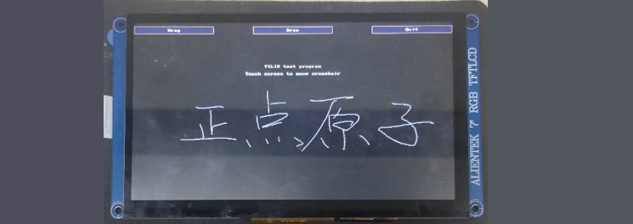

# 3.3 LCD触摸屏

ALPHA/Mini开发板已经兼容所有本公司的RGB LCD屏幕，由于屏幕存在id的关系，开发板上电自动识别屏幕，进行LCD触摸屏实验时请先断电插上RGB屏幕，再启动系统。

| 屏幕尺寸             | 触摸芯片                            | 屏幕ID |
| -------------------- | ----------------------------------- | ------ |
| 4.3寸屏（480x272）   | gt9xx                               | 0x00   |
| 4.3寸屏（800x480）   | gt9xx/gt1151                        | 0x04   |
| 7寸屏（800x480）     | ft5x06                              | 0x01   |
| 7寸屏（1024x600）    | ft5x06/cst340(cst340兼容ft5x06驱动) | 0x02   |
| 10.1寸屏（1280x800） | gt9xx                               | 0x03   |

## 3.3.1 LCD背光调节

LCD 屏幕的背光支持 8级变化，亮度级数为 0～7，默认为7。

查看LCD屏幕最大亮度等级
```c#
cat /sys/devices/platform/backlight/backlight/backlight/max_brightness
```


查看当前LCD屏幕背光亮度等级
```c#
cat /sys/devices/platform/backlight/backlight/backlight/actual_brightness 
```


修改当前LCD屏幕背光亮度等级，修改后再查看当前亮度等级
```c#
echo 5 > /sys/class/backlight/backlight/brightness // 修改亮度等级为5
cat /sys/devices/platform/backlight/backlight/backlight/actual_brightness
```


## 3.3.2 LCD触摸测试

先退出Qt桌面，直接点击桌面的“设置”，点击设置项里的退出桌面即可！如果没有这项，用户的出厂系统还不是最新的，请使用正点原子ALPHA最新的资料，参考[固化系统小节](../preparation/curing_system.md)的更新系统即可！

以下实验是对本公司7寸屏800*480分辨率的屏幕进行测试。
```c#
ts_test        //可按“Ctrl + c”停止
```


LCD测试程序如下图。点击Draw，就可以开始画图，7寸屏800*480分辨率效果。



关闭桌面程序后，请点击设置App中的通用>退出，就会关闭桌面UI了。
注意：这里不需要使用ts_calibrate校准。ts_calibrate一般是针对电阻屏校准的。使用ts_calibrate后会在/etc目录下生成一个坐标参考文件pointercal。如果您的/etc目录下有pointercal这个坐标参考文件，请把它删除。否则可能影响触摸坐标上报的数据值。

## 3.3.3 LCD显示控制

进入/退出睡眠模式，注：这里指控制LCD进入睡眠模式（实质是操控fb0），并不是整机进入睡眠模式。

进入睡眠/熄屏模式
```c#
echo "4" > /sys/class/graphics/fb0/blank
```


退出睡眠/亮屏模式
```c#
echo "0" > /sys/class/graphics/fb0/blank
```


