# 3.23 ME3630-W 4G模块测试

| ALPHA | MINI |
| ----- | ---- |
| 本实验支持 | 本实验不支持/但是可使用PCIE转USB座子接4G模块 |

实验前准备ME3630-W 4G模块（正点原子店铺有售卖）、天线和一张上网卡（电信4G卡、联通4G卡或者移动4G卡）。

进行 4G 模块测试前，将移动或者联通 4G 卡插到底板的SIM卡槽里，再插上ME3630-W 4G模块，同时插上天线，天线接到模块的 MAIN 处。正确插入 4G 卡与天线后，正常加载驱动后，开发板启动后底板上的WWAN LED 会亮绿灯（WWAN LED指示灯说明参考[之前小节](./ec20_test.md)），若此灯不亮，请检查 4G 卡是否插好（卡没插好也不会亮绿灯），ME3630-W是否插稳，天线是否连接正确，如测试失败多数是没有正确连接模块。必须插上开发板使用的电源！否则供电不足，模块无法正常工作ME3630-W 4G模块安装如下图所示：


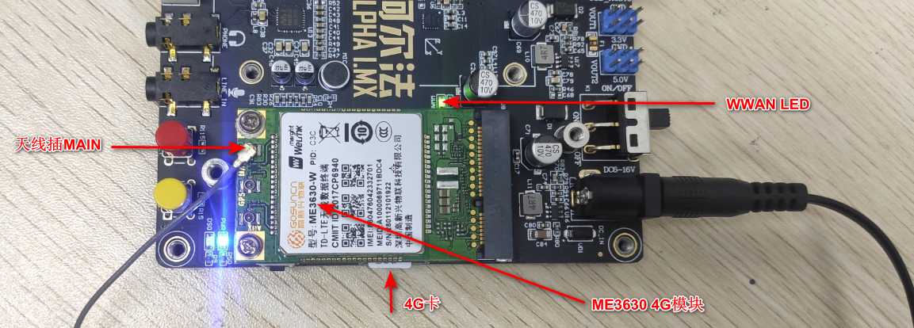

开机启动串口终端打印4G模块加载成功，并生成ttyUSB0~ ttyUSB2。

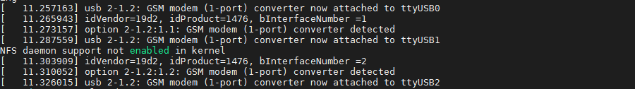

进入/home/root/shell/4G目录下，这个目录存放着测试4G模块的脚本，如果您没看见4G这个目录，请回到[之前小节](../preparation/curing_system.md)下载最新的固件更新。
```c#
cd /home/root/shell/4G
ls
```
4G测试脚本如下，（下图文件系统版本需要v2.4以上）。

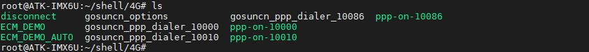

脚本解释：
ppp拨号主要是ppp-on-1000、ppp-on-10010和ppp-on-10086。这三个脚本分别是不同的运营商配置的APN值不一样。ppp-on-1000、ppp-on-10010和ppp-on-10086分别是电信卡需要执行的脚本、联通卡需要执行的脚本和移动卡需要执行的脚本。

ECM接口主要用ECM_DEMO和ECM_DEMO_AUTO二进制执行文件。

## 3.23.1 pppd拨号上网

比如本次测试使用的是电信卡，那么执行的脚本是ppp-on-10000。
```c#
./ppp-on-10000 &             // &的作用是放到后台运行
```


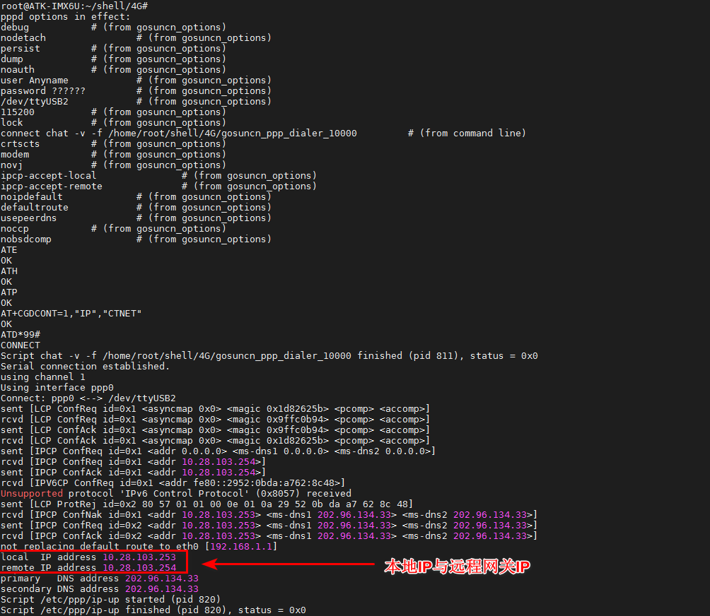

如果开发板同时插上了网线，因为此系统默认会只让一个网卡连外网，设置网关为4G模块的路由规则。使用route指令查看路由表。
```c#
route
```
因为本人已经插上网线，上网会优先选择eth0/eth1。如果用户没有插网线，就不需要添加路由表啦，因为你的网卡只有4G网卡上网，系统就会选择4G网卡上网。

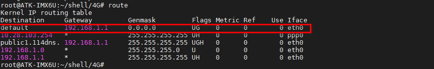

我们需要先添加4G模块的网关地址，然后删除默认的eth0的网关地址，再使用route指令查看添加是否成功
```c#
route add default gw 10.28.103.254	
route del default gw 192.168.1.1
route
```
可以看到下面default项，已经修改为ppp0上网。

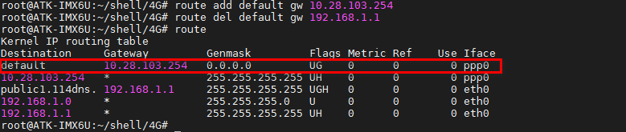

使用ifconfig指令查看获取的ip地址，表明4G网络可以与eth0/eth1共存，上网通过切换默认的路由表来控制连外网即可！
```c#
ifconfig
```

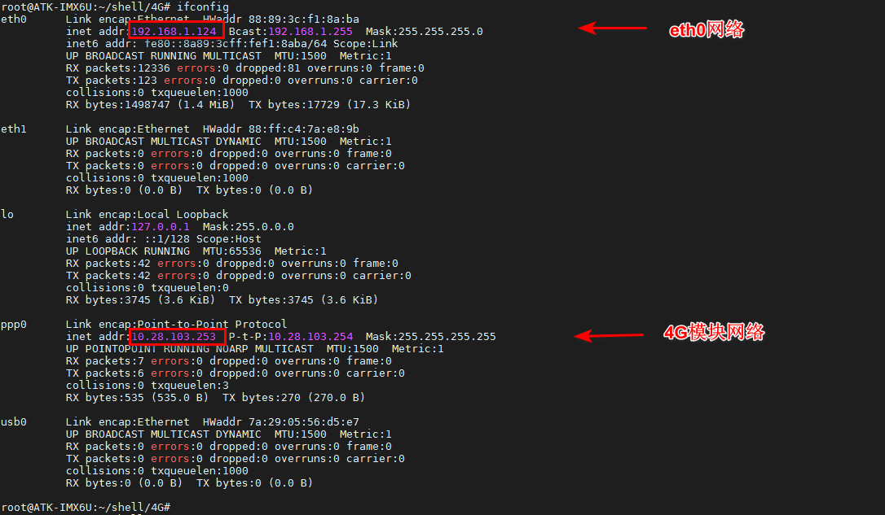

通过ping www.baidu.com来测试是否能上网。-I参数是指定ppp0(4G网络)，按“Ctrl +c”结束ping。看到下图结果表明能上网。
```c#
ping www.baidu.com -I ppp0
```

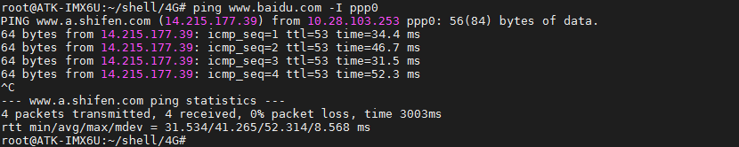

## 3.23.2 通过ECM上网

在操作系统看来，CDC ECM设备就是一个虚拟以太网卡，包含标准网卡需要的MAC地址和IP地址。

ECM_DEMO_AUTO 和 ECM_DEMO是高新兴ECM上网的程序，指令简介如下：
```c#
ECM_DEMO -t up         //开启ecm上网 
ECM_DEMO -t down       //关闭ecm上网
ECM_DEMO -t up -p /dev/ttyUSB1 -a 3gnet  //开启的同时指定对应的apn和拨号端口
ECM_DEMO -t down -p /dev/ttyUSB1     //关闭ecm上网
```
详细的参数可以查看源代码或者执行 ECM_DEMO -h  查看

ECM_DEMO_AUTO 和 ECM_DEMO参数是一样的，区别是ECM_DEMO执行完流程就会退出，ECM_DEMO_AUTO会一直运行并每隔一段时间会检查是否断网，断网了会自动重连
ECM_DEMO_AUTO默认会自动执行拨号流程，故适合做开机自启的程序。

要配置ECM模式上网，如果运行了pppd上网，请先执行disconnect脚本断开pppd拨号上网，再执行下面的指令配置成ECM模式链接网络。
```c#
./disconnect
./ECM_DEMO -t up
```

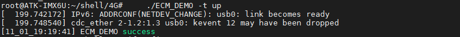

使用ifconfig指令查看获取的ip地址，如果没有获取到ip地址使用udhcpc -i usb0获取。
```c#
ifconfig
```

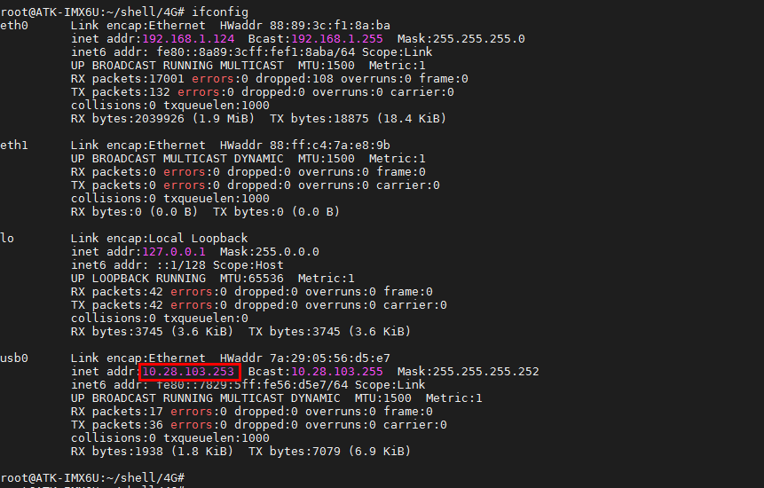

通过ping www.baidu.com来测试是否能上网。-I参数是指定usb0(4G网络)，按“Ctrl +c”结束
```c#
ping www.baidu.com -I usb0      // “-I”参数是指定网卡名
```

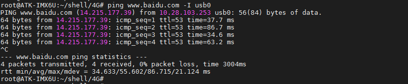